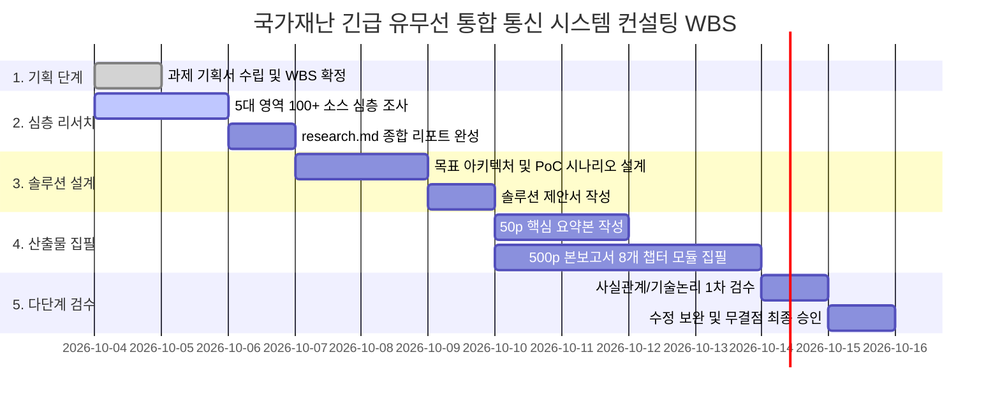

# [프로젝트 기획서] 국가재난 긴급 유무선 통합 통신 시스템 구축 컨설팅

- **과제명:** 국가재난 긴급 유무선 통합 통신 시스템 구축 컨설팅
- **고객사:** ITS 컨버젼스
- **작성자:** 프로젝트팀 기획 담당
- **보고 대상:** 프로젝트팀 팀장(PM)
- **작성일자:** 2026년 10월 4일
- **PoC 실증 모델:** 옵션 A (S/W 가상 시뮬레이션 + 핵심 H/W 실물 연동 하이브리드 PoC 모델)

---

## 1. 과제 배경과 해결할 문제

### 1.1. 과제 추진 배경
1. **대형 복합 재난의 일상화 및 지휘 통신의 한계:**
   - 기후변화 및 도시 고밀화로 인해 복합 대형 재난(집중호우, 지하철/터널 화재, 대형 산불, 도심 다중밀집 압사 사고 등)이 빈발하고 있습니다.
   - 재난 발생 시 초동 대처의 핵심인 '골든타임(Golden Time)' 확보를 위해서는 **소방, 경찰, 해경, 지자체, 철도, 군 등 8대 재난 대응 기관 간 실시간 음성·영상·데이터 연동**이 필수적입니다.
2. **현행 재난 통신망의 구조적 파편화(Fragmentation):**
   - 대한민국은 PS-LTE(재난안전통신망), LTE-R(철도망), LTE-M(해상망)의 무선망을 구축했으나, **현장의 유선 통신 인프라(지자체 CCTV 관제망, 유선 비상벨, 행정전화, 지하구 유선 인터폰)와의 유기적 연동 체계가 여전히 미흡**합니다.
   - 각 부처 및 공공기관의 레거시 유무선 장비(PSTN, VHF/UHF, TRS, 위성망)가 분리 운영되어 재난 현장에서 '유선↔무선', '부처↔부처' 간 실시간 긴급 통화 단절 현상이 발생하고 있습니다.
3. **고객사(ITS 컨버젼스)의 시장 선점 기회:**
   - ITS 컨버젼스는 차세대 재난 통신 시스템 및 지능형 교통/방재 솔루션 전문 기업으로서, 향후 정부 및 지자체가 발주할 대규모 '유무선 통합 재난망 고도화 사업'의 주사업자로 진입하기 위한 **최고 권위의 기술 컨설팅 보고서(본보고서 500p, 요약본 50p, PoC 실증안)**가 긴급히 필요합니다.

### 1.2. 해결해야 할 핵심 문제 (Core Problems)
- **문제 1: 유무선 분리 운영에 따른 통신 단절:** 유선 전화/인터폰으로 접수된 신고가 현장 출동 대원의 무전기(PS-LTE)로 즉각 그룹 통화(MCPTT) 연결되지 못하는 지연 발생.
- **문제 2: 부처 간 공통 통신 프로토콜 부재:** 소방(119), 경찰(112), 해경(122), 지자체(재난상황실)가 서로 다른 주파수/장비를 사용하여 다자간 현장 지휘망 결합 불가.
- **문제 3: 재난 통신 트래픽 폭증 및 음영 지역 발생:** 대형 재난 시 통신 기지국 소실, 트래픽 폭주로 인한 통화 불능, 지하/터널/원해 통신 사각지대 존재.
- **문제 4: 통합 시현(PoC) 모델 부재:** 고객사가 발주처(행안부, 소방청 등)에 기술적 우수성을 입증할 구체적이고 신뢰도 높은 하이브리드 실증 모델 결여.

---

## 2. 프로젝트 목표와 성공 기준 (KPI)

### 2.1. 정량적 목표 (Measurable KPIs)
1. **산출물 규모 준수:**
   - 본보고서: **총 8개 챕터 500페이지 내외**의 고밀도 기술 컨설팅 보고서 완벽 구축
   - 요약본: 경영진 및 발주처 의사결정용 **50페이지 내외 핵심 요약본(Executive Summary)** 완성
2. **공신력 있는 리서치 소스 100개 이상 확보:**
   - 정부 백서, 감사원 감사보고서, 국회 입법조사처 보고서, ITU/3GPP 국제표준, 국내외 학술 논문 등 **100건 이상의 팩트 소스 교차 검증**
3. **사례 분석의 정밀성:**
   - 세월호, 대구지하철, 제천스포츠센터, 이태원, 오송지하차도 등 **최소 5대 주요 재난 사고의 통신 장애 원인 타임라인별 정밀 분석**
4. **목표 통합 시스템 아키텍처 및 PoC 완성도:**
   - 현행 대비 목표 통합 시스템의 네트워크 토폴로지, RoIP 게이트웨이, AI 우선순위 제어, S/W+H/W 하이브리드 실증 시나리오 3건 도출

### 2.2. 정성적 목표
- ITS 컨버젼스가 정부 공공 입찰 및 수주전에 즉시 '표준 기술 제안서'로 활용 가능한 수준의 완결성 달성
- 5단계 반복 검수를 통한 사실관계, 기술 논리, 법규 검토 상의 무결점(Zero-Defect) 달성

---

## 3. 프로젝트 범위 (Scope)

```
┌────────────────────────────────────────────────────────────────────────┐
│                        프로젝트 범위 정의서                             │
├────────────────────────────────────────────────────────────────────────┤
│ [포함 사항 (In-Scope)]                                                 │
│ 1. 국가 재난안전통신망(PS-LTE/R/M) 및 8대 부처 통신망 전수 현황 분석    │
│ 2. 유무선 단절로 인한 과거 재난 골든타임 상실 사례 원인 분석          │
│ 3. 차세대 유무선 통합 시스템 목표 아키텍처 (RoIP/MCPTT/AI/위성 백본)   │
│ 4. 옵션 A 하이브리드 실증(PoC) 시나리오, 시험 절차서 및 H/W 구성도    │
│ 5. 총소요비용(TCO), 개발 소요 자원, 추진 로드맵 및 법제도 개선 방안    │
│ 6. 500p 본보고서 및 50p 요약본 집필, 다단계 반복 검수                 │
├────────────────────────────────────────────────────────────────────────┤
│ [제외 사항 (Out-of-Scope)]                                             │
│ 1. 실제 상용 제품 양산 생산 및 최종 납품 (본 과제는 컨설팅 및 PoC 설계)│
│ 2. 국가 재난망 실제 주파수(700MHz) 법적 독점 할당 인허가 대행          │
│ 3. 타 국가 해외 현지 재난망의 상세 현장 실사 (해외 사례 문헌 분석으로) │
└────────────────────────────────────────────────────────────────────────┘
```

---

## 4. 리서치 담당(02)에게 요청할 세부 조사 질문 목록

기획 담당은 리서치 담당 에이전트에게 다음 **5대 핵심 영역 15개 세부 질문**에 대한 전수 조사를 요청합니다:

### [영역 1] 현행 국가 재난안전통신망(PS-LTE/R/M) 인프라 현황
- **Q1-1:** 대한민국 PS-LTE(행안부), LTE-R(철도), LTE-M(해양)의 구축 연혁, 주파수 대역(700MHz 대역), 기지국 수, 커버리지 및 운영 현황은 어떠한가?
- **Q1-2:** 각 무선망의 운영 주체(행안부, 철도공단, 해수부)별 코어망(Core Network) 분리 현황과 상호 연동 게이트웨이(RAN Sharing / Core 연동)의 기술적 한계는 무엇인가?
- **Q1-3:** 소방, 경찰, 해경의 현장 단말기(무전기, 스마트폰 형태) 보급 수량과 실제 현장 활용률, 배터리 및 음영 지역 문제점은 무엇인가?

### [영역 2] 정부 8대 부처 및 지자체 통신망 유무선 통합 실태
- **Q2-1:** 행안부, 소방청, 경찰청, 해양경찰청, 국방부, 산림청, 기상청, 지자체 재난상황실 간 긴급 통신망은 현재 실시간으로 연결되어 있는가?
- **Q2-2:** 지자체 CCTV 관제센터(유선 광망), 재난 비상벨(유선/LTE), 산불감시망, 지진·침수 센서 등 유선 인프라와 현장 무선망 간의 직접 통화/데이터 연동 수준은 어느 정도인가?
- **Q2-3:** PSTN 유선 행정망 및 각 기관별 레거시 무전망(VHF/UHF, TRS)과 최신 PS-LTE 간의 유무선 상호 호환 게이트웨이 구축 실태는 어떠한가?

### [영역 3] 유무선 단절 및 통합망 부재로 인한 골든타임 상실 사례
- **Q3-1 (세월호 참사 2014):** 해경(VHF/TRS), 소방(VHF), 해수부, 지자체 간 통신 주파수 불일치 및 통신 단절로 인한 구조 지연 팩트 분석.
- **Q3-2 (대구 지하철 참사 2003 / 제천 스포츠센터 화재 2017):** 지하 역사 및 건물 내 무전 불통(무선통신보조설비 미작동), 유선 상황실-현장 무전 단절 원인 분석.
- **Q3-3 (이태원 참사 2022 / 오송 지하차도 참사 2023):** PS-LTE 구축 이후임에도 불구하고 경찰·소방·지자체 간 공통통화그룹(재난안전통신망 통화그룹) 미가동 및 유선 지휘망과의 연계 부재로 인한 골든타임 상실 원인 분석.

### [영역 4] 차세대 유무선 통합 통신 핵심 기술 및 표준 동향
- **Q4-1:** 3GPP 표준 기반 MCPTT(Mission Critical Push-To-Talk), MCData, MCVideo 규격과 기존 유선 SIP/VoIP, RoIP(Radio over IP)의 통합 메커니즘은 무엇인가?
- **Q4-2:** LEO(저궤도 위성 통신 - Starlink/OneWeb 등) 및 이동형 기지국(드론/차량)을 활용한 비상 통신 백본 이중화 기술 동향은 어떠한가?
- **Q4-3:** AI 기반 음성 인식(STT), 재난 트래픽 QoS 지능형 우선순위 제어, 다채널 노이즈 캔슬링 기술 동향은 어떠한가?

### [영역 5] 글로벌 주요국 재난 통신망(FirstNet 등) 벤치마킹
- **Q5-1:** 미국 FirstNet(AT&T), 영국 ESN(Emergency Services Network), 일본 재난방재망의 유무선 통합 운영 모델 및 기술 표준 벤치마킹 분석.

---

## 5. 솔루션 담당(03)에게 요청할 핵심 설계 요건

1. **전체 시스템 목표 아키텍처 다이어그램 (현행 vs 목표):**
   - 유선(광망/PSTN/CCTV) + 무선(PS-LTE/R/M, 5G NR) + 위성(LEO)을 단일 백본으로 묶는 **하이브리드 메쉬 통합 네트워크 구성도** 설계
2. **핵심 서브시스템 상세 설계:**
   - **RoIP & SIP 통합 미디어 게이트웨이 (HW/SW):** 레거시 무전기(VHF/UHF) 및 유선 전화와 PS-LTE 단말 간 원활한 상호 음성 변환
   - **지능형 재난 지휘 통합 관제 플랫폼 (S/W):** 단일 화면에서 8대 기관 위치(GIS), 영상(CCTV/드론), 다자간 그룹통화 동시 제어
   - **AI 기반 재난 트래픽 QoS 우선순위 제어 엔진:** 트래픽 폭주 시 인명 구조 통화를 1순위로 선점(Preemption)하는 알고리즘 설계
3. **옵션 A 하이브리드 PoC(실증) 시나리오 설계:**
   - S/W 가상 재난 상황 시뮬레이터(1,000개 노드 트래픽 발생) + 실물 H/W(RoIP 게이트웨이 2대, PS-LTE 단말 4대, 유선 IP폰 2대, 레거시 무전기 2대) 연동 실증 시험 방안
4. **TCO 및 개발 소요 자원 모델:**
   - 하드웨어 개발비, 소프트웨어 플랫폼 개발비, 인프라 구축비, 운영 유지보수비 및 인력 M/M 산출

---

## 6. 단계별 추진 일정 및 WBS



---

## 7. 예상 리스크 및 대응 방안

| 리스크 요인 | 심각도 | 발생 가능성 | 구체적 대응 방안 |
| :--- | :---: | :---: | :--- |
| **1. 500페이지 대용량 산출물의 품질 균일성 저하** | 상 | 중 | - 8개 챕터별 모듈화 템플릿 표준을 엄격히 적용<br>- 챕터별 독립 검수 및 교차 링크 검증 실시 |
| **2. 공공 통신망 기밀/비공개 데이터 접근 한계** | 중 | 상 | - 감사원 공개 보고서, 국회 예결위 회의록, 정부 공공 백서 및 3GPP 표준 기술 문헌을 최대한 활용하여 공신력 확보 |
| **3. PoC 실증 모델의 기술적 실현 가능성 논란** | 상 | 하 | - 표준 프로토콜(SIP RFC 3261, RoIP, 3GPP Rel.15/16 MCPTT) 기반의 상용 검증된 H/W 사양을 명시하여 논란 원천 차단 |
| **4. 부처 간 이해관계 대립에 따른 법제도적 한계** | 중 | 중 | - '재난안전기본법' 및 '전파법' 개정안을 부록에 구체적 조문 형태로 제시하여 정책적 타당성 부여 |

---

## 8. 기획 담당 결론 및 후속 지시 요청

본 기획서는 대표님의 **옵션 A(S/W+H/W 하이브리드 PoC 모델)** 결정 사항을 완벽히 반영하여 수립되었습니다.
즉시 **팀원 2(리서치 담당)**에게 본 기획서의 5대 핵심 영역 15개 질문에 대한 전수 조사를 지시하고, 리서치 리포트(`research.md`)를 발행하도록 조치하겠습니다.
