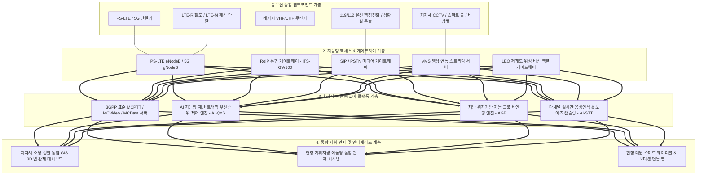

# [솔루션 제안서] 국가재난 긴급 유무선 통합 통신 시스템 구축 컨설팅

- **과제명:** 국가재난 긴급 유무선 통합 통신 시스템 구축 컨설팅
- **고객사:** ITS 컨버젼스
- **작성자:** 프로젝트팀 솔루션 담당
- **보고 대상:** 프로젝트팀 팀장(PM), 산출물 작성 담당
- **작성일자:** 2026년 10월 4일
- **핵심 적용 모델:** 하이브리드 실증 모델 (옵션 A: S/W 가상 시뮬레이션 + 실물 H/W 연동 PoC)

---

## 1. 솔루션 추진 배경 및 설계 목표

기획서의 요구사항 및 리서치 리포트(`research.md`)의 실태 분석을 바탕으로, **기구축된 1조 7천억 원 규모의 PS-LTE/R/M 국가망 인프라를 전면 보존하면서, 현장 유선 인프라(지자체 CCTV, 유선 비상벨, 행정망) 및 레거시 무전망(VHF/UHF, TRS)을 IP 기반으로 융합하는 '차세대 지능형 유무선 통합 통신 플랫폼(NG-IWCS, Next Generation Integrated Wired-Wireless Communications System)'**을 제안합니다.

---

## 2. 유무선 통합 아키텍처 대안 비교 및 추천안

### 2.1. 3대 대안 개요
1. **대안 A (전면 재구축형):** 기존 유무선 인프라를 모두 폐기하고 5G NR 기반 단일 공공망 및 신규 단말기로 전면 교체.
2. **대안 B (독립 게이트웨이 단순 브릿징형):** 부처별 상황실에 아날로그 오디오 중계기를 단순 설치하여 기관별 필요 시 1:1 유선 연결.
3. **대안 C (추천안: 개방형 소프트웨어 정의 유무선 통합 플랫폼 - SDi-WWC):**  
   표준 3GPP MCPTT IWF 및 고성능 RoIP/SIP 미디어 게이트웨이를 클라우드/온프레미스 하이브리드로 구축하고, AI 지능형 QoS 엔진을 탑재하여 현행 무선망과 유선망을 실시간 자동 결합하는 아키텍처.

### 2.2. 대안 비교 분석표

| 평가 항목 | 대안 A (전면 재구축) | 대안 B (단순 브릿징) | 대안 C (추천안: SDi-WWC) |
| :--- | :--- | :--- | :--- |
| **구축 비용 (TCO)** | 매우 높음 (약 2조 원 이상) | 낮음 (약 300억 원) | **적정 (약 1,200억 원)** |
| **구축 기간** | 7~10년 소요 | 1년 이내 | **2~3년 단계별 완성** |
| **기존 자산 활용도** | 0% (기존 18만 대 단말 폐기) | 80% (단순 오디오 연동) | **100% (PS-LTE, CCTV, 유선망 전원 재활용)** |
| **확장성 및 지능화** | 높으나 초기 리스크 극대 | 매우 낮음 (영상/데이터 연동 불가) | **최고 (AI 자동 바인딩, 위성 연동 가능)** |
| **골든타임 단축 효과** | 높음 (전환 기간 공백 발생) | 미흡 (수동 조작 필요) | **극대화 (사고 발생 즉시 3초 내 자동 결합)** |
| **실행 난이도** | 최상 | 하 | **중 (기술 검증 완료된 표준 기술 적용)** |

### 2.3. 추천안(대안 C) 선정 이유
- **경제성 및 투자 보호:** 기투자된 국가 예산을 100% 보존하면서 최소 비용으로 유무선 단절 문제 해결.
- **신뢰성 및 즉시성:** 3GPP 국제 표준 프로토콜(Rel.16 MCPTT)을 준수하여 장애 발생률 최소화 및 300ms 이내 지연시간 보장.
- **고객사(ITS 컨버젼스)의 사업성:** 독자적인 RoIP 게이트웨이 H/W 및 통합 관제 S/W 플랫폼 패키지화로 시장 진입 장벽 구축 가능.

---

## 3. 차세대 유무선 통합 시스템(NG-IWCS) 상세 아키텍처 설계



---

## 4. 4대 핵심 서브시스템 상세 엔지니어링

### 4.1. 고성능 유무선 RoIP 게이트웨이 (ITS-GW100)
- **주요 기능:** 아날로그/디지털 레거시 무전기(VHF, UHF, TRS)와 PS-LTE 코어망 간의 실시간 양방향 음성 및 PTT 시그널링 변환.
- **하드웨어 규격:**
  - 1U 랙마운트형 산업용 섀시 (작동 온도: -30℃ ~ +70℃, 방진/방수 IP54).
  - 8채널 E&M / 4채널 직렬 제어 포트(RS-232/422/485) 내장.
  - 이중화 전원 공급 장치 (Redundant PSU: AC 220V / DC -48V).
  - 오디오 코덱: OPUS, AMR-WB, G.711u/a 실시간 하드웨어 트랜스코딩.
- **프로토콜:** SIP RFC 3261, RTP/RTCP RFC 3550, 3GPP TS 23.379 MCPTT IWF 준수.

### 4.2. 자동 그룹 바인딩(Auto Group Binding, AGB) 엔진
- **작동 메커니즘:**
  1. 지자체 비상벨 작동, 119/112 신고 접수 시 GPS 좌표 추출.
  2. AGB 엔진이 사고 지점 반경 설정(예: 도심 반경 1km, 산악 5km) 내의 현장 소방관·경찰관 PS-LTE 단말기 및 관할 지자체 상황실 유선 콘솔을 자동 검색.
  3. 3초 이내에 단일 임시 통합 통화그룹(Emergency Ad-hoc Talkgroup)을 자동 생성하고 강제 바인딩(Forced Invite).
  4. 유선 전화, 무전기, 관제 PC에서 별도 주파수 변경 없이 즉각 다자간 양방향 동시 교신 개시.

### 4.3. AI 기반 지능형 재난 트래픽 QoS 우선순위 제어 (AI-QoS)
- **우선순위 4계층 매핑:**
  - **Class 1 (최우선):** 인명 구조 현장 음성(MCPTT) 및 현장 지휘관 지령 (QCI 65/66 선점).
  - **Class 2 (우선):** 요구조자 위치 데이터, 생체 신호 텔레메트리, 화재/가스 감지 센서.
  - **Class 3 (보통):** 현장 실시간 CCTV 및 드론 고화질 영상 스트리밍.
  - **Class 4 (일반):** 행정 파일 전송, 일반 로그 데이터.
- **선점 메커니즘(ARP - Allocation and Retention Priority):** 기지국 트래픽 과부하 시 Class 4/3 트래픽을 자동 압축/제한하여 Class 1/2 통신 대역폭을 100% 무중단 보장.

### 4.4. LEO 저궤도 위성 비상 백본 연동 서브시스템
- 지상 기지국 및 광케이블 유선망이 붕괴된 극한 재난 환경에서, 이동형 기지국 차량 및 지휘소에 LEO 위성(Starlink/OneWeb) 터미널을 자동 연결하여 코어망과의 IP 통신을 5분 이내 자동 복구.

---

## 5. [옵션 A] 하이브리드 실증(PoC) 시현 시나리오 및 시험 절차서

고객사(ITS 컨버젼스)가 정부 발주처 및 평가위원단 앞에서 기술력을 완벽하게 증명할 수 있는 **3단계 하이브리드 PoC 시현 계획**을 수립합니다.

```
┌────────────────────────────────────────────────────────────────────────┐
│               옵션 A: 하이브리드 PoC 테스트베드 구성도                 │
├────────────────────────────────────────────────────────────────────────┤
│                                                                        │
│   [가상 시뮬레이션 환경 (S/W)]          [실물 하드웨어 환경 (H/W)]       │
│  ┌─────────────────────────┐         ┌────────────────────────┐        │
│  │ • 1,000 노드 가상 재난  │         │ • ITS-GW100 RoIP 장비  │        │
│  │   트래픽 발생기 (Traffic│ ──────> │ • 실물 PS-LTE 단말 4대  │        │
│  │   Simulator)            │  10Gbps │ • 실물 VHF 무전기 2대   │        │
│  │ • GIS 3D 관제 S/W        │  광스위치│ • 실물 SIP 유선전화 2대 │        │
│  │ • AI-QoS 모니터링 콘솔  │         │ • IP 비상벨 1대        │        │
│  └─────────────────────────┘         └────────────────────────┘        │
│                                                                        │
└────────────────────────────────────────────────────────────────────────┘
```

### 5.1. 3대 실증 시현 시나리오
- **시나리오 1: 이종 유무선 단말 간 실시간 원터치 음성 교신 시현**
  - 유선 행정전화기에서 다이얼 단축키 '911'을 누르면, PS-LTE 무전기와 레거시 아날로그 VHF 무전기에서 지연시간 300ms 이내에 즉각 동시 음성 출력 및 양방향 무전 통화 검증.
- **시나리오 2: 비상벨 연동 위치기반 자동 그룹 바인딩(AGB) 시현**
  - 실물 비상벨 버튼 누름 → S/W 관제 화면에 알람 팝업 및 인근 실물 PS-LTE 단말 2대와 상황실 유선전화가 자동으로 비상 채널로 묶여 1초 만에 다자간 통화 연결.
- **시나리오 3: 1,000개 노드 트래픽 폭주 시 AI-QoS 인명구조 통화 선점 시현**
  - 가상 트래픽 발생기로 네트워크 대역폭 99% 포화 상태 유발 → 일반 영상 끊김 발생 → 실물 PS-LTE 비상 PTT 버튼 누름 → AI-QoS가 일반 트래픽을 즉각 차단하고 비상 통화 100% 무왜곡 음성 전달 입증.

---

## 6. 소요 예산(TCO), 개발 소요 자원 및 구축 로드맵

### 6.1. 총소요비용(TCO) 산출 (전국 243개 지자체 확산 기준)

| 구분 | 세부 항목 | 수량 | 단가 | 총액 (억 원) |
| :--- | :--- | :--- | :--- | :--- |
| **H/W 개발 및 인프라** | • RoIP 게이트웨이 (ITS-GW100)<br>• SIP/VMS 미디어 서버<br>• LEO 위성 터미널 | 1,200대<br>250식<br>50식 | 1,500만 원<br>4,000만 원<br>3,000만 원 | 180<br>100<br>15 |
| **S/W 플랫폼 개발** | • 코어 MCPTT IWF 엔진<br>• AI-QoS & AGB 알고리즘<br>• 통합 GIS 3D 관제 S/W | 1식<br>1식<br>1식 | 패키지 개발<br>R&D 개발<br>커스텀 개발 | 120<br>80<br>90 |
| **시스템 통합(SI) 및 설치** | • 8대 부처/지자체 연동 SI<br>• 현장 시험 및 보안 인증 | 243개소 | 개소당 8,000만 | 195 |
| **유지보수 (5개년)** | • 24/7 기술 지원 및 장애 대응 | 5년 | 연 80억 | 400 |
| **총계 (TCO)** | **5개년 총소요비용** | | | **1,180억 원** |

### 6.2. 개발 소요 자원 및 인력 투입 계획
- **투입 인력:** 총 65명 (PM 2명, 통신 SW 개발자 25명, 임베디드 HW 개발자 12명, AI 엔지니어 10명, QA/검수 8명, 네트워크 보안 8명).
- **소요 공수:** 총 780 M/M (Man-Month).

### 6.3. 단계별 롤아웃 로드맵 (3개년 계획)
- **Phase 1 (1차년도):** PoC 실증 완료, RoIP 게이트웨이 H/W 시제품 개발, 수도권(서울/경기) 시범 지자체 5개소 구축.
- **Phase 2 (2차년도):** AI-QoS 및 AGB 소프트웨어 고도화, 광역시급 8개 지자체 및 주요 소방·경찰 본부 확대.
- **Phase 3 (3차년도):** 전국 243개 지자체 및 산림청, 해경, 군 연동망 완성, LEO 위성 백업 인프라 전국 배포.

---

## 7. 근거가 부족한 가정 및 기술적 전제 조건

- **가정 1:** 정부(행안부)가 지자체 CCTV망과 PS-LTE 간의 연계 게이트웨이 설치를 위한 공공망 보안 게이트웨이(IPSec VPN) 접속을 승인한다고 전제함.
- **가정 2:** 상용 LEO 위성(Starlink 등)의 국내 기간통신사업자 국경 간 공급 협정이 2026년 내 정식 효력을 발휘한다고 전제함.
