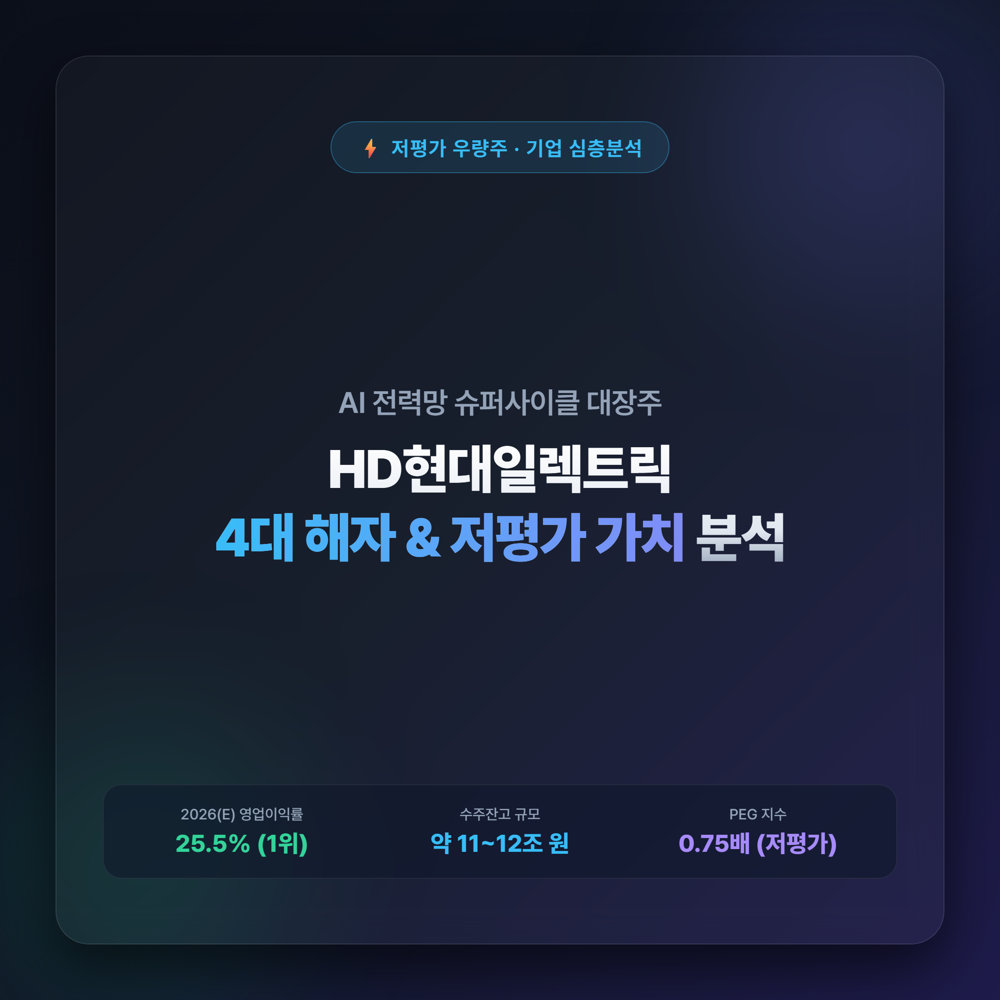
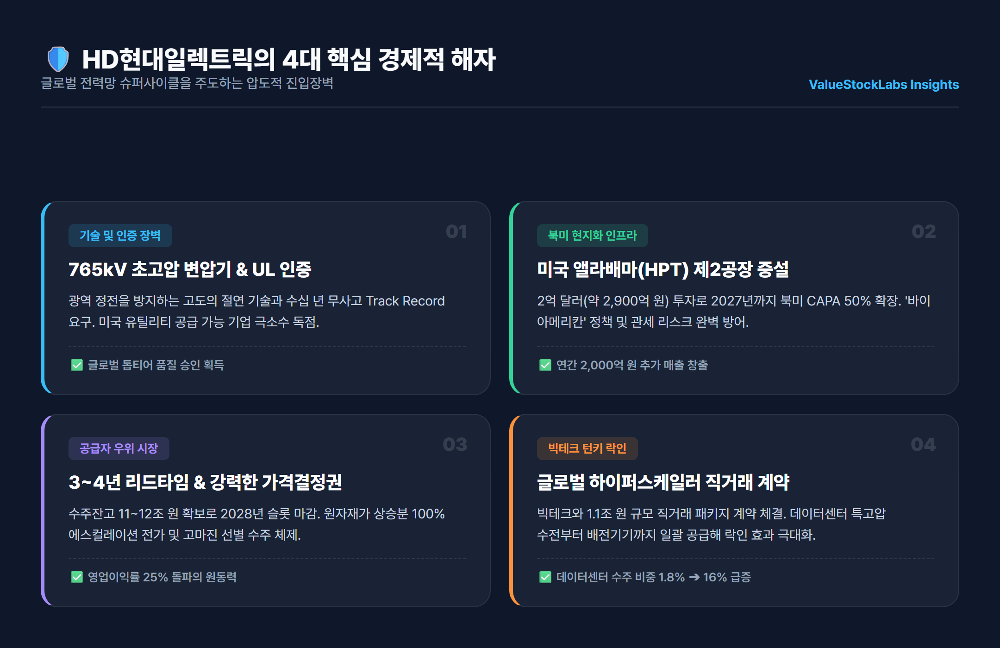
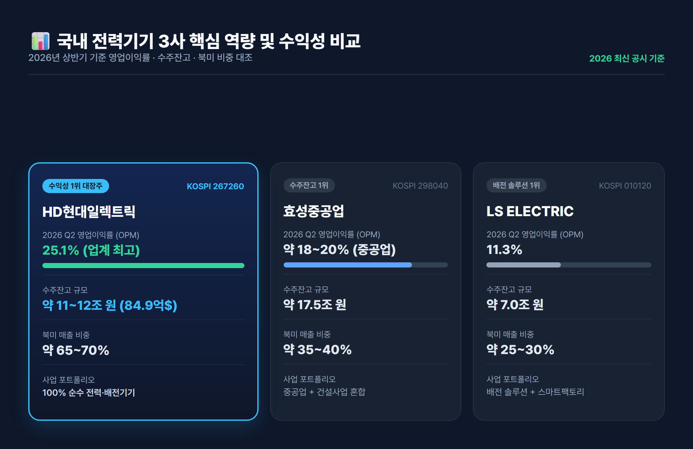
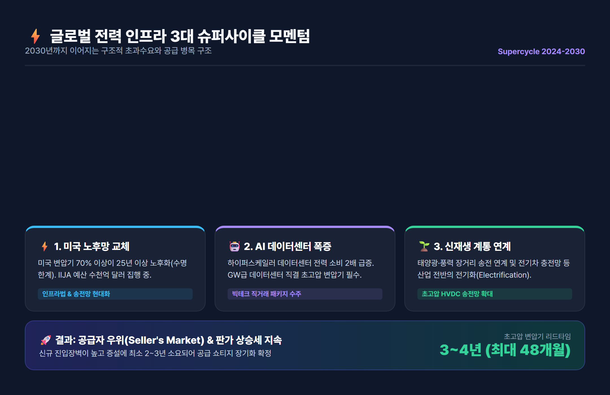
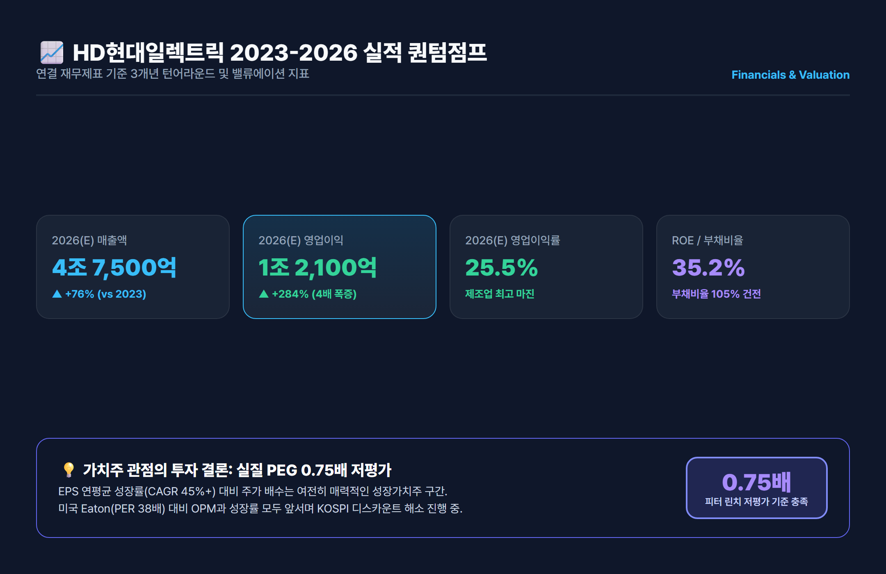

# HD현대일렉트릭 기업분석: 전력 슈퍼사이클 해자·경쟁사·실적과 저평가 가치 총정리

> 글로벌 AI 데이터센터와 미국 전력망 교체 슈퍼사이클의 최대 수혜주 HD현대일렉트릭! 독보적인 4대 경제적 해자와 영업이익률 25% 돌파 비결, 경쟁사 비교 및 재무제표 가치평가를 명쾌하게 분석합니다.

---

## 목차
- [1. 기업 개요 및 4대 핵심 경제적 해자](#1-기업-개요-및-4대-핵심-경제적-해자)
- [2. 국내외 전력기기 경쟁사 비교 분석](#2-국내외-전력기기-경쟁사-비교-분석)
- [3. 글로벌 전력 인프라 3대 슈퍼사이클 전망](#3-글로벌-전력-인프라-3대-슈퍼사이클-전망)
- [4. 재무제표 퀀텀점프 및 저평가(PEG) 밸류에이션](#4-재무제표-퀀텀점프-및-저평가peg-밸류에이션)
- [5. 투자 결론 및 리스크 점검](#5-투자-결론-및-리스크-점검)

---

## 1. 기업 개요 및 4대 핵심 경제적 해자

**HD현대일렉트릭(267260)**은 2017년 현대중공업 전기전자시스템 사업부문에서 인적분할되어 설립된 국내 대표 전력기기 및 에너지 솔루션 전문 기업입니다. 발전소에서 만들어진 전기를 송전망을 통해 대도시와 산업시설, 데이터센터로 전달하는 데 필수적인 **초고압 변압기(UHV Transformer), 고압 차단기(GIS), 배전반** 등을 일괄 공급하는 글로벌 톱티어 제조사입니다.

최근 HD현대일렉트릭이 글로벌 증시에서 폭발적인 관심을 받는 이유는 단순한 경기 순환을 넘어 구조적인 **4대 경제적 해자(Economic Moats)**를 구축했기 때문입니다.

### ① 765kV 초고압 변압기 기술력과 UL/IEEE 인증 장벽
초고압(500kV~765kV) 변압기는 고전압·대용량 전력을 손실 없이 승압·강압해야 하므로 고도의 절연 기술과 전자기 해석 기술이 요구됩니다. 제품 고장 시 광역 정전(Blackout)이라는 치명적 재난으로 이어지기 때문에 미국 유틸리티 기업들은 보수적인 기준과 수십 년간의 무사고 레퍼런스(Track Record)를 요구합니다. 이 조건을 만족하며 미국 시장에 대규모로 공급할 수 있는 기업은 전 세계에서 손에 꼽힙니다.

### ② 미국 앨라배마 현지 공장(HPT)의 독점적 인프라 우위
HD현대일렉트릭은 미국 앨라배마주 몽고메리에 현지 생산법인(HPT)을 보유하고 있습니다. 특히 약 2억 달러(약 2,900억 원)를 투입해 **제2공장 증설(2027년 준공 목표)**을 진행 중이며, 완공 시 북미 현지 초고압 변압기 생산능력(CAPA)은 50% 이상 급증합니다. 이는 미국의 '바이 아메리칸(Buy American)' 인센티브를 선점하고 고율 관세 리스크를 원천 차단하는 핵심 방패가 됩니다.

### ③ 3~4년 납기(Lead-Time) 장벽과 강력한 가격 결정력(Seller's Market)
현재 전 세계 초고압 변압기 시장은 공급이 수요를 턱없이 따라가지 못하는 완전한 '공급자 우위 시장'입니다. 리드타임이 과거 1년에서 **3~4년(최대 48개월)**까지 늘어나면서 2028~2029년 납기 물량까지 채워지고 있습니다. 이에 따라 원자재 가격 상승분을 전액 판가에 연동(에스컬레이션)시키며 고마진 일감만 선별 수주하는 압도적 가격 결정권을 확보했습니다.

### ④ 글로벌 빅테크 데이터센터 직거래 턴키 패키지 수주
과거 전력회사(유틸리티) 위주의 수주에서 벗어나 마이크로소프트, 아마존, 구글 등 하이퍼스케일러 빅테크 기업들과 1조 1,000억 원 규모의 대규모 직거래 계약을 체결했습니다. 데이터센터 특고압 수전부터 실내 정밀 배전기기까지 턴키(Turn-key)로 일괄 공급하는 락인(Lock-in) 구조를 완성했습니다.

---

## 2. 국내외 전력기기 경쟁사 비교 분석

글로벌 전력기기 슈퍼사이클 속에서 국내 전력 3사(HD현대일렉트릭, 효성중공업, LS ELECTRIC)는 각기 다른 사업 포트폴리오와 수익 구조를 가지고 있습니다.

| 비교 항목 | HD현대일렉트릭 (267260) | 효성중공업 (298040) | LS ELECTRIC (010120) |
|---|---|---|---|
| **핵심 제품군** | 초고압 변압기, 고압차단기, 배전반 | 초고압 변압기, STATCOM, 건설 | 배전기기, 스마트그리드, 인버터 |
| **2026년 2분기 OPM** | **25.1% (업계 독보적 1위)** | 약 18~20% (중공업 기준) | 11.3% |
| **수주잔고 규모** | **약 84.9억 달러 (11~12조 원)** | 약 17.5조 원 (건설 포함) | 약 7.0조 원 |
| **북미 매출 비중** | **약 65~70% (가장 높음)** | 약 35~40% | 약 25~30% |
| **사업 순수성** | 전력·배전기기 100% 순수 전력주 | 중공업 + 건설 혼합 구조 | 전력 배전 + 자동화 솔루션 |

### 경쟁사 대비 HD현대일렉트릭만의 차별화 포인트
1. **제조업의 한계를 넘는 25.1% 영업이익률**: 효성중공업과 LS일렉트릭 대비 북미 초고압 변압기 비중이 압도적으로 높아 판가 프리미엄과 마진율이 가장 뛰어납니다.
2. **건설 리스크가 없는 순수 전력주**: 효성중공업의 경우 우수한 중공업 역량에도 불구하고 국내 건설 부문의 우발채무나 미분양 리스크가 혼재되어 있으나, HD현대일렉트릭은 100% 순수 전력기기로 구성되어 밸류에이션 디스카운트가 없습니다.
3. **글로벌 메이저(Hitachi, Siemens, Eaton) 대비 기동성**: 히타치 에너지나 지멘스 에너지는 거대한 조직으로 인해 북미 고객사의 커스텀 스펙 요구와 빠른 납기 대응에 한계가 있는 반면, HD현대일렉트릭은 울산 공장의 고효율 라인과 앨라배마 공장을 연계한 최상의 납기 신뢰성을 자랑합니다.

---

## 3. 글로벌 전력 인프라 3대 슈퍼사이클 전망

전력기기 시장의 호황은 일시적 테마가 아닙니다. 아래 3가지 거대한 구조적 동인이 맞물려 최소 **2030년까지 지속될 메가 트렌드**로 평가받습니다.

### 1) 미국 송배전망의 심각한 노후화 및 교체 주기 도래
미국 에너지부(DOE)에 따르면 미국 내 설치된 대형 전력 변압기의 **70% 이상이 25년 이상 노후화**되었습니다. 변압기의 통상 설계 수명이 30~40년임을 감안하면 교체 한계치에 도달한 것입니다. 미국 정부의 인프라 투자 및 일자리법(IIJA)에 따른 수천억 달러 규모의 전력망 현대화 예산이 본격 집행되면서 안정적인 교체 수요가 뒷받침되고 있습니다.

### 2) 생성형 AI 및 빅테크 하이퍼스케일러 데이터센터 전력 소비 폭증
AI 칩(GPU, TPU) 연산에는 기존 서버 대비 수배에서 수십 배의 전력이 소모됩니다. 국제에너지기구(IEA)는 글로벌 데이터센터 전력 소비량이 2026년까지 2배 이상 급증할 것으로 전망했습니다. 특히 기가와트(GW)급 차세대 데이터센터가 확충되면서 발전소 전력을 직결 수전할 수 있는 345kV/765kV 초고압 변압기 수요가 전례 없는 수준으로 폭증하고 있습니다.

### 3) 신재생에너지 계통 연계 및 글로벌 전기화(Electrification)
태양광 및 풍력 발전소는 대도시 수요처와 멀리 떨어진 해안이나 사막 지역에 건설됩니다. 이를 장거리 송전선로에 손실 없이 싣기 위해서는 고효율 초고압 변압기가 필수적입니다. 또한 전기차 충전 인프라와 산업 전반의 전기화 전환이 가속화되면서 배전망 증설 수요까지 동반 폭발하고 있습니다.

---

## 4. 재무제표 퀀텀점프 및 저평가(PEG) 밸류에이션

HD현대일렉트릭의 재무제표는 지난 3년간 '환골탈태'라는 표현이 어울릴 정도로 가파른 퀀텀점프를 기록하고 있습니다.

### 📊 주요 재무제표 실적 및 컨센서스 (K-IFRS 연결 기준)
| 주요 재무 지표 (단위: 억 원) | 2023년 | 2024년 (확정) | 2025년 (E) | 2026년 (E) |
|---|---|---|---|---|
| **매출액** | 27,028 | 35,200 | 41,800 | **47,500** |
| **영업이익** | 3,152 | 6,650 | 9,800 | **12,100** |
| **영업이익률 (OPM)** | 11.7% | 18.9% | 23.4% | **25.5%** |
| **당기순이익** | 2,595 | 5,100 | 7,600 | **9,450** |
| **ROE (자기자본이익률)** | 30.2% | 34.5% | 36.8% | **35.2%** |
| **부채비율** | 178% | 135% | 118% | **105%** |

### 💡 저평가 주식 섹션 관점: 왜 지금도 매력적인 '성장 가치주'인가?

1. **피터 린치 PEG(주가수익성장비율) 기준 명백한 저평가**:
   - 겉으로 보이는 PER 지표(약 30~35배)만 보면 고평가처럼 착각할 수 있습니다.
   - 그러나 주당순이익(EPS)이 매년 40~50%씩 급증하고 있다는 점을 반영한 **PEG 지수는 0.75배 수준**에 불과합니다. 전설적인 가치투자자 피터 린치는 PEG 1.0 미만을 '성장 대비 저평가된 매력적 매수 구간'으로 규정했습니다.
2. **글로벌 피어 대비 밸류에이션 디스카운트**:
   - 글로벌 전력기기 선두 기업인 미국 Eaton(PER 38배, OPM 17%)이나 프랑스 Schneider Electric(PER 32배, OPM 18%)과 비교할 때, HD현대일렉트릭은 영업이익률(25.5%)과 이익 성장률 모두 압도적 우위에 있음에도 상대적으로 낮은 멀티플을 적용받고 있습니다.
3. **재무 건전성 개선과 실질 순현금 전환**:
   - 부채비율이 2020년 200% 초과에서 2026년 105%로 대폭 개선되었으며, 매년 수천억 원의 잉여현금흐름(FCF)이 유입되며 향후 배당 확대 및 자사주 소각 등 주주환원 여력이 극대화되고 있습니다.

---

## 5. 투자 결론 및 리스크 점검

### 🎯 핵심 투자 포인트 3줄 요약
1. **독보적인 해자**: 미국 앨라배마 공장 증설과 765kV 인증, 4년치 수주잔고로 2028년까지 실적 가시성 완벽 확보.
2. **압도적인 수익성**: 영업이익률 25% 돌파 및 2026년 연간 영업이익 1.2조 원 클럽 입성 확실시.
3. **실질 저평가 매력**: 연 40% 이상 성장하는 순이익 대비 PEG 0.75배로 프리미엄 전력 가치주로서의 재평가(Re-rating) 진행 중.

### ⚠️ 투자 시 유의해야 할 리스크 요인
- **구리 등 주요 원자재 가격 변동**: 에스컬레이션 조항이 장착되어 있으나 단기 급등 시 마진 변동성 가능성.
- **환율 변동성**: 수출 비중이 70%를 상회하므로 원/달러 환율 급락 시 원화 환산 실적 영향.
- **글로벌 경기 둔화에 따른 인프라 투자 지연 여부**: 단, 전력망 교체와 AI 데이터센터는 필수재 성격이 강해 타격이 제한적.

---

*면책 조항: 본 글은 신뢰할 수 있는 공개된 금융 데이터 및 기업 공시를 바탕으로 작성된 정보 제공 목적의 콘텐츠이며, 특정 금융상품이나 주식에 대한 매수·매도 권유가 아닙니다. 모든 투자의 최종 결정과 손익에 대한 책임은 투자자 본인에게 있습니다.*

---

## 📚 참고 출처 (References)
1. [DART 전자공시시스템](https://dart.fss.or.kr) - HD현대일렉트릭 정기 사업보고서 및 분기 실적 공시
2. [HD현대 공식 뉴스룸](https://www.hd.com) - 미국 앨라배마 제2공장 투자 계획 및 빅테크 턴키 계약 보도자료
3. [에프앤가이드(FnGuide)](https://www.fnguide.com) - 국내 전력기기 3사 재무제표 및 컨센서스 데이터
4. [미국 에너지부(DOE)](https://www.energy.gov) - Large Power Transformer(LPT) 공급망 리포트 및 전력망 현대화 가이드
5. [국제에너지기구(IEA)](https://www.iea.org) - Electricity 2024-2026 Analysis and Forecast Reports
