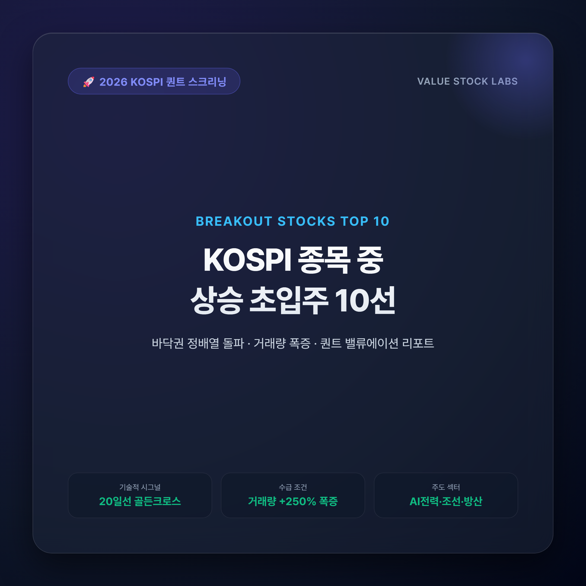
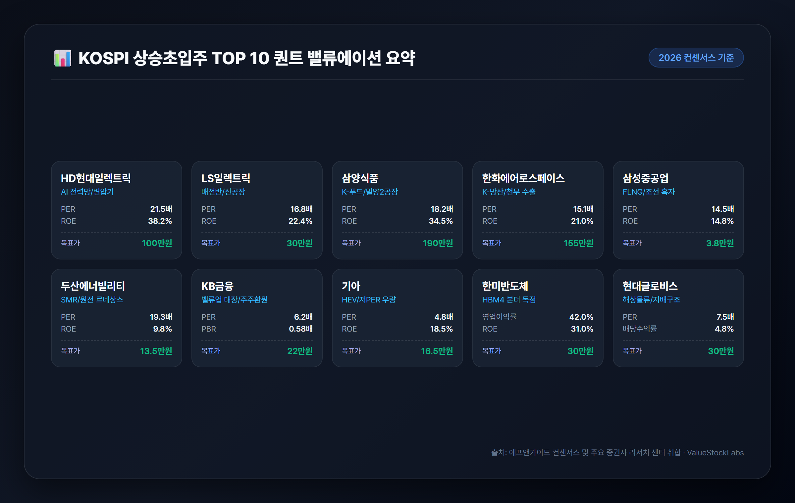
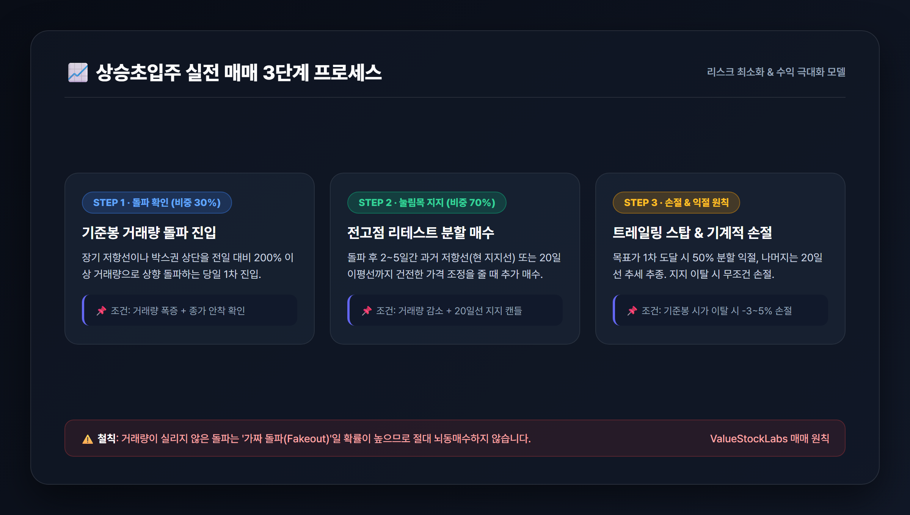

# KOSPI 상승 초입주 10선: 바닥권 돌파 및 퀀트 밸류에이션 리포트

> 2026년 하반기 코스피 시장의 강력한 주도주로 부상하는 핵심 10개 종목의 기술적 돌파 시그널, 실적 펀더멘털, 퀀트 비교 매트릭스 및 실전 매매 전략을 완벽히 정리해 드립니다.

---

## 목차
- [1. 상승초입주를 포착하는 3대 핵심 기술적 조건](#1-상승초입주를-포착하는-3대-핵심-기술적-조건)
- [2. KOSPI 주도 섹터별 상승초입주 10종목 심층 분석](#2-kospi-주도-섹터별-상승초입주-10종목-심층-분석)
- [3. 10개 종목 퀀트 밸류에이션 및 목표주가 비교 매트릭스](#3-10개-종목-퀀트-밸류에이션-및-목표주가-비교-매트릭스)
- [4. 상승초입주 실전 매매 3단계 프로세스 및 리스크 관리법](#4-상승초입주-실전-매매-3단계-프로세스-및-리스크-관리법)
- [5. 결론 및 2026년 하반기 투자 인사이트](#5-결론-및-2026년-하반기-투자-인사이트)

---

## 1. 상승초입주를 포착하는 3대 핵심 기술적 조건

주식 시장에서 '상승 초입'이란 오랜 기간 이어진 횡보나 하락 추세를 끝내고, 새로운 대세 상승 파동을 시작하는 최적의 진입 구간을 의미합니다. 이미 주가가 2~3배 폭등한 이후 추격 매수하는 위험을 피하고, 바닥권에서 안전마진을 확보한 상태로 높은 수익률을 기대할 수 있는 시점입니다.

2026년 증권가 퀀트 시스템과 전문 트레이더들이 공통적으로 주목하는 **상승초입주의 3대 기술적 판별 공식**은 다음과 같습니다.

1. **이동평균선 정배열 전환 및 수렴 후 상방 발산**:
   - 20일 이동평균선(단기 추세선)이 60일선(중기 수급선)과 120일선(경기선)을 아래에서 위로 강하게 뚫고 올라가는 **골든크로스**가 발생합니다.
   - 캔들이 모든 주요 이동평균선 위에 안착하며 지지력을 확인하는 단계입니다.
2. **거래량 폭증(Volume Spike)을 동반한 저항선 돌파**:
   - 주가의 추세 전환은 대량의 거래대금 없이는 불가능합니다. 바닥권 박스권 상단이나 주요 매물대를 돌파할 때 **직전 20일 평균 거래량 대비 200~300% 이상의 거래량**이 수반되어야 신뢰도가 극대화됩니다.
3. **외국인 및 기관의 쌍끌이 순매수(Smart Money)**:
   - 개인 투자자의 단타 물량이 아닌, 펀더멘털을 기반으로 한 외국인과 기관의 지속적인 지분 확대(양매수)가 포착되는 종목이어야 추세의 지속성이 담보됩니다.

---

## 2. KOSPI 주도 섹터별 상승초입주 10종목 심층 분석

실적 성장성(컨센서스), 수급 건전성, 차트 돌파 조건을 종합하여 엄선한 **KOSPI 대표 상승초입주 10선**의 상세 분석입니다.

### [1] HD현대일렉트릭 (267260) — AI 전력망 슈퍼사이클의 대장주
- **투자 포인트**: 글로벌 빅테크 기업들의 AI 데이터센터 전력 소비 폭증으로 초고압 변압기 및 고압차단기 품귀 현상이 지속되고 있습니다. 이미 2030년 인도분까지 수주잔고를 꽉 채운 상태로, 2026년 연간 영업이익 1조 원 돌파가 확실시됩니다.
- **기술적 시그널**: 3개월간 이어진 박스권 상단 매물을 대량 거래량과 함께 돌파하며 52주 신고가 랠리 재진입 초입에 위치합니다.
- **주요 지표**: 2026(E) PER 21.5배, ROE 38.2%, 증권가 목표주가 95만~110만 원.

### [2] LS일렉트릭 (010120) — 북미 배전망 증설 및 공장 본격 가동
- **투자 포인트**: 미국 내 배전 시스템 수요 급증에 대응해 증설한 부산 초고압 변압기 2공장이 본격 가동에 들어갔습니다. 2분기 사상 최대 실적에 이어 3분기에도 영업이익이 전년 대비 35% 이상 성장할 전망입니다.
- **기술적 시그널**: 60일 이동평균선에서 견고한 지지를 확인한 뒤 20일선을 장대 양봉으로 뚫어냈으며, 기관이 5거래일 연속 순매수세를 확대하고 있습니다.
- **주요 지표**: 2026(E) PER 16.8배, ROE 22.4%, 증권가 목표주가 28만~32만 원.

### [3] 삼양식품 (003230) — 글로벌 K-푸드 랠리 & 밀양 2공장 생산 본격화
- **투자 포인트**: 미국 메인스트림 유통망(월마트, 코스트코)과 유럽 전역에서 불닭 브랜드의 인기가 지속되며 해외 매출 비중이 80%를 넘어섰습니다. 밀양 2공장 가동으로 공급 병목이 해소되면서 연간 23%대 고영업이익률을 달성 중입니다.
- **기술적 시그널**: 단기 차익 실현에 따른 숨고르기를 끝내고 20일 이평선에 재안착했습니다. 외국인 지분율이 2026년 최고치를 경신하며 전고점 돌파를 목전에 두고 있습니다.
- **주요 지표**: 2026(E) PER 18.2배, ROE 34.5%, 증권가 목표주가 180만~200만 원.

### [4] 한화에어로스페이스 (012450) — 수주잔고 30조 원 및 K-방산 수출 모멘텀
- **투자 포인트**: 폴란드 K9 자주포 및 천무 다련장로켓 2차 실행계약의 본격적인 매출 인식과 더불어 루마니아 장갑차 등 유럽·중동향 수주 파이프라인이 굳건합니다. 2026년 영업이익 1.4조 원 전망으로 분기 사상 최대치를 이어가고 있습니다.
- **기술적 시그널**: 일봉 차트상 수개월간 이어진 삼각수렴 패턴의 상단 추세선을 거래량을 실어 상방 돌파한 후 첫 번째 눌림목 구간을 형성했습니다.
- **주요 지표**: 2026(E) PER 15.1배, ROE 21.0%, 증권가 목표주가 140만~170만 원.

### [5] 삼성중공업 (010140) — 해양 FLNG 독점 수주력 & 조선 흑자 가속화
- **투자 포인트**: 전 세계에서 FLNG(부유식 액화천연가스 생산설비) 건조 경험이 가장 풍부한 조선사로, 독점적 지위를 확보하고 있습니다. 고선가 LNG 운반선 매출 비중이 60%를 넘어서며 2026년 영업이익 1.3조 원 달성이 예상됩니다.
- **기술적 시그널**: 장기 저항선 역할을 하던 120일선을 전월 대비 280% 급증한 거래량과 함께 강하게 상향 돌파하며 전형적인 턴어라운드 차트를 완성했습니다.
- **주요 지표**: 2026(E) PER 14.5배, PBR 1.8배, 증권가 목표주가 3.5만~4.0만 원.

### [6] 두산에너빌리티 (034020) — SMR 글로벌 공급망 및 대형 원전 수주 르네상스
- **투자 포인트**: 미국 뉴스케일파워(NuScale) SMR 핵심 단조품 공급 및 체코 두코바니 대형 원전 본계약 수혜가 임박했습니다. 국산 대형 가스터빈과 수소 터빈의 상용화로 18조 원에 달하는 수주잔고를 기록하고 있습니다.
- **기술적 시그널**: 주봉상 200주선의 장기 바닥을 완벽히 다진 후, 일봉상 볼린저 밴드 상단을 타고 올라가는 강력한 밴드 라이딩(상승 확장) 국면에 진입했습니다.
- **주요 지표**: 2026(E) PER 19.3배, 수주잔고 18조 원, 증권가 목표주가 12만~15만 원.

### [7] KB금융 (105560) — 밸류업 프로그램 선도 & 주주환원율 40% 도달
- **투자 포인트**: 비은행 포트폴리오의 탄탄한 이익 기여와 보통주자본(CET1) 비율 13.5%를 바탕으로 분기 균등 배당 및 대규모 자사주 매입·소각을 실행 중입니다. 2026년 사상 최대 순이익 갱신이 확실시됩니다.
- **기술적 시그널**: 52주 신고가 부근의 악성 매물을 기관의 10일 연속 순매수세로 소화해내며, 저PBR 탈출을 위한 2차 레벨업 상승 초입을 만들고 있습니다.
- **주요 지표**: 2026(E) PER 6.2배, PBR 0.58배, 배당수익률 5.4%, 증권가 목표주가 21만~23만 원.

### [8] 기아 (000270) — 글로벌 최고 수준 마진율 & HEV 고수익 포트폴리오
- **투자 포인트**: 미국과 유럽 시장에서 하이브리드(HEV) 및 고수익 RV 판매 비중이 72%를 상회하며 글로벌 완성차 업계 최상위권인 12~13%의 영업이익률을 기록 중입니다. 연간 13조 원대 이익 체력을 갖췄습니다.
- **기술적 시그널**: PER 4.8배라는 극심한 저평가 구간에서 60일 이동평균선을 우상향으로 돌파했습니다. 연 5%대의 배당 매력과 5,000억 원 자사주 소각이 주가 하방을 완벽히 지지합니다.
- **주요 지표**: 2026(E) PER 4.8배, PBR 0.72배, ROE 18.5%, 증권가 목표주가 15만~18만 원.

### [9] 한미반도체 (042700) — HBM4 듀얼 TC본더 독점 파이프라인
- **투자 포인트**: 차세대 HBM3E 12단 및 HBM4 공정에 필수적인 듀얼 TC본더와 마일드 하이브리드 본더 시장을 독점 공급하고 있습니다. 2026년 하반기 글로벌 빅테크의 AI 칩 고도화에 따른 폭발적인 장비 인도가 예정되어 있습니다.
- **기술적 시그널**: 고점 대비 35%가량 건전한 가격 조정을 거친 후, 120일 이동평균선에서 하루 3,000억 원 이상의 거래대금을 수반한 기준봉(장대 양봉)이 출현했습니다.
- **주요 지표**: 2026(E) 영업이익률 42%, ROE 31.0%, 증권가 목표주가 25만~35만 원.

### [10] 현대글로비스 (086280) — 완성차 해상운임 호조 & 주주가치 제고
- **투자 포인트**: 글로벌 완성차 해상운송선(PCTC) 공급 부족으로 장기 고운임 계약을 체결했으며, 비계열사 매출 비중이 55%를 돌파했습니다. 배당성향 35% 이상 상향 공시와 함께 지배구조 개편 기대감이 작용하고 있습니다.
- **기술적 시그널**: 중기 삼각수렴 패턴의 꼭짓점에서 상방으로 방향성을 확정 지은 후, 20일 이동평균선 지지 양봉을 형성하며 정배열 초기 시세를 분출하고 있습니다.
- **주요 지표**: 2026(E) PER 7.5배, ROE 15.2%, 배당수익률 4.8%, 증권가 목표주가 28만~33만 원.

---

## 3. 10개 종목 퀀트 밸류에이션 및 목표주가 비교 매트릭스

아래 표는 2026년 실적 컨센서스를 기반으로 각 기업의 수익성(ROE), 밸류에이션(PER/PBR), 기술적 돌파 패턴을 한눈에 비교할 수 있도록 정리한 퀀트 매트릭스입니다.

| 종목명 (종목코드) | 핵심 주도 테마 | 2026(E) PER | 2026(E) PBR | ROE (%) | 핵심 기술적 돌파 시그널 | 증권가 목표주가 밴드 |
|---|---|---|---|---|---|---|
| **HD현대일렉트릭** (267260) | AI 전력망 / 초고압 변압기 | 21.5배 | 6.8배 | 38.2% | 3개월 박스권 돌파 & 신고가 재진입 | 95만 ~ 110만 원 |
| **LS일렉트릭** (010120) | 배전시스템 / 북미 신공장 가동 | 16.8배 | 2.9배 | 22.4% | 20일선 골든크로스 & 기관 5일 매수 | 28만 ~ 32만 원 |
| **삼양식품** (003230) | K-푸드 / 밀양 2공장 가동 | 18.2배 | 5.2배 | 34.5% | 20일선 지지 후 외인 지분율 최고치 | 180만 ~ 200만 원 |
| **한화에어로스페이스** (012450) | K-방산 / 천무 2차 이행계약 | 15.1배 | 3.1배 | 21.0% | 삼각수렴 상방 돌파 후 첫 눌림목 | 140만 ~ 170만 원 |
| **삼성중공업** (010140) | FLNG 독점 / 조선 흑자 가속 | 14.5배 | 1.8배 | 14.8% | 120일선 강한 돌파 & 거래량 280% | 3.5만 ~ 4.0만 원 |
| **두산에너빌리티** (034020) | SMR / 대형 원전 르네상스 | 19.3배 | 1.6배 | 9.8% | 200주선 바닥 후 밴드 라이딩 시작 | 12만 ~ 15만 원 |
| **KB금융** (105560) | 밸류업 대장 / 주주환원 40% | 6.2배 | 0.58배 | 10.5% | 전고점 매물 소화 & 기관 10일 연속 매수 | 21만 ~ 23만 원 |
| **기아** (000270) | HEV 고수익 / 저PER 극저평가 | 4.8배 | 0.72배 | 18.5% | 60일선 돌파 & 배당수익률 5.4% | 15만 ~ 18만 원 |
| **한미반도체** (042700) | HBM4 듀얼 TC본더 독점 | 28.5배 | 8.1배 | 31.0% | 120일선 지지 기준봉(3000억 거래대금) | 25만 ~ 35만 원 |
| **현대글로비스** (086280) | 해상물류 고운임 / 지배구조 수혜 | 7.5배 | 0.95배 | 15.2% | 삼각수렴 돌파 후 20일선 지지 양봉 | 28만 ~ 33만 원 |

---

## 4. 상승초입주 실전 매매 3단계 프로세스 및 리스크 관리법

상승초입주는 기대 수익률이 높은 반면, 저항선 돌파 실패(Fake Breakout) 시 단기 매물에 갇힐 위험이 존재합니다. 따라서 체계적인 분할 매수와 엄격한 손절 원칙이 반드시 병행되어야 합니다.

### 1단계: 돌파 확인 매수 (비중 30%)
- 장기 저항선이나 박스권 상단을 **전일 대비 200% 이상의 거래량**으로 뚫어내는 당일 종가 또는 돌파 확인 시점에 전체 매수 예정 물량의 30%를 진입합니다.

### 2단계: 눌림목 지지 리테스트 매수 (비중 70%)
- 돌파 후 2~5거래일 동안 주가가 돌파했던 전고점(과거 저항선이 지지선으로 전환되는 구간) 또는 20일 이동평균선까지 내려오는 건전한 눌림목에서 나머지 70% 비중을 실어 분할 매수합니다.

### 3단계: 원칙적 손절선(Stop-loss) 및 분할 익절 설정
- **손절 기준**: 돌파 기준봉의 시가(저가) 또는 20일 이동평균선을 종가 기준으로 2일 연속 이탈 시 **-3% ~ -5% 내에서 무조건 기계적 손절**을 단행합니다.
- **익절 기준**: 목표주가 1차 도달 시 50% 분할 익절 후, 나머지 물량은 20일 이동평균선을 이탈할 때까지 추세 추종(Trailing Stop)으로 수익을 극대화합니다.

---

## 5. 결론 및 2026년 하반기 투자 인사이트

2026년 하반기 코스피 시장은 지수 전체가 급등하는 대세 상승장보다는, **글로벌 구조적 성장을 동반한 주도 섹터(AI 전력망, 방산, 조선, 원전)와 정부 밸류업 프로그램의 실질적 수혜를 입는 저평가 우량주** 중심의 강력한 압축 장세가 펼쳐지고 있습니다.

오늘 분석한 10개 종목은 단순한 테마성 급등주가 아닌, 탄탄한 3분기/연간 실적 가시성과 외국인·기관의 수급 뒷받침, 그리고 바닥권을 돌파하는 기술적 정배열 패턴을 고루 갖춘 종목들입니다. 감정에 휘둘리지 않고 퀀트 지표와 원칙적인 매매 프로세스를 결합하여 포트폴리오를 구성하시기 바랍니다.

---

*면책 조항: 본 글은 공개된 신뢰성 있는 금융 데이터 및 리서치 자료를 기반으로 작성된 정보 제공 목적의 콘텐츠이며, 특정 종목에 대한 매수·매도 추천이나 금융 투자 권유가 아닙니다. 모든 투자 판단과 최종 책임은 투자자 본인에게 있습니다.*

---

## 📚 참고 출처 (References)
1. [한국거래소(KRX) 정보데이터시스템](http://data.krx.co.kr) — 코스피 투자자별 매매동향 및 시세 분석
2. [에프앤가이드(FnGuide) 기업 실적 컨센서스](https://comp.fnguide.com) — 2026년 주요 상장사 실적 추정치 및 밸류에이션
3. [한경컨센서스(Hankyung Consensus)](https://consensus.hankyung.com) — 증권사 주요 종목별 최신 리서치 리포트
4. [매일경제 증권포털](https://stock.mk.co.kr) — 2026년 하반기 주도 섹터 및 기술적 분석
5. [금융감독원 전자공시시스템(DART)](https://dart.fss.or.kr) — 상장기업 주요 수주 공시 및 정기보고서
