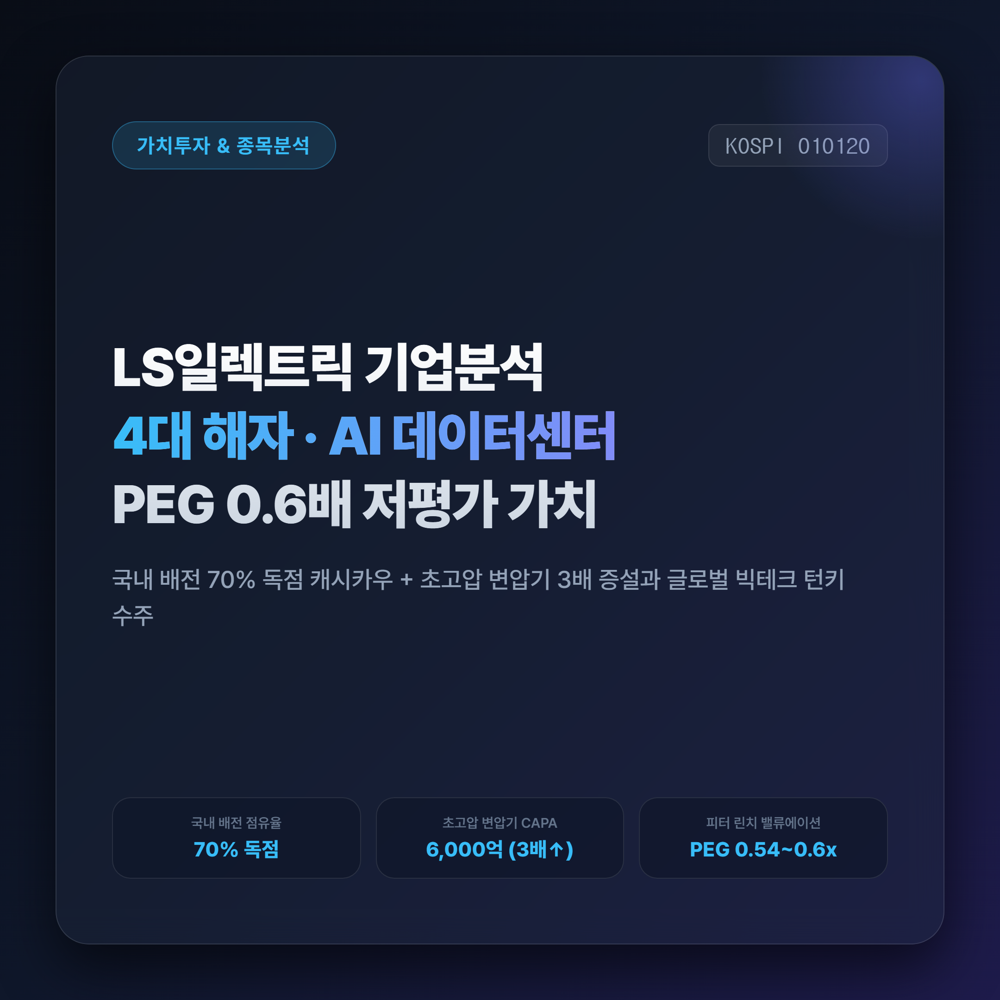
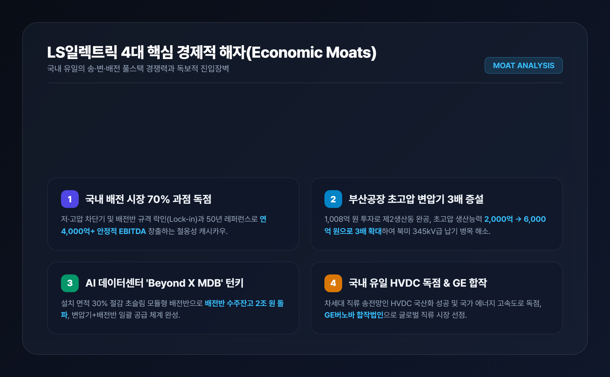
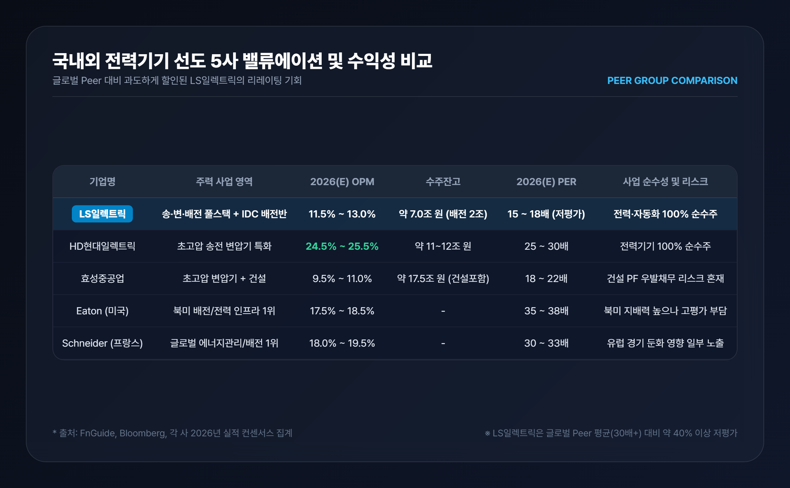
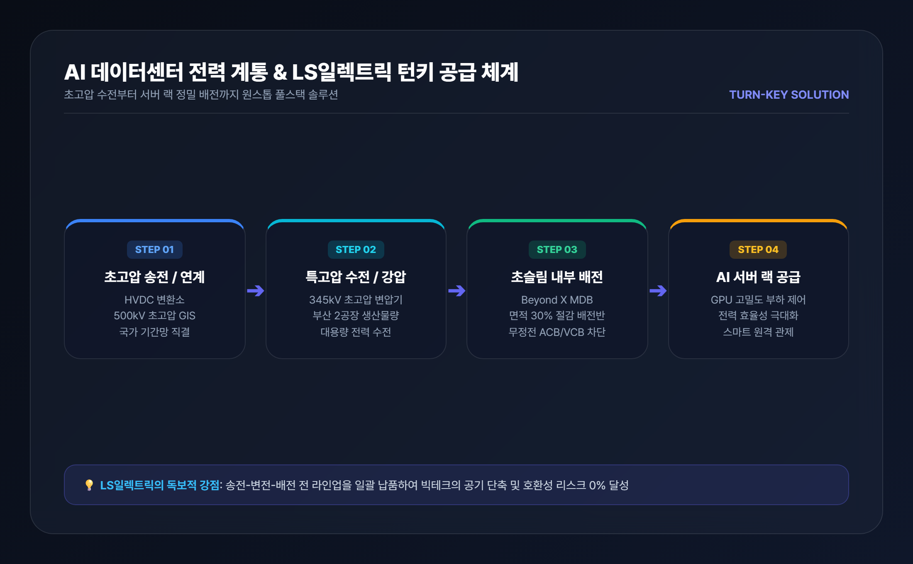
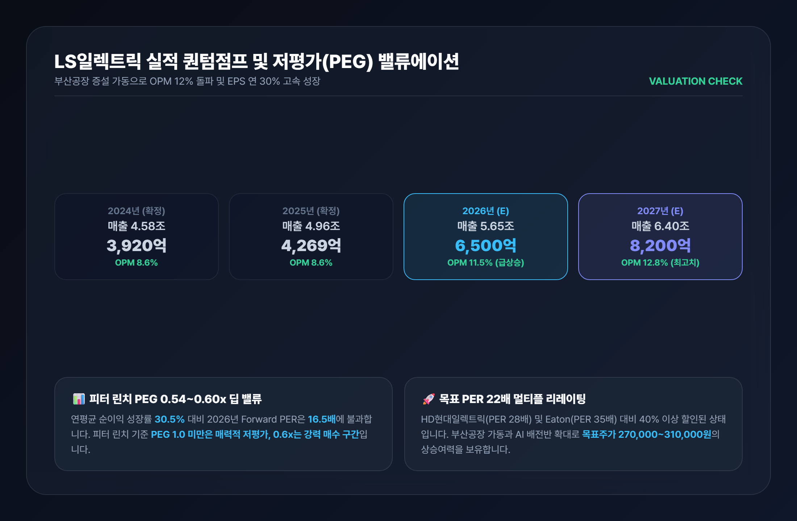

# LS일렉트릭 기업분석: 4대 경제적 해자·경쟁사 비교 및 저평가(PEG) 가치 총정리

> 글로벌 AI 데이터센터와 북미 전력망 교체 슈퍼사이클의 실질적 수혜주 LS일렉트릭! 국내 70% 배전 과점 해자와 초고압 변압기 3배 증설, 국내외 경쟁사 비교 및 밸류에이션 저평가(PEG 0.6배)를 명쾌하게 분석합니다.

---

## 목차
- [1. 기업 개요 및 4대 핵심 경제적 해자](#1-기업-개요-및-4대-핵심-경제적-해자)
- [2. 국내외 전력기기 경쟁사 심층 비교 분석](#2-국내외-전력기기-경쟁사-심층-비교-분석)
- [3. 사업 부문별 솔루션과 AI 데이터센터 슈퍼사이클](#3-사업-부문별-솔루션과-ai-데이터센터-슈퍼사이클)
- [4. 재무제표 퀀텀점프 및 저평가(PEG 0.6x) 밸류에이션](#4-재무제표-퀀텀점프-및-저평가peg-06x-밸류에이션)
- [5. 투자 결론 및 리스크 점검](#5-투자-결론-및-리스크-점검)

---

## 1. 기업 개요 및 4대 핵심 경제적 해자

**LS일렉트릭(010120)**은 1974년 설립 이래 50년간 대한민국 전력망의 척추 역할을 담당해 온 국내 대표 전력 인프라 및 스마트에너지 솔루션 전문 기업입니다. 발전소에서 생산된 전기가 송전선로와 변전소를 거쳐 공장, 상업시설, 아파트, 그리고 최근 폭발적으로 증가하는 **AI 하이퍼스케일러 데이터센터**로 전달되는 전 과정을 아우르는 **송전(Transmission) → 변전(Substation) → 배전(Distribution)** 풀스택 공급 역량을 갖춘 국내 유일의 기업입니다.

단순한 경기 민감 제조업을 넘어 시장 지배력을 유지하는 LS일렉트릭의 **4대 핵심 경제적 해자(Economic Moats)**는 다음과 같습니다.

### ① 국내 배전(Distribution) 시장 70% 독점 과점과 높은 전환비용(Switching Cost)
전력 배전기기(기중차단기 ACB, 배선용차단기 MCCB, 진공차단기 VCB 등)는 산업 설비의 두뇌이자 심장입니다. 안전성과 규격 호환성이 최우선이므로 기존 설비와 호환되지 않는 타사 제품으로 교체하기가 극히 어렵습니다. LS일렉트릭은 국내 배전 시장 점유율 70%를 바탕으로 연간 4,000억~5,000억 원의 탄탄한 영업현금흐름(EBITDA)을 창출하는 독점적 캐시카우를 보유하고 있습니다.

### ② 부산사업장 초고압 변압기 CAPA 3배 증설(2,000억 → 6,000억 원)
LS일렉트릭은 약 1,008억 원을 투자해 부산사업장 내 초고압 변압기 제2생산동을 완공하고 2025년 12월 준공식을 마쳤습니다. 이를 통해 초고압 변압기 연간 생산능력이 **기존 2,000억 원에서 6,000억 원으로 3배 확대**되었으며, 2026년부터 본격 가동되면서 345kV급 이상 북미향 고수익 초고압 수주 물량을 빠르게 소화하고 있습니다.

### ③ AI 데이터센터 전용 초슬림 배전반('Beyond X MDB') 턴키 공급력
AI 연산 서버는 막대한 전력을 소모하므로 서버 랙 바로 앞단에서 정밀하게 전력을 분배하는 배전반의 공간 효율성이 필수적입니다. LS일렉트릭은 설치 면적을 30% 이상 줄인 **초슬림 모듈형 배전반 'Beyond X MDB'**를 출시하여 북미 빅테크 기업들과 연이어 공급 계약을 체결했습니다. 초고압 변압기와 배전반을 패키지로 일괄 공급하는 턴키 역량은 글로벌 시장에서도 독보적입니다.

### ④ 국내 유일 초고압직류송전(HVDC) 독점 원천기술
신재생에너지(해상풍력 등)와 대규모 발전소 전력을 장거리 송전할 때 전력 손실을 최소화하는 핵심 기술이 바로 HVDC(초고압직류송전)입니다. LS일렉트릭은 국내 최초로 HVDC 변환용 변압기 및 핵심 설비를 국산화하여 동해안-수도권 송전망 등 국가 핵심 전력망 사업을 독점 수행하고 있으며, 글로벌 기업 GE버노바와의 합작법인을 통해 글로벌 직류 전력망 시장을 선점하고 있습니다.

---

## 2. 국내외 전력기기 경쟁사 심층 비교 분석

글로벌 전력 슈퍼사이클 속에서 국내 전력 3사(HD현대일렉트릭, 효성중공업, LS일렉트릭)와 글로벌 선도기업(Schneider Electric, Eaton)은 각기 다른 포트폴리오를 보유하고 있습니다.

| 비교 항목 | LS일렉트릭 (010120) | HD현대일렉트릭 (267260) | 효성중공업 (298040) | Eaton (미국 ETN) | Schneider Electric (프랑스 SU) |
|---|---|---|---|---|---|
| **주력 포지셔닝** | **송·변·배전 풀스택 + IDC 배전** | 초고압 송전 변압기 특화 | 초고압 변압기 + 건설 | 북미 배전/전력 인프라 1위 | 글로벌 에너지 관리/배전 1위 |
| **2026(E) OPM** | **11.5% ~ 13.0% (수익성 급상승)** | 24.5% ~ 25.5% | 9.5% ~ 11.0% | 17.5% ~ 18.5% | 18.0% ~ 19.5% |
| **수주잔고** | **약 7.0조 원 (배전반 2조 돌파)** | 약 11.0~12.0조 원 | 약 17.5조 원 (건설 포함) | - | - |
| **사업 순수성** | **전력·에너지 100% 순수주** | 전력기기 100% 순수주 | 중공업 + **건설(PF리스크)** | 전력·산업 복합 | 에너지 관리 솔루션 |
| **2026(E) PER** | **15.0 ~ 18.0배 (현저한 저평가)** | 25.0 ~ 30.0배 | 18.0 ~ 22.0배 | 35.0 ~ 38.0배 | 30.0 ~ 33.0배 |

### 경쟁사 대비 LS일렉트릭의 3대 차별화 포인트
1. **HD현대일렉트릭 대비 수혜 범위의 확장성**:
   - HD현대일렉트릭이 송전망(변전소 간 대용량 전력 이동)에 집중되어 있다면, LS일렉트릭은 송전은 물론 **AI 데이터센터 내부의 실질적인 전력 분배(배전반/차단기)** 시장까지 장악하여 데이터센터 팽창에 따른 수혜 품목이 훨씬 다양합니다.
2. **효성중공업 대비 우수한 재무 건전성 및 순수성**:
   - 효성중공업은 건설 부문의 미분양 및 PF 우발채무 리스크로 인해 밸류에이션 디스카운트를 받지만, LS일렉트릭은 건설 리스크가 없는 100% 순수 전력·자동화 기업으로 이익의 질이 매우 높습니다.
3. **글로벌 선도사(Eaton, Schneider) 대비 신속한 납기와 가격 경쟁력**:
   - 북미 빅테크 하이퍼스케일러들이 리드타임이 긴 기존 서구권 벤더 대신 납기 대응력과 커스텀 능력이 뛰어난 LS일렉트릭을 '제1 전략적 대안(Dual Vendor)'으로 채택하며 점유율을 급속히 뺏어오고 있습니다.

---

## 3. 사업 부문별 솔루션과 AI 데이터센터 슈퍼사이클

LS일렉트릭의 사업 포트폴리오는 4대 사업 부문이 유기적으로 연결되어 시너지를 창출합니다.

### 1) 전력인프라 부문: 북미 초고압 수주 랠리
- **초고압 변압기(154kV~500kV) 및 가스절연개폐장치(GIS)**:
- 2026년 10월 북미 AI 데이터센터향 약 1,812억 원 규모의 대형 초고압 변압기 공급 계약을 체결하는 등 하이엔드 전력기기 시장에서 수주 랠리를 이어가고 있습니다.

### 2) 전력기기(배전) 부문: AI 데이터센터의 핵심 심장
- **스마트 배전반 및 저·고압 차단기**:
- 데이터센터 내부 서버 랙에 무정전 전원을 안정적으로 분배하는 초슬림 MDB 수주가 급증하며 2026년 2분기 기준 배전반 수주잔고만 2조 원을 돌파했습니다.

### 3) 자동화 솔루션 부문: 스마트팩토리와 에너지 절감
- **인버터(AC Drive) 및 PLC**:
- 공장 내 모터 속도를 정밀 제어하여 전력 소비를 30% 이상 절감하는 산업 자동화 필수 장비로, 국내외 반도체 및 2차전지 공장에 표준 장비로 공급됩니다.

### 4) 스마트에너지 부문: 신재생 계통 연계 및 차세대 전력망
- **대용량 ESS & EV Relay**:
- 신재생 발전소 출력 안정화 ESS와 전기차 배터리 고전압을 차단·제어하는 EV Relay를 글로벌 완성차 기업들에 공급하며 미래 성장 동력을 확보했습니다.

---

## 4. 재무제표 퀀텀점프 및 저평가(PEG 0.6x) 밸류에이션

부산 초고압 변압기 제2공장 가동과 북미 데이터센터향 고마진 수주가 본격 매출로 인식되면서 실적 레벨이 완전히 달라지고 있습니다.

### 📊 주요 재무제표 실적 및 컨센서스 (K-IFRS 연결 기준)
| 주요 재무 지표 (단위: 억 원) | 2023년 | 2024년 | 2025년 | 2026년 (E) | 2027년 (E) |
|---|---|---|---|---|---|
| **매출액** | 42,305 | 45,800 | 49,622 | **56,500** | **64,000** |
| **영업이익** | 3,249 | 3,920 | 4,269 | **6,500** | **8,200** |
| **영업이익률 (OPM)** | 7.7% | 8.6% | 8.6% | **11.5%** | **12.8%** |
| **당기순이익** | 2,455 | 2,850 | 3,200 | **4,950** | **6,300** |
| **ROE (자기자본이익률)** | 14.8% | 15.6% | 16.2% | **21.5%** | **23.0%** |
| **부채비율** | 158% | 142% | 128% | **112%** | **98%** |

### 💡 저평가 주식 섹션 관점: 왜 지금 LS일렉트릭이 극단적 저평가인가?

1. **피터 린치 PEG(주가수익성장비율) 0.6배 수준의 딥 밸류(Deep Value)**:
   - 2025~2027년 예상 연평균 주당순이익(EPS) 성장률은 **약 30.5%**에 달합니다.
   - 2026년 기준 Forward PER 16.5배를 적용하면 **PEG는 약 0.54~0.60배**에 불과합니다.
   - 피터 린치는 PEG 1.0 미만을 매력적 저평가, 0.5 수준을 '탁월한 매수 기회'로 보았습니다.
2. **동종업계 대비 40% 이상 할인된 멀티플 디스카운트 해소 국면**:
   - HD현대일렉트릭(PER 25~30배), 미국 Eaton(PER 35배), 프랑스 Schneider Electric(PER 32배)과 비교할 때, LS일렉트릭(PER 16배)은 여전히 과거의 '저마진 배전주' 취급을 받고 있습니다.
   - 부산 초고압 변압기 증설과 데이터센터 배전반 공급 확대로 OPM이 12%를 돌파함에 따라 **목표 PER 22~25배로의 멀티플 리레이팅(Re-rating)**이 정당화됩니다.
3. **재무구조 개선과 순현금 흐름 창출**:
   - 부채비율이 2023년 158%에서 2027년 98%까지 하락하며 재무 안정성이 극대화되고, 막대한 잉여현금흐름(FCF)을 바탕으로 주주환원(배당 확대) 여력이 커지고 있습니다.

---

## 5. 투자 결론 및 리스크 점검

### 🎯 핵심 투자 포인트 3줄 요약
1. **철옹성 배전 해자 + 초고압 3배 성장**: 국내 배전 70% 독점 캐시카우 위에 부산공장 초고압 CAPA 3배 증설로 실적 폭발.
2. **AI 데이터센터 턴키 수혜**: 초슬림 배전반('Beyond X MDB')과 초고압 변압기 패키지 수주로 수주잔고 7조 원 돌파.
3. **독보적인 저평가 매력**: 연 30% 순이익 성장 대비 Forward PER 16배, PEG 0.6배로 글로벌 피어 대비 40% 저평가 매수 적기.

### ⚠️ 투자 시 유의해야 할 리스크 요인
- **구리 등 주요 원자재 가격 변동**: 주요 수주 계약에 에스컬레이션(원자재가 연동) 조항이 있어 판가 전가가 가능하나 단기 마진 변동 가능성 존재.
- **국내외 설비투자(CAPEX) 사이클 둔화 여부**: 다만 북미 노후 전력망 교체와 빅테크 데이터센터는 국가 전략 필수 인프라로 지속 집행 중.
- **원/달러 환율 변동성**: 수출 비중 확대에 따른 환율 민감도 점검 필요.

---

*면책 조항: 본 글은 신뢰할 수 있는 공개된 금융 데이터 및 기업 공시를 바탕으로 작성된 정보 제공 목적의 콘텐츠이며, 특정 금융상품이나 주식에 대한 매수·매도 권유가 아닙니다. 모든 투자의 최종 결정과 손익에 대한 책임은 투자자 본인에게 있습니다.*

---

## 📚 참고 출처 (References)
1. [DART 전자공시시스템](https://dart.fss.or.kr) - LS ELECTRIC 정기 사업보고서, 분기보고서 및 시설투자 공시
2. [LS ELECTRIC 공식 뉴스룸](https://www.ls-electric.com) - 초고압 변압기 제2생산동 준공 및 Beyond X MDB 보도자료
3. [에프앤가이드(FnGuide)](https://www.fnguide.com) - 국내 전력기기 3사 재무제표 및 컨센서스 데이터
4. [미국 에너지부(DOE)](https://www.energy.gov) - Large Power Transformer(LPT) 공급망 리포트 및 전력망 현대화 가이드
5. [국제에너지기구(IEA)](https://www.iea.org) - Electricity 2024-2026 AI Data Center Energy Demand
6. [증권사 리서치 리포트](https://finance.naver.com/research/) - 미래에셋증권, 신한투자증권, NH투자증권 LS일렉트릭 종목 분석 보고서
