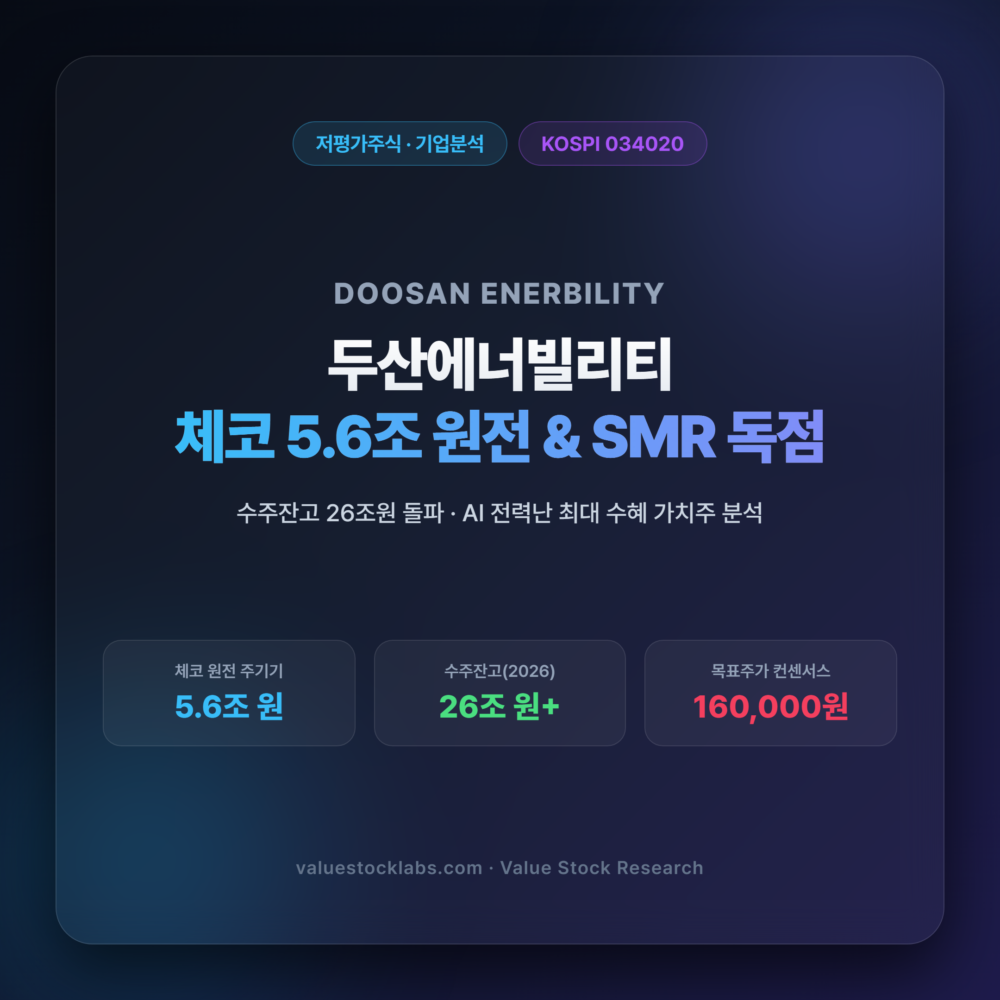
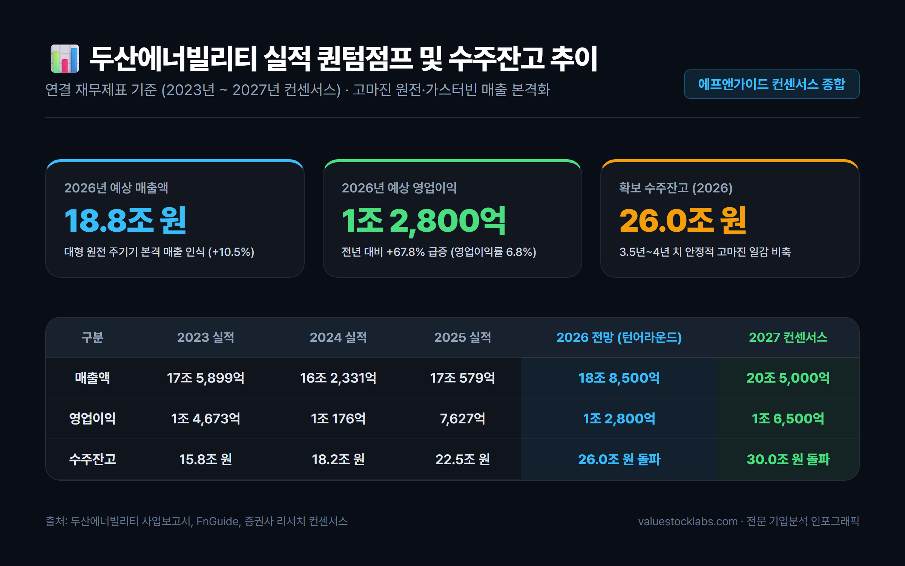
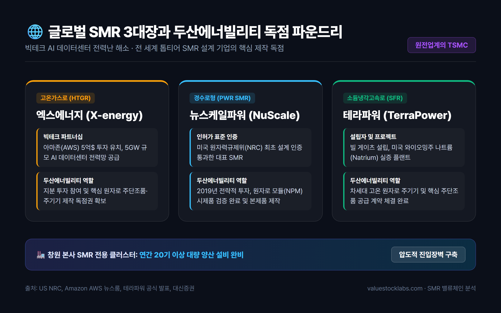
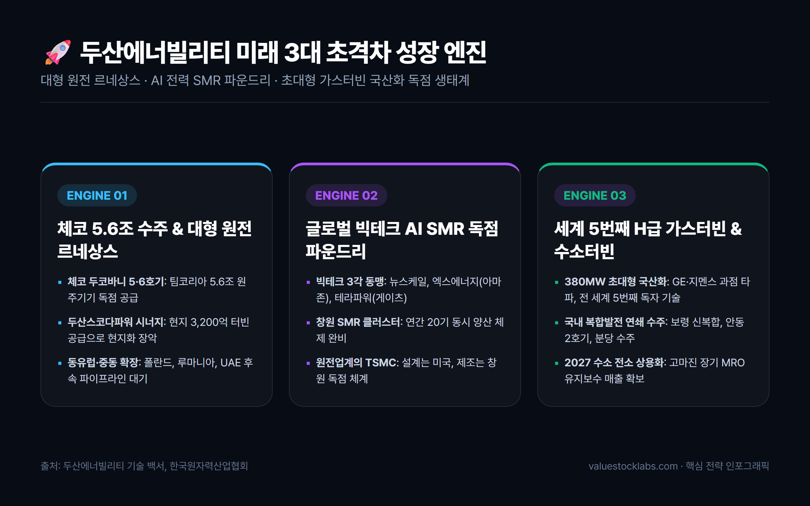
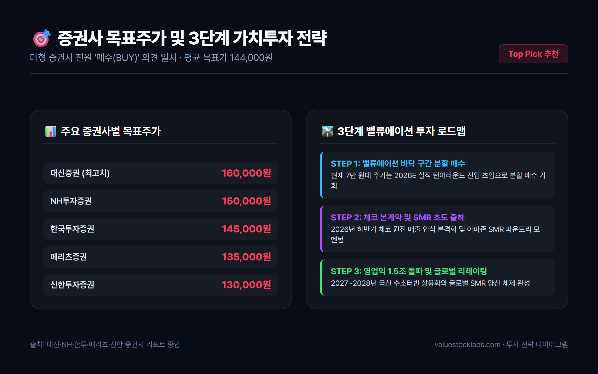

# 두산에너빌리티 주가 전망 및 기업분석: 체코 원전 5.6조와 SMR 파운드리 독점 비결

> **글로벌 원전 르네상스의 최전선, 체코 5.6조 원전 수주 잭팟과 빅테크 AI 전력난을 해소할 글로벌 'SMR 제조 파운드리 독점 지위'를 확보한 두산에너빌리티(034020)의 핵심 가치와 중장기 투자 전략을 정밀 분석합니다.**

---

## 목차
- [1. 화려한 부활: 중공업의 위기를 넘어 글로벌 청정에너지 리더로](#1-화려한-부활-중공업의-위기를-넘어-글로벌-청정에너지-리더로)
- [2. 실적 퀀텀점프: 수주잔고 26조 원 돌파와 영업이익 1조 원 재진입의 근거](#2-실적-퀀텀점프-수주잔고-26조-원-돌파와-영업이익-1조-원-재진입의-근거)
- [3. 핵심 투자 포인트 3가지: 왜 지금 두산에너빌리티인가?](#3-핵심-투자-포인트-3가지-왜-지금-두산에너빌리티인가)
  - [포인트 1: 체코 두코바니 5.6조 주기기 수주와 유럽 원전 공급망 장악](#포인트-1-체코-두코바니-56조-주기기-수주와-유럽-원전-공급망-장악)
  - [포인트 2: 빅테크 AI 전력난의 유일한 해법, 글로벌 'SMR 파운드리' 독점 지위](#포인트-2-빅테크-ai-전력난의-유일한-해법-글로벌-smr-파운드리-독점-지위)
  - [포인트 3: 세계 5번째 380MW급 대형 가스터빈 국산화와 수소터빈 혁신](#포인트-3-세계-5번째-380mw급-대형-가스터빈-국산화와-수소터빈-혁신)
- [4. 재무구조 대변혁: 지배구조 개편과 1조 원 투자 여력 확보](#4-재무구조-대변혁-지배구조-개편과-1조-원-투자-여력-확보)
- [5. 투자 리스크 점검: 지정학적 인허가 변수 및 원자재 원가 관리](#5-투자-리스크-점검-지정학적-인허가-변수-및-원자재-원가-관리)
- [6. 증권가 목표주가 컨센서스 및 최종 투자 전략](#6-증권가-목표주가-컨센서스-및-최종-투자-전략)

---

## 1. 화려한 부활: 중공업의 위기를 넘어 글로벌 청정에너지 리더로

대한민국 발전 및 중공업의 상징인 **두산에너빌리티(034020)**는 과거 탈원전 정책과 글로벌 발전 시장의 침체로 인해 유동성 위기를 겪으며 뼈를 깎는 구조조정을 단행했습니다. 비핵심 자산 매각과 채권단 관리 조기 졸업을 거친 두산에너빌리티는 2022년 사명을 변경하며 완전히 새로운 기업으로 거듭났습니다.

현재 두산에너빌리티가 맞이한 사업 환경은 과거와 차원이 다릅니다. 전 세계적인 탄소중립 드라이브와 러시아-우크라이나 전쟁 이후 촉발된 에너지 안보 위기로 인해 전 세계 주요국들이 원전으로 회귀하는 **'글로벌 원전 르네상스'**가 본격화되었습니다. 

여기에 더해 오픈AI, 구글, 마이크로소프트(MS), 아마존(AWS) 등 글로벌 빅테크 기업들이 주도하는 **생성형 AI 데이터센터의 전력 소모 폭증**은 24시간 중단 없는 무탄소 기저 전력을 생산할 수 있는 원자력 발전, 특히 소형모듈원자로(SMR)에 대한 폭발적인 수요를 일으켰습니다.

원자로 용기부터 증기발생기, 터빈 발전기까지 원전 1·2차 계통의 핵심 주기기를 단일 공장에서 일괄 주조·단조·가공·조립할 수 있는 제조 역량을 갖춘 기업은 전 세계에서 두산에너빌리티가 유일무이합니다.

---

## 2. 실적 퀀텀점프: 수주잔고 26조 원 돌파와 영업이익 1조 원 재진입의 근거

두산에너빌리티의 재무제표는 2026년을 기점으로 고마진 원전 주기기와 가스터빈의 매출 인식이 본격화되며 강력한 실적 턴어라운드를 보여주고 있습니다.

### 📊 연도별 주요 실적 추이 및 컨센서스 (연결 기준)

| 구분 | 2023 (실적) | 2024 (실적) | 2025 (실적) | 2026 (전망치) | 2027 (컨센서스) |
|---|---|---|---|---|---|
| **매출액** | 17조 5,899억원 | 16조 2,331억원 | 17조 579억원 | **18조 8,500억원** | **20조 5,000억원** |
| **영업이익** | 1조 4,673억원 | 1조 176억원 | 7,627억원 | **1조 2,800억원** | **1조 6,500억원** |
| **영업이익률(OPM)** | 8.3% | 6.3% | 4.5% | **6.8%** | **8.0%** |
| **당기순이익** | 5,175억원 | 3,840억원 | 2,980억원 | **8,450억원** | **1조 2,100억원** |
| **수주잔고** | 15.8조원 | 18.2조원 | 22.5조원 | **26.0조원 돌파** | **30조원 돌파 전망** |

### 💡 실적 분석 핵심 포인트
1. **수주잔고 26조 원의 질적 도약**: 2023년 15.8조 원 수준이던 수주잔고가 2026년 기준 **26조 원**을 돌파하여 약 3.5~4년 치의 압도적인 일감을 확보했습니다. 무엇보다 과거 저마진 단순 EPC 중심에서 마진율이 높은 대형 원전 주기기, SMR 파운드리, 국산 가스터빈 비중이 70% 이상으로 재편되었습니다.
2. **영업이익 1조 클럽 재탈환**: 2024~2025년 자회사 두산밥캣의 북미 건설장비 경기 둔화와 원자재 가격 변동으로 영업이익이 조정을 받았으나, 2026년에는 본업인 에너빌리티 자체 사업부의 영업이익이 급증하며 연결 영업이익 **1조 2,800억 원**을 달성할 전망입니다.

---

## 3. 핵심 투자 포인트 3가지: 왜 지금 두산에너빌리티인가?

시장 전문가들이 두산에너빌리티를 단순한 중공업주가 아닌 차세대 첨단 에너지 인프라 독점 수혜주로 평가하는 데는 3가지 명확한 성장 엔진이 있습니다.

### 포인트 1: 체코 두코바니 5.6조 주기기 수주와 유럽 원전 공급망 장악
팀코리아(한국수력원자력 컨소시엄)의 체코 두코바니 5·6호기 신규 원전 수주는 대한민국 원전 수출 역사상 2009년 UAE 바라카 원전 이후 최대의 쾌거입니다.

- **5조 6,400억 원 규모의 주기기 독점 계약**: 두산에너빌리티는 원자로 용기, 증기발생기, 냉각재 펌프(RCP) 등 1차 계통 핵심 설비와 터빈 발전기 등 2차 계통 주기기를 전담 공급합니다.
- **두산스코다파워의 완벽한 현지화 시너지**: 체코 현지 자회사인 두산스코다파워가 3,200억 원 규모의 증기터빈 공급 계약을 체결함으로써, 체코 정부의 까다로운 현지화 요구를 100% 충족시켰습니다.
- **후속 파이프라인 확장**: 체코 정부가 계획 중인 테멜린 3·4호기 추가 발주뿐만 아니라 폴란드 퐁트누프 2기, 루마니아 원전 개보수 및 UAE 후속 원전 등 동유럽과 중동 전역으로 수출 파이프라인이 확산되고 있습니다.

---

### 포인트 2: 빅테크 AI 전력난의 유일한 해법, 글로벌 'SMR 파운드리' 독점 지위
반도체 시장에 TSMC가 있다면, 차세대 원전 시장에는 두산에너빌리티가 있습니다. 전 세계 SMR 시장의 선두 설계 기업들은 모두 두산에너빌리티 창원공장에 모듈 제작을 위탁하고 있습니다.

#### 🌐 글로벌 3대 SMR 파트너십 구축 현황

1. **엑스에너지(X-energy, 고온가스로)**:
   - 아마존(AWS)이 5억 달러 이상을 직접 투자하며 5GW 규모의 데이터센터 전력 공급 프로젝트를 발표했습니다. 두산에너빌리티는 지분 투자와 함께 핵심 주기기 제작 독점 공급권을 확보했습니다.
2. **뉴스케일파워(NuScale Power, 경수로형)**:
   - 미국 NRC(원자력규제위원회) 설계 인증을 최초로 획득한 대표 주자로, 두산에너빌리티는 2019년부터 전략적 파트너로서 원자로 모듈(NPM) 제작에 착수했습니다.
3. **테라파워(TerraPower, 소듐냉각고속로)**:
   - 빌 게이츠가 설립한 차세대 원전 기업으로, 미국 와이오밍주 실증 프로젝트에 투입될 핵심 원자로 및 주단조품 공급 계약을 체결했습니다.

두산에너빌리티는 창원 본사에 **연간 20기 이상의 SMR을 동시 양산할 수 있는 전용 클러스터**를 구축함으로써 경쟁사들이 수년 내에 따라올 수 없는 압도적인 제조 진입장벽을 완성했습니다.

---

### 포인트 3: 세계 5번째 380MW급 대형 가스터빈 국산화와 수소터빈 혁신
원전뿐만 아니라 액화천연가스(LNG) 복합화력발전과 무탄소 청정에너지의 핵심인 대형 가스터빈 분야에서도 두산에너빌리티는 세계적 수준의 기술적 독립을 이뤄냈습니다.

- **세계 5번째 독자 개발 성공**: 미국(GE), 독일(지멘스), 일본(미쓰비시), 이탈리아(안살도)에 이어 전 세계 5번째로 고효율 H급 380MW 발전용 가스터빈을 독자 개발했습니다.
- **국내 발전소 연쇄 수주**: 보령신복합발전소, 안동복합발전소 2호기, 분당복합발전소 현대화 사업 등 국내 주요 가스복합발전 프로젝트를 연달아 수주하며 실증 레퍼런스를 확보했습니다.
- **고수익 MRO 및 100% 수소터빈 로드맵**: 가스터빈은 공급 후 20~30년간 고온 부품 교체와 장기유지보수(LTSA)를 통해 막대한 반복 수익(Recurring Revenue)을 창출합니다. 또한 2027~2028년 상용화를 목표로 수소 50% 혼소를 넘어 100% 수소 전소 터빈 개발을 주도하고 있습니다.

---

## 4. 재무구조 대변혁: 지배구조 개편과 1조 원 투자 여력 확보

두산그룹은 그룹 전체 사업군을 '에너지·기계·반도체'로 단순화하는 지배구조 개편을 추진해 왔습니다. 비록 초기 포괄적 주식교환은 일반 주주의 이익 보호를 위해 철회되었으나, 주주가치를 제고하는 방향으로 수정된 분할합병안은 두산에너빌리티의 재무구조를 혁신적으로 탈바꿈시킵니다.

### 💰 재무 개선 및 1조 원 투자 재원 마련 효과
- **차입금 7,000억 원 이관**: 두산밥캣 지분 취득 당시 발생했던 차입금 약 7,000억 원이 분할 신설법인으로 이전되어 두산에너빌리티의 부채비율이 대폭 축소됩니다.
- **비영업 자산 매각 5,000억 원**: 골프장(두산큐벡스) 등 비핵심 자산을 매각하여 5,000억 원의 순현금을 유입시킵니다.
- **원전·SMR 초격차 설비투자(CAPEX)**: 확보된 총 1조 2,000억 원 규모의 재원은 창원 SMR 공장 증설, 대형 원전 주단조 라인 스마트팩토리화, 가스터빈 생산라인 확대에 집중 투입되어 미래 실적 성장의 마중물이 됩니다.

---

## 5. 투자 리스크 점검: 지정학적 인허가 변수 및 원자재 원가 관리

투자자가 주의 깊게 살펴봐야 할 핵심 리스크 요인은 다음과 같습니다.

1. **지식재산권(IP) 및 지정학적 이슈**: 미국 웨스팅하우스(Westinghouse)와의 원전 노형 지재권 분쟁 및 미국 원자력 수출 통제(10 CFR Part 810) 이슈입니다. 다만 한미 양국 정부 간의 원전 동맹 강화 및 한수원-웨스팅하우스 간 실무 협의를 통해 분쟁 리스크는 점진적으로 완화되는 국면입니다.
2. **원자재 인플레이션**: 원자로 및 가스터빈 제작에 투입되는 특수강, 니켈, 코발트 등 고가 희유금속 가격 변동성이 원가에 미치는 영향입니다. 두산에너빌리티는 장기 조달 계약과 발주처 원가 연동(Escalation) 조항을 통해 마진 훼손을 최소화하고 있습니다.
3. **지배구조 개편 주총 일정**: 분할합병에 따른 주식매수청구권 행사 규모가 재무 계획에 미치는 영향에 대해 투자자들의 지속적인 확인이 요구됩니다.

---

## 6. 증권가 목표주가 컨센서스 및 최종 투자 전략

국내 주요 대형 증권사들은 두산에너빌리티에 대해 일제히 강력 '매수(BUY)' 의견을 유지하며 목표주가를 상향 조정하고 있습니다.

### 🎯 국내 주요 증권사 목표주가 현황 (2026년 기준)

| 증권사 | 투자의견 | 목표주가 | 핵심 투자 논거 |
|---|---|---|---|
| **대신증권** | 매수 (BUY) | **160,000원** | 체코 5.6조 원전 수주 본계약 체결 및 글로벌 SMR 파운드리 밸류에이션 프리미엄 |
| **NH투자증권** | 매수 (BUY) | **150,000원** | 빅테크 AI 데이터센터 전력 수혜 본격화, 아마존-엑스에너지 핵심 파트너십 |
| **한국투자증권** | 매수 (BUY) | **145,000원** | 대형 가스터빈 380MW급 연쇄 수주 및 고마진 LTSA 장기유지보수 매출 가시화 |
| **메리츠증권** | 매수 (BUY) | **135,000원** | 차입금 이관에 따른 재무 리스크 해소 및 1조원 원전 CAPEX 투자 모멘텀 |
| **신한투자증권** | 매수 (BUY) | **130,000원** | 수주잔고 26조원 돌파, 원전 르네상스 국면에서 대체 불가능한 제작 역량 |

### 📌 최종 투자 전략 요약
두산에너빌리티는 더 이상 전통적인 플랜트 건설업체가 아닙니다. **‘대형 원전 르네상스’ + ‘글로벌 빅테크 AI SMR 독점 공급자’ + ‘국산 대형 가스터빈 생태계 주도자’**라는 3개의 강력한 프리미엄을 동시에 보유한 글로벌 독점 에너지 인프라 기업입니다.

현재 주가(7만 원대 후반)는 2026년 하반기부터 본격화될 체코 원전 매출 인식과 SMR 상용화 모멘텀을 고려할 때 매력적인 진입 구간으로 판단됩니다. 단기 주가 변동성에 흔들리기보다는 중장기 수주 사이클의 결실을 향유하는 분할 매수 전략이 유효합니다.

---

*면책 조항: 본 글은 신뢰할 수 있는 공개 자료를 바탕으로 작성된 정보 제공 목적의 분석 글이며, 특정 금융투자상품에 대한 매수 또는 매도 권유가 아닙니다. 모든 투자의 결과와 책임은 투자자 본인에게 귀속됩니다.*
