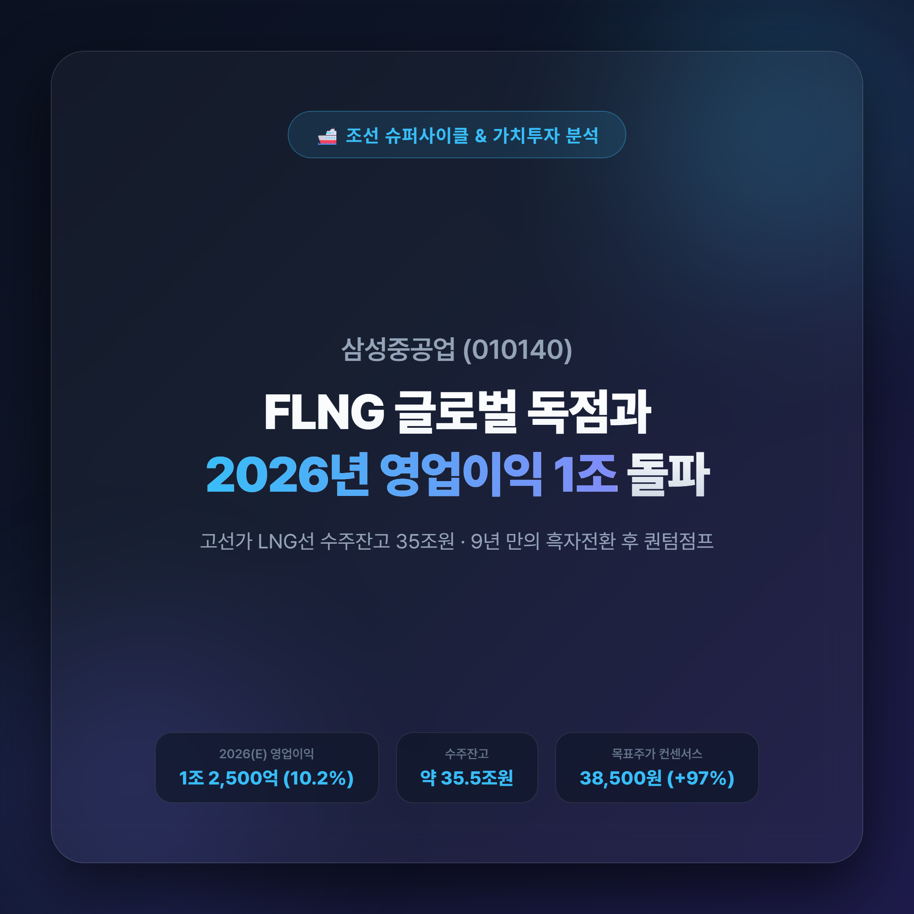
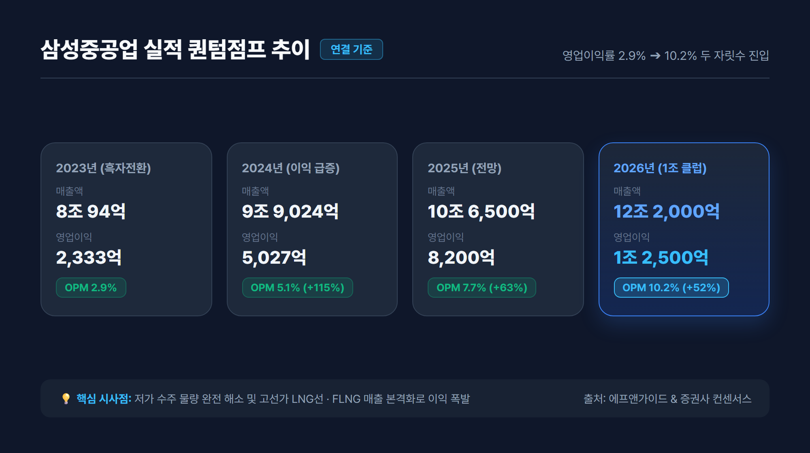
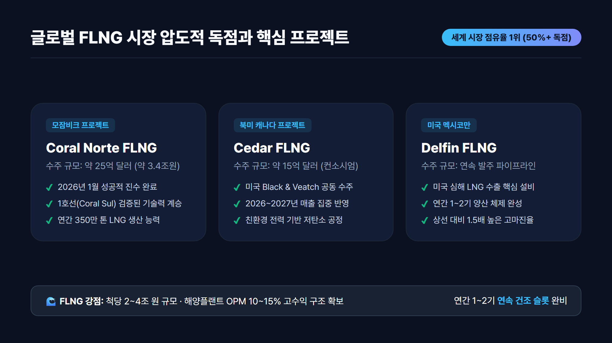
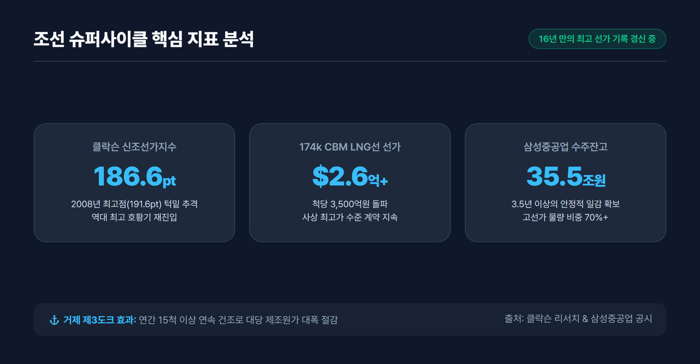
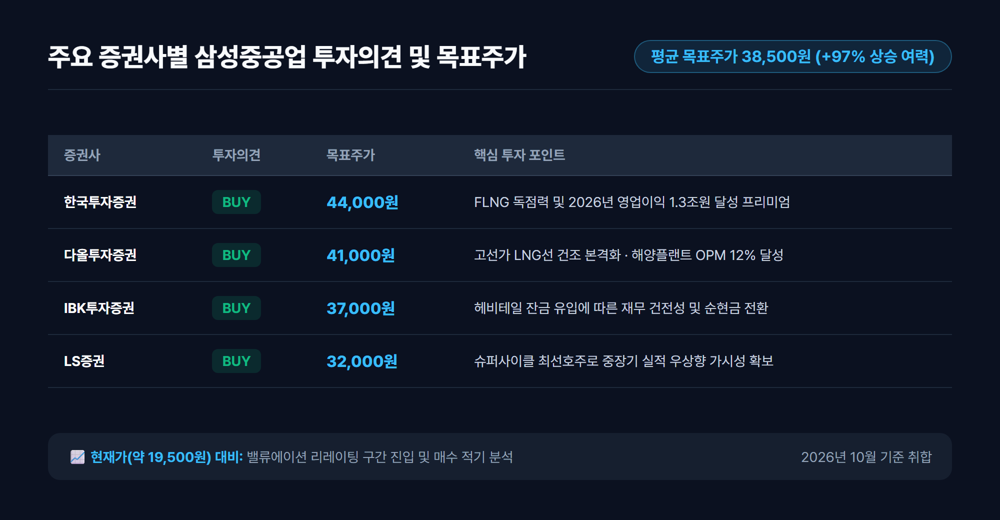

# 삼성중공업 주가 전망 및 기업분석: FLNG 독점과 2026년 영업이익 1조원 돌파 비결

> **조선업 슈퍼사이클의 정점, 고선가 LNG선과 글로벌 FLNG 독점 수주로 9년 만의 흑자전환을 넘어 2026년 '영업이익 1조 클럽' 진입을 눈앞에 둔 삼성중공업(010140)의 핵심 투자 가치를 정밀 분석합니다.**

---

## 목차
- [1. 9년 만의 턴어라운드: 적자의 늪을 벗어나 구조적 고수익 구간 진입](#1-9년-만의-턴어라운드-적자의-늪을-벗어나-구조적-고수익-구간-진입)
- [2. 실적 퀀텀점프: 2026년 영업이익 1조 2,500억원 전망의 근거](#2-실적-퀀텀점프-2026년-영업이익-1조-2500억원-전망의-근거)
- [3. 핵심 투자 포인트 3가지: 왜 지금 삼성중공업인가?](#3-핵심-투자-포인트-3가지-왜-지금-삼성중공업인가)
  - [포인트 1: 바다 위의 LNG 공장, 글로벌 FLNG 시장 압도적 독점](#포인트-1-바다-위의-lng-공장-글로벌-flng-시장-압도적-독점)
  - [포인트 2: 클락슨 신조선가지수 186pt 돌파와 고선가 LNG선 수주 잭팟](#포인트-2-클락슨-신조선가지수-186pt-돌파와-고선가-lng선-수주-잭팟)
  - [포인트 3: 100% 철저한 환헤지와 스마트야드 3X 생산성 혁신](#포인트-3-100-철저한-환헤지와-스마트야드-3x-생산성-혁신)
- [4. 투자 리스크 점검: 후판 가격 및 원가 변수 분석](#4-투자-리스크-점검-후판-가격-및-원가-변수-분석)
- [5. 증권가 목표주가 컨센서스 및 최종 투자 전략](#5-증권가-목표주가-컨센서스-및-최종-투자-전략)

---

## 1. 9년 만의 턴어라운드: 적자의 늪을 벗어나 구조적 고수익 구간 진입

국내 조선 빅3 중 하나인 **삼성중공업(010140)**은 지난 2015년부터 이어진 해양플랜트 부실과 글로벌 발주 가뭄으로 인해 무려 8년 연속 대규모 적자를 기록하는 혹독한 구조조정의 시기를 겪었습니다. 그러나 2023년 연간 영업이익 **2,333억 원**을 달성하며 9년 만의 완벽한 흑자전환에 성공했습니다.

단순한 일회성 반등이 아닙니다. 과거 발목을 잡았던 저가 수주 물량이 2024년 상반기를 기점으로 조선소 도크(Dock)에서 완전히 소진되었습니다. 현재 거제조선소를 채우고 있는 물량은 척당 2억 5,000만 달러를 웃도는 **고선가 LNG 운반선**과 척당 20억~30억 달러에 달하는 **초대형 FLNG(부유식 액화천연가스 생산설비)**입니다.

이로 인해 삼성중공업은 이제 '살아남기 위한 수주'가 아닌, 선가를 높여 부르는 **'수익성 중심의 선별 수주'** 체제로 완벽히 전환되었습니다.

---

## 2. 실적 퀀텀점프: 2026년 영업이익 1조 2,500억원 전망의 근거

삼성중공업의 재무제표는 2024년부터 2026년에 이르기까지 매년 계단식 성장을 예고하고 있습니다. 

### 📊 연도별 주요 실적 추이 및 컨센서스 (연결 기준)

| 구분 | 2023 (실적) | 2024 (실적) | 2025 (전망) | 2026 (컨센서스) | 연평균 성장률(CAGR) |
|---|---|---|---|---|---|
| **매출액** | 8조 94억원 | 9조 9,024억원 | 10조 6,500억원 | **12조 2,000억원** | **+15.1%** |
| **영업이익** | 2,333억원 | 5,027억원 | 8,200억원 | **1조 2,500억원** | **+74.8%** |
| **영업이익률(OPM)** | 2.9% | 5.1% | 7.7% | **10.2%** | - |
| **당기순이익** | 1,580억원 | 4,120억원 | 7,100억원 | **1조 500억원** | **+88.1%** |
| **수주잔고** | 약 28조원 | 약 32조원 | 약 34조원 | **약 35.5조원** | 3.5년치 일감 |

### 💡 실적 분석 핵심 포인트
1. **영업이익률(OPM)의 두 자릿수 진입**: 2023년 2.9%에 불과했던 영업이익률이 2024년 5.1%, 2025년 7.7%를 거쳐 2026년에는 **10.2%**로 급상승합니다.
2. **헤비테일(Heavy-tail) 인도 사이클**: 조선업 특유의 건조 후반 잔금 집중 수령 구조에 따라, 2025~2026년에 걸쳐 연간 1.5조원 이상의 대규모 영업 현금흐름이 유입되며 부채비율이 빠르게 하향 안정화되고 있습니다.

---

## 3. 핵심 투자 포인트 3가지: 왜 지금 삼성중공업인가?

삼성중공업이 다른 조선사 대비 차별화된 밸류에이션 프리미엄을 받는 이유는 명확한 3가지 성장 엔진에 있습니다.

### 포인트 1: 바다 위의 LNG 공장, 글로벌 FLNG 시장 압도적 독점
FLNG는 육상 터미널을 거치지 않고 해상 가스전 위에서 천연가스를 바로 채굴·정제·액화·저장하는 최첨단 고부가가치 설비입니다. 

- **글로벌 1위의 트랙레코드**: 전 세계에 발주된 대형 FLNG 중 과반 이상을 삼성중공업이 독점적으로 건조했습니다 (Shell Prelude, Eni Coral Sul 등).
- **연간 1~2기 안정적 양산 체제**: 
  - **모잠비크 Coral Norte FLNG**: 2026년 1월 성공적 진수 완료 (약 25억 달러 규모).
  - **캐나다 Cedar FLNG**: 미국 Black & Veatch와 컨소시엄으로 수주 완료, 2026년 매출 본격 반영.
  - **미국 Delfin FLNG**: 장기 수주 파이프라인 확보.
- FLNG는 척당 2조~4조 원에 육박하며 상선 대비 높은 마진율(OPM 10~15%)을 자랑하여 삼성중공업의 이익 체력을 견고하게 지지합니다.

---

### 포인트 2: 클락슨 신조선가지수 186pt 돌파와 고선가 LNG선 수주 잭팟
글로벌 조선 해운 분석기관 클락슨(Clarkson)의 신조선가지수가 **186.6pt**를 돌파하며 2008년 조선 슈퍼사이클 당시 역사적 최고점(191.6pt)에 근접하고 있습니다.

- **LNG 운반선 선가 고공행진**: 174,000㎥ 기준 척당 선가가 **2억 6,000만 달러**를 상회하며 사상 최고치를 경신하고 있습니다.
- **거제 제3도크의 연속 건조 효과**: 삼성중공업은 거제조선소 제3도크를 LNG선 전용으로 집중 가동하여, 연간 15척 이상의 고선가 선박을 연속 건조함으로써 대당 제조원가를 획기적으로 낮추고 있습니다.
- **수주 목표 초과 달성**: 2026년 들어서만 LNG선 20척을 수주하며 연간 상선 수주 목표를 140% 이상 초과 달성했습니다.

---

### 포인트 3: 100% 철저한 환헤지와 스마트야드 3X 생산성 혁신
조선업계의 최대 변수인 환율과 인건비에 대해 삼성중공업은 가장 안전한 방어벽을 구축했습니다.

1. **보수적 선물환 100% 헤지 전략**:
   - 삼성중공업은 수주 계약을 체결하는 즉시 선수금과 잔금 전체에 대해 선물환 매도(Forward Contract)를 실행합니다.
   - 따라서 향후 원/달러 환율이 급락하더라도 확정된 수주 이익률을 그대로 지켜내는 독보적인 실적 방어력을 가집니다.
2. **스마트야드 3X(Smart SHI) 프로젝트**:
   - AI 설계 자동화, 무인 용접 로봇, 디지털 트윈 기반 선박 블록 물류 최적화를 통해 건조 공기를 10% 이상 단축시켰으며, 숙련공 부족 리스크를 기술로 극복했습니다.

---

## 4. 투자 리스크 점검: 후판 가격 및 원가 변수 분석

투자자가 반드시 짚고 넘어가야 할 주요 리스크 요인도 투명하게 점검해야 합니다.

1. **후판(厚板) 가격 협상**:
   - 선박 원가의 15~20%를 차지하는 후판 가격은 조선 3사 중 삼성중공업의 영업이익 민감도가 다소 높은 편입니다.
   - 그러나 최근 중국산 저가 후판 유입으로 국내 철강사(포스코·현대제철)와의 공급가 인하/동결 압력이 커지고 있어 추가적인 대규모 충당금 발생 가능성은 매우 제한적입니다.
2. **지정학적 에너지 수송선 발주 추이**:
   - 러시아-우크라이나 및 중동 분쟁으로 인한 글로벌 에너지 해상 운송 루트 재편은 전반적으로 LNG선 수요에 우호적이나, 특정 항로의 프로젝트 지연 여부는 지속적인 모니터링이 필요합니다.

---

## 5. 증권가 목표주가 컨센서스 및 최종 투자 전략

국내 주요 증권사들은 삼성중공업에 대해 일제히 **'매수(BUY)'** 의견을 유지하고 있으며, 목표주가를 지속적으로 상향 조정하고 있습니다.

### 🏢 주요 증권사별 투자의견 및 목표주가 (2026년 10월 기준)

| 증권사 | 투자의견 | 목표주가 (원) | 핵심 분석 요약 |
|---|---|---|---|
| **한국투자증권** | **BUY** | **44,000원** | "독보적 FLNG 수주 잔고와 2026년 영업이익 1.3조원 달성으로 밸류에이션 리레이팅 가속화" |
| **다올투자증권** | **BUY** | **41,000원** | "고선가 LNG선 매출 본격 반영과 해양플랜트 OPM 12% 이상 달성 전망" |
| **IBK투자증권** | **BUY** | **37,000원** | "헤비테일 인도 잔금 유입으로 재무구조 대폭 개선 및 순현금 전환" |
| **LS증권** | **BUY** | **32,000원** | "조선업 슈퍼사이클 내 최선호주로서 구조적 실적 우상향 지속" |

- **시장 컨센서스 평균 목표주가**: **38,500원** (현재가 약 19,500원 대비 **+97%** 이상의 상승 여력 확보)

### 💡 투자 전략 요약
삼성중공업은 **"2023년 흑자전환 ➔ 2024년 이익 100% 성장 ➔ 2025년 8,000억 원 돌파 ➔ 2026년 영업이익 1조 2,500억 원"**이라는 확실한 실적 가시성을 확보한 조선업 최선호 가치성장주입니다. 

조선업 슈퍼사이클의 강력한 파도와 FLNG라는 독점적 무기를 장착한 삼성중공업에 대한 중장기적 분할 매수 접근은 매우 유효한 투자 전략이 될 것입니다.

---

*면책 조항: 본 글은 공개된 신뢰성 있는 자료를 바탕으로 작성된 정보 제공 목적의 콘텐츠이며, 특정 종목에 대한 매수·매도 추천이나 금융 투자 권유가 아닙니다. 모든 투자 판단과 최종 책임은 투자자 본인에게 있습니다.*

### 📚 참고 출처 (References)
1. [WiseReport 에프앤가이드 컨센서스 통합 리포트](https://www.wisereport.co.kr)
2. [클락슨 리서치(Clarkson Research) 글로벌 신조선가지수 보고서](https://www.clarksons.com)
3. [한국투자증권 기업분석 리포트: 삼성중공업(010140)](https://www.truefriend.com)
4. [다올투자증권 조선업 섹터 리포트](https://www.daolsecurities.com)
5. [금융감독원 전자공시시스템(DART) 삼성중공업 사업보고서](https://dart.fss.or.kr)
