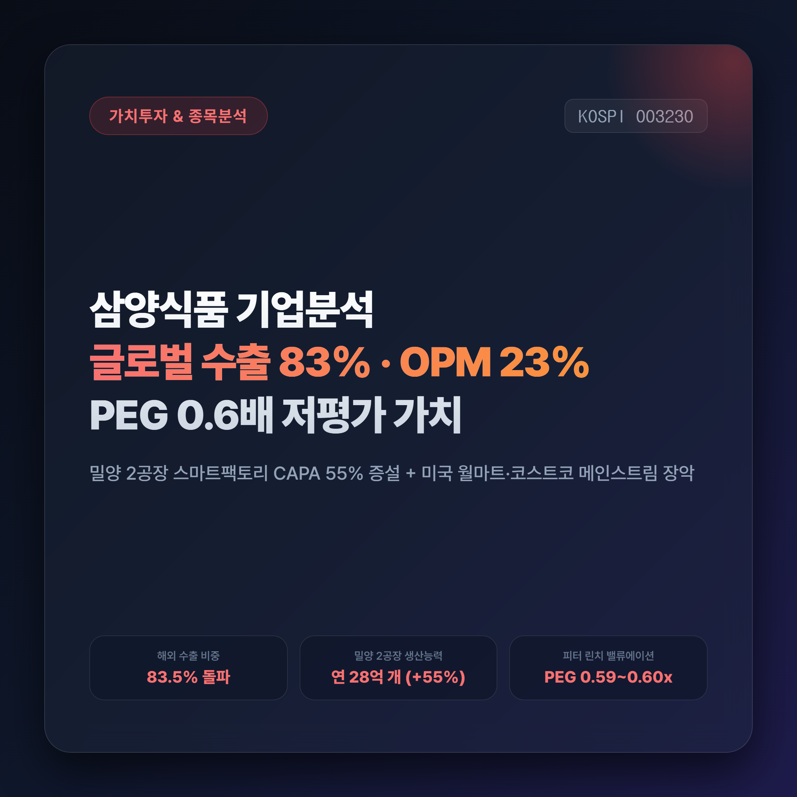
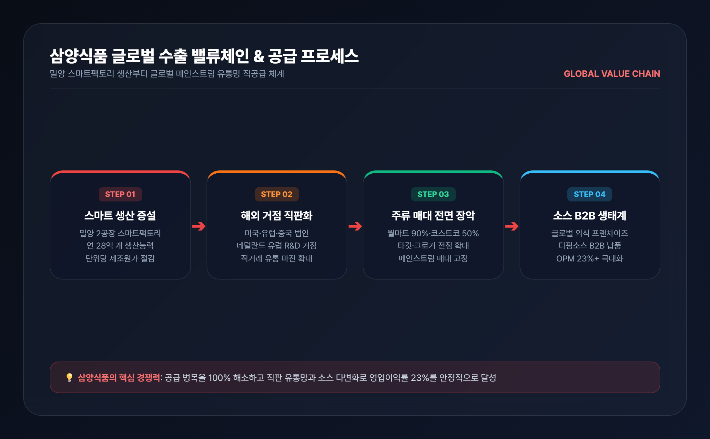
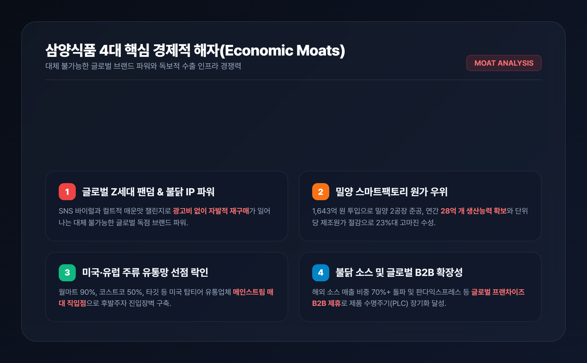
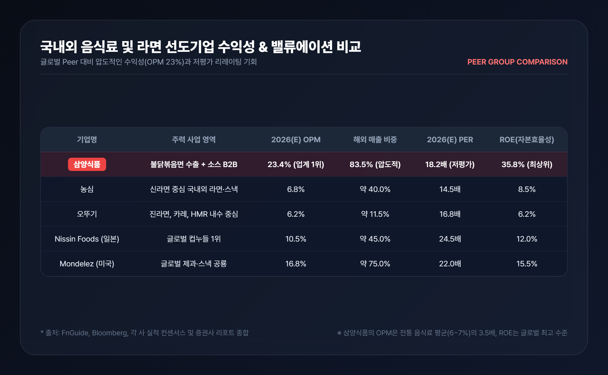
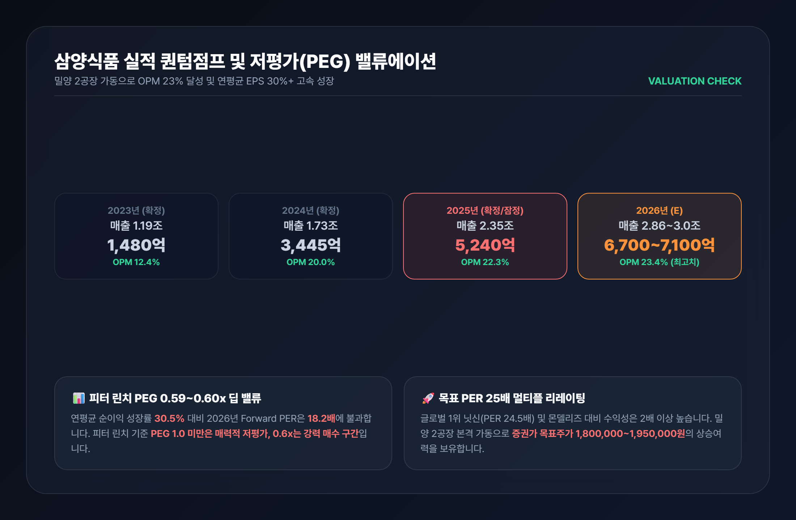

# 삼양식품 주가 전망과 기업분석 | OPM 23%·밀양 2공장 가동과 PEG 0.6배 저평가 가치

> 불닭볶음면의 전 세계적 열풍을 타고 해외 수출 비중 83%를 돌파한 삼양식품. 밀양 2공장 완공으로 생산능력이 55% 급증한 가운데, 독보적인 영업이익률 23%와 피터 린치 PEG 0.6배 구간의 압도적 투자 가치를 심층 분석합니다.

---

## 목차
- [1. 내수 라면 기업에서 글로벌 K-푸드 수출 플랫폼으로](#1-내수-라면-기업에서-글로벌-k-푸드-수출-플랫폼으로)
- [2. 밀양 2공장 가동과 글로벌 유통망(월마트·코스트코) 장악](#2-밀양-2공장-가동과-글로벌-유통망월마트코스트코-장악)
- [3. 삼양식품의 4대 핵심 경제적 해자와 피어 비교](#3-삼양식품의-4대-핵심-경제적-해자와-피어-비교)
- [4. 실적 퀀텀점프와 피터 린치 PEG 0.6배 밸류에이션](#4-실적-퀀텀점프와-피터-린치-peg-06배-밸류에이션)
- [5. 결론 및 투자 전략 핵심 요약](#5-결론-및-투자-전략-핵심-요약)

---

## 1. 내수 라면 기업에서 글로벌 K-푸드 수출 플랫폼으로

국내 주식시장에서 음식료 업종은 오랫동안 '저성장·내수 방어주'라는 고정관념에 갇혀 있었습니다. 인구 감소와 내수 시장의 포화로 인해 매출 성장이 제한적이고, 원자재 가격 상승분을 판가에 온전히 전가하기 어려운 전형적인 저마진 산업으로 인식되었기 때문입니다.

그러나 **삼양식품(003230)** 은 이러한 음식료 섹터의 전통적 한계를 완전히 깨부수고 있습니다. 2012년 출시 이후 전 세계적인 컬트 팬덤을 형성한 '불닭볶음면' 시리즈를 필두로, 삼양식품은 이제 단순한 가공식품 제조사를 넘어 **글로벌 하이마진 소비재 수출 플랫폼**으로 완벽한 패러다임 전환을 이뤄냈습니다.

2024년 해외 매출 비중 77%를 돌파한 삼양식품은 2025~2026년 기준 **해외 매출 비중이 83%를 상회**하며 명실상부한 수출 주도형 기업으로 자리매김했습니다. 특히 전통 식품사의 영업이익률이 5~7% 수준에 머무는 것과 달리, 삼양식품은 해외 직수출 중심의 원가 레버리지와 브랜드 프리미엄을 바탕으로 **영업이익률(OPM) 23%를 웃도는 경이로운 수익성**을 기록하고 있습니다.

---

## 2. 밀양 2공장 가동과 글로벌 유통망(월마트·코스트코) 장악

삼양식품의 가장 큰 고민은 '수요 부족'이 아니라 글로벌 수요 폭발에 따른 **'공급 병목(Supply Shortage)'** 이었습니다. 이를 해결하기 위해 총 1,643억 원을 투입하여 완공한 **밀양 2공장 스마트팩토리**가 2025년 하반기부터 본격 가동되면서 생산능력의 퀀텀점프가 현실화되었습니다.

밀양 2공장 가동으로 삼양식품의 연간 라면 생산능력은 기존 약 18억 개에서 **28억 개로 55% 급증**했습니다. 특히 완전 무인 자동화와 최첨단 물류 시스템을 갖춘 밀양 2공장은 고정비 절감과 단위당 제조원가 개선을 이끌어내며 삼양식품의 글로벌 납기 경쟁력을 극대화하고 있습니다.

여기에 더해 해외 핵심 시장인 미국과 유럽에서의 유통망 침투 속도는 더욱 가속화되고 있습니다.
- **미국 시장**: 미국 최대 유통 체인인 **월마트(Walmart) 매장 입점률 90% 이상**을 달성하며 아시안 전용 매대가 아닌 메인스트림(Mainstream) 주류 매대에 전면 배치되었습니다. 또한 **코스트코(Costco) 전점 50% 입점**, 타깃(Target), 크로거(Kroger) 등 대형 채널로 입점이 전방위 확대되고 있습니다.
- **유럽 시장**: 2024년 8월 네덜란드 법인(Samyang Foods Europe)을 설립하여 직판 체제를 구축했으며, 2026년 네덜란드 R&D 센터를 통해 현지 맞춤형 비건/할랄 제품군을 확장하고 있습니다.
- **중국 및 신흥국**: 2027년 1월 완공 예정인 **중국 자싱공장**을 통해 추가 40% 생산능력을 확보함으로써 관세 절감 및 현지 직공급 체계를 완성할 계획입니다.

---

## 3. 삼양식품의 4대 핵심 경제적 해자와 피어 비교

삼양식품이 글로벌 시장에서 지속 가능한 초과이익을 창출할 수 있는 배경에는 4가지 강력한 **경제적 해자(Economic Moats)** 가 존재합니다.

1. **독보적인 불닭 브랜드 지적재산권(IP) 파워**: 매운맛 챌린지와 SNS 바이럴을 통해 전 세계 Z세대의 필수 문화 콘텐츠로 안착하며 별도의 대규모 마케팅비 없이도 자발적 재구매가 일어나는 강력한 브랜드 충성도를 확보했습니다.
2. **원가 우위 스마트팩토리 및 고환율 수혜 레버리지**: 밀양 스마트공장의 제조원가 절감 효과와 함께, 전체 매출의 83% 이상이 해외에서 발생하여 달러 결제 비중 확대에 따른 구조적 환율 수혜를 누립니다.
3. **미국·유럽 메인스트림 유통망 선점 락인(Lock-in)**: 월마트, 코스트코 등 글로벌 톱티어 유통업체들과의 장기 직거래 계약으로 후발 주자가 넘보기 힘든 진열 매대 독점력을 구축했습니다.
4. **불닭 소스 및 글로벌 B2B 외식 생태계 확장**: 단순 라면 봉지면을 넘어 불닭 소스를 판다익스프레스, KFC 등 글로벌 외식 프랜차이즈에 B2B로 공급하며 제품 수명주기(PLC)를 영구적으로 연장하고 있습니다.

| 기업명 | 주력 사업 영역 | 2026(E) OPM | 해외 매출 비중 | 2026(E) PER | ROE |
|---|---|---|---|---|---|
| **삼양식품 (003230)** | 불닭볶음면 글로벌 수출 + 소스 | **23.4%** | **83.5%** | **18.2배** | **35.8%** |
| **농심 (004370)** | 신라면 중심 국내외 라면·스낵 | 6.8% | 40.0% | 14.5배 | 8.5% |
| **오뚜기 (007310)** | 진라면, 카레, HMR 내수 중심 | 6.2% | 11.5% | 16.8배 | 6.2% |
| **Nissin Foods (일본)** | 글로벌 컵누들 1위 | 10.5% | 45.0% | 24.5배 | 12.0% |
| **Mondelez (미국)** | 글로벌 제과·스낵 공룡 | 16.8% | 75.0% | 22.0배 | 15.5% |

국내 경쟁사인 농심(OPM 6.8%)과 오뚜기(OPM 6.2%) 대비 삼양식품은 3~4배 이상의 압도적인 수익성을 자랑합니다. 또한 글로벌 라면 1위 기업인 일본 닛신(PER 24.5배, OPM 10.5%)이나 미국 몬델리즈(PER 22.0배, OPM 16.8%)와 비교해도 삼양식품의 수익성과 자본효율성(ROE 35.8%)은 세계 최고 수준임에도, 2026년 예상 PER은 **18.2배 수준으로 뚜렷하게 저평가**되어 있습니다.

---

## 4. 실적 퀀텀점프와 피터 린치 PEG 0.6배 밸류에이션

삼양식품의 실적은 단순한 일회성 성장이 아닌 구조적인 우상향 궤적을 그리고 있습니다.

| 구분 | 2023(A) | 2024(A) | 2025(P) | 2026(E) | 2027(E) |
|---|---|---|---|---|---|
| **매출액 (십억 원)** | 1,193 | 1,728 | 2,352 | **2,860 ~ 3,000** | 3,450 |
| **영업이익 (십억 원)** | 148 | 345 | 524 | **670 ~ 710** | 830 |
| **영업이익률 (OPM)** | 12.4% | 20.0% | 22.3% | **23.4%** | 24.1% |
| **당기순이익 (십억 원)** | 125 | 272 | 415 | **502** | 620 |
| **EPS 성장률 (YoY)** | - | +117.6% | +52.6% | **+21.0%** | +23.5% |

월가의 전설적인 가치투자자 피터 린치(Peter Lynch)는 기업의 성장성 대비 주가 매력도를 평가할 때 **PEG(Price/Earnings to Growth ratio, 주가이익성장비율)** 지표를 핵심 잣대로 제시했습니다.
- 피터 린치 기준: **PEG 1.0 이하 = 저평가 매수 구간, PEG 0.5~0.6 이하 = 강력한 초저평가 기회**
- 삼양식품의 2024~2027년 연평균 주당순이익(EPS) 성장률은 **약 30.5%** 수준입니다.
- 현재 주가(1,215,000원) 기준 2026년 Forward PER 18.2배를 대입한 **삼양식품의 PEG는 약 0.59~0.60배**로 산출됩니다.

즉, 삼양식품은 매년 20~30% 이상 이익이 급증하는 초고성장 소비재 기업임에도, 시장에서는 여전히 전통 음식료 업종의 보수적 배수를 적용받고 있어 **멀티플 리레이팅(Multiple Rerating)** 의 여력이 대단히 큽니다. 주요 증권사(하나, 키움, NH투자증권)가 제시한 목표주가 1,800,000~1,950,000원은 타당한 밸류에이션 재평가 과정으로 해석할 수 있습니다.

---

## 5. 결론 및 투자 전략 핵심 요약

삼양식품(003230)은 '라면'이라는 친숙한 아이템을 고마진 글로벌 브랜드 IP로 승화시킨 한국 증시의 독보적인 성장주이자 가치주입니다.

### 📌 핵심 투자 체크포인트 3가지
1. **수출 주도형 성장**: 해외 매출 비중 83.5%, 미국 월마트/코스트코 전방위 침투 및 유럽 직판 체제 구축 완료.
2. **생산능력 55% 증설**: 밀양 2공장 스마트팩토리 가동으로 공급 병목 해소 및 2026년 매출 3조 원 돌파 가시화.
3. **압도적 밸류에이션 매력**: OPM 23.4%, ROE 35.8%의 초우량 펀더멘털에도 불구하고 피터 린치 **PEG 0.6배**의 딥 밸류 매수 기회 제공.

단기적으로 원자재 가격 변동이나 환율 등락에 따른 주가 흔들림이 발생할 수 있으나, 글로벌 시장에서의 메인스트림 소비 안착과 소스 사업의 다변화 흐름을 고려할 때 삼양식품은 중장기 우상향 관점에서 포트폴리오의 핵심 축으로 주목할 가치가 충분합니다.

---

*면책 조항: 본 글은 신뢰할 수 있는 공개 자료를 기반으로 작성된 정보 제공 목적의 분석 글이며, 특정 종목에 대한 매수·매도 추천이나 투자 권유가 아닙니다. 모든 투자의 최종 결정과 손익에 대한 책임은 투자자 본인에게 있습니다.*

---

## 📚 참고 출처 (References)
1. [금융감독원 전자공시시스템 (DART)](https://dart.fss.or.kr) - 삼양식품 사업보고서 및 분기 실적 공시
2. [하나증권 리서치센터](https://www.hanaw.com) - 삼양식품(003230) 밀양 2공장 증설 및 글로벌 수출 실적 분석 리포트
3. [키움증권 리서치센터](https://www.kiwoom.com) - 음식료 산업 분석: 삼양식품 글로벌 유통 채널 확대와 OPM 전망
4. [한국경제신문](https://www.hankyung.com) - 삼양식품 밀양 2공장 가동 및 불닭볶음면 글로벌 매출 3조 원 시대 개막
5. [매일경제신문](https://www.mk.co.kr) - 미국 메인스트림 장악한 K-라면, 삼양식품 글로벌 성공 전략
6. [FnGuide](https://www.fnguide.com) - 삼양식품 기업 재무제표 및 컨센서스 데이터
