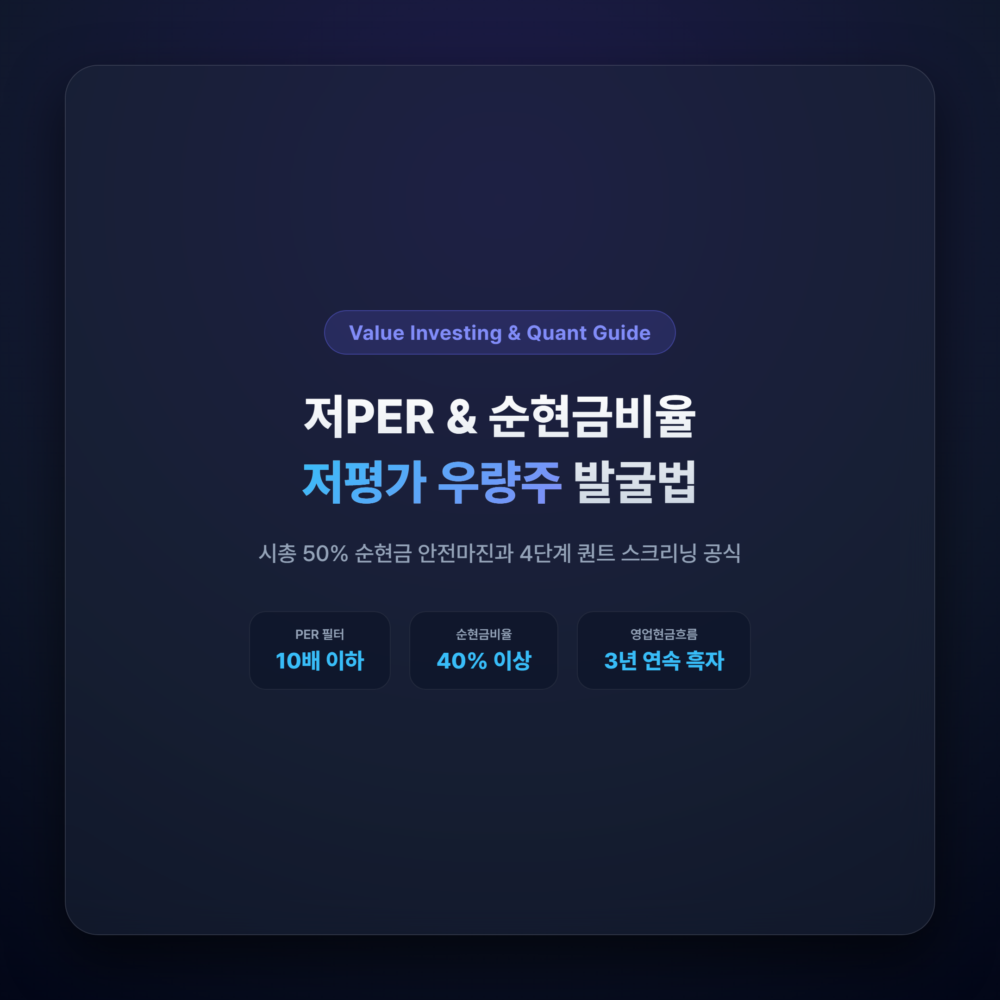
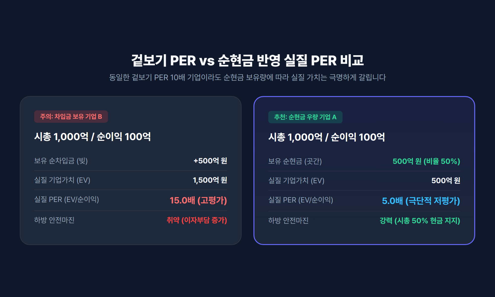
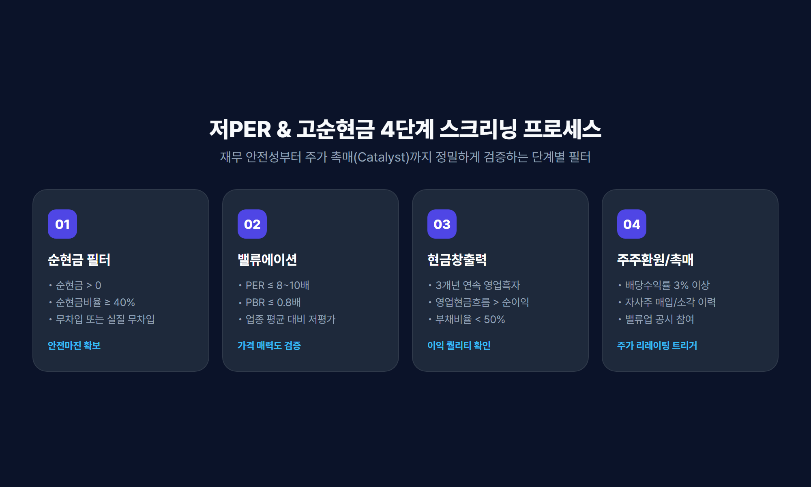
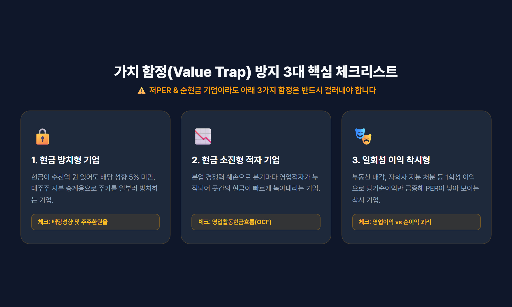

# 저평가 우량주 발굴: 저 PER & 순현금 비율 높은 종목 스크리닝 4단계

> 주가수익비율(PER)과 순현금비율(Net Cash Ratio)을 결합하여 강력한 안전마진을 확보하고 '가치 함정(Value Trap)'을 피하는 실전 퀀트 스크리닝 가이드입니다.



---

## 목차
- [1. 왜 저 PER에 순현금 비율을 결합해야 하는가?](#1-왜-저-per에-순현금-비율을-결합해야-하는가)
- [2. 순현금 및 순현금비율의 핵심 계산 공식](#2-순현금-및-순현금비율의-핵심-계산-공식)
- [3. 저 PER + 고 순현금 종목 발굴 4단계 스크리닝](#3-저-per--고-순현금-종목-발굴-4단계-스크리닝)
- [4. 가치 함정(Value Trap)을 피하는 3가지 체크리스트](#4-가치-함정value-trap을-피하는-3가지-체크리스트)
- [5. 결론 및 2026년 밸류업 투자 전략 요약](#5-결론-및-2026년-밸류업-투자-전략-요약)

---

## 1. 왜 저 PER에 순현금 비율을 결합해야 하는가?

주식 시장에서 단순히 **PER(주가수익비율)** 만 보고 투자했다가 주가가 끝없이 하락하는 이른바 **'가치 함정(Value Trap)'** 에 빠진 경험이 있으신가요? 

PER은 기업의 당기순이익 대비 시가총액의 배수를 나타내지만, **기업이 짊어지고 있는 부채와 보유 현금의 질(Quality)** 을 직접적으로 반영하지 못한다는 결정적인 한계가 있습니다. 예를 들어, PER이 동일하게 8배인 두 기업이 있더라도 A사는 시가총액에 육박하는 막대한 현금을 곳간에 쌓아둔 반면, B사는 막대한 이자 비용이 발생하는 단기 차입금으로 연명하고 있을 수 있습니다.



이러한 왜곡을 완벽히 보완하는 지표가 바로 **순현금(Net Cash)** 과 **순현금비율(순현금/시가총액)** 입니다.
- **안전마진(Margin of Safety) 확보**: 시가총액의 50% 이상이 현금으로 채워져 있다면, 주가가 급락하더라도 보유 현금이 강력한 하방 지지선 역할을 합니다.
- **실질 기업가치(EV) 기준 초저평가**: 시가총액에서 순현금을 차감한 실질 영업 가치 기준으로 평가할 때, 실질 PER은 3~5배 수준으로 극단적인 저평가 상태에 놓이게 됩니다.
- **금리 변동기 이자수익 방어력**: 금리 불확실성 국면에서 부채가 많은 기업은 이자 부담이 급증하지만, 순현금 기업은 막대한 금융 수익을 창출하여 순이익을 방어합니다.

---

## 2. 순현금 및 순현금비율의 핵심 계산 공식

순현금 종목을 정확히 스크리닝하기 위해서는 재무상태표(DART 공시) 상에서 다음 항목들을 직접 확인하고 계산할 수 있어야 합니다.

### ① 순현금(Net Cash) 산출식
```
순현금 = (현금 및 현금성자산 + 단기금융상품 + 단기기타금융자산) - (총차입금 + 사채 + 유이자부채)
```

### ② 순현금비율(Net Cash Ratio) 산출식
```
순현금비율(%) = (순현금 / 시가총액) × 100
```

| 순현금비율 구간 | 밸류에이션 및 재무적 의미 | 투자 전략 관점 |
|---|---|---|
| **30% ~ 50%** | 안정적인 현금 완충력 및 우수한 재무 건전성 | 배당 확대 및 신규 투자 여력 충분 |
| **50% ~ 80%** | 주가의 절반 이상이 현금성 자산으로 지지됨 | 강력한 하방 경직성 및 안전마진 확보 |
| **100% 초과** | 벤저민 그레이엄식 청산가치형 **넷넷(Net-Net)** | 기업 매수 후 현금만 회수해도 이익이 남는 극단적 저평가 |

---

## 3. 저 PER + 고 순현금 종목 발굴 4단계 스크리닝

실제 HTS 조건검색이나 퀀트 스크리닝 툴(에프앤가이드, 네이버증권, 퀀트킹 등)을 활용해 유망 종목을 추려내는 **4단계 실전 필터링 프로세스**입니다.



### 1단계: 순현금 유동성 필터 (재무 안전성)
- `순현금 > 0` (무차입 또는 실질 무차입 기업)
- `순현금비율 ≥ 40%` (시가총액 대비 순현금이 40% 이상인 종목)

### 2단계: 밸류에이션 필터 (가격 매력도)
- `PER ≤ 8.0 ~ 10.0배` (업종 평균 대비 저PER)
- `PBR ≤ 0.8배` (보유 순자산 대비 할인 거래)

### 3단계: 현금 창출력 검증 (이익의 질)
- 최근 3개년 **영업이익 연속 흑자** (일시적 적자 기업 배제)
- **영업활동현금흐름(OCF) > 당기순이익** (장부상 이익이 아닌 실제 통장에 현금이 꽂히는 기업)
- 부채비율 50% 이하, 유동비율 200% 이상

### 4단계: 주주환원 및 주가 촉매(Catalyst) 확인
- 배당수익률 3% 이상 또는 자사주 매입/소각 이력 확인
- 정부/거래소 **기업 밸류업 프로그램(Value-up)** 공시 및 지배구조 건전성 확인

---

## 4. 가치 함정(Value Trap)을 피하는 3가지 체크리스트

저PER과 고순현금 조건을 모두 만족하더라도 다음 3가지 유형에 해당한다면 투자를 피해야 합니다.



1. **현금 방치 및 무주주환원 기업 (대주주 사유화 리스크)**
   - 현금을 수천억 원 쌓아두고도 배당 성향이 5% 미만이거나, 대주주가 승계나 경영권 방어를 위해 고의로 주가를 억누르는 기업은 피해야 합니다.
2. **현금 소진(Cash-Burn)형 적자 기업**
   - 본업의 경쟁력 상실로 매 분기 영업적자가 지속되어 보유 현금이 빠르게 줄어드는 기업은 안전마진이 소멸될 위험이 있습니다.
3. **일회성 자산 매각으로 인한 착시 현상**
   - 토지, 공장, 지분 매각 등 일회성 영업외수익으로 인해 일시적으로 당기순이익이 급증하여 PER이 낮아진 착시 종목을 필터링해야 합니다.

---

## 5. 결론 및 2026년 밸류업 투자 전략 요약

2026년 자본시장의 핵심 화두는 **자본 효율성(ROE)과 적극적인 주주환원**입니다. 순현금 비중이 높고 저PER 상태인 기업은 다음과 같은 강력한 상승 모멘텀을 보유하고 있습니다:

> **핵심 요약**:  
> 순현금비율이 높은 저PER 기업은 하락장에서는 든든한 방패(안전마진)가 되어주고, 자사주 소각이나 배당 확대와 같은 밸류업 공시가 발표되는 순간 폭발적인 주가 리레이팅(Re-rating)의 기회를 제공합니다.

철저한 4단계 스크리닝과 현금흐름 검증을 통해 시장의 숨은 가치주를 선별해 보시기 바랍니다.

---

*면책 조항: 본 글은 정보 제공 및 투자 학습을 목적으로 작성되었으며, 특정 종목에 대한 매수·매도 추천이나 금융 투자 권유가 아닙니다. 모든 투자의 최종 판단과 책임은 투자자 본인에게 있습니다.*

---

## 참고 소스 (References)
1. [FnGuide (에프앤가이드 기업 재무 분석 가이드)](https://www.fnguide.com) - 순현금 및 EV/EBITDA 산출 방법론
2. [한국거래소(KRX) 기업 밸류업 포털](https://www.krx.co.kr) - 저PBR/저PER 기업의 주주가치 제고 가이드라인
3. [금융감독원 전자공시시스템(DART)](https://dart.fss.or.kr) - 상장사 재무제표 주석 차입금 및 현금성 자산 분석
4. [Benjamin Graham: Security Analysis & Net-Net Approach](https://www.cfainstitute.org) - 청산가치와 안전마진 개념 원전
