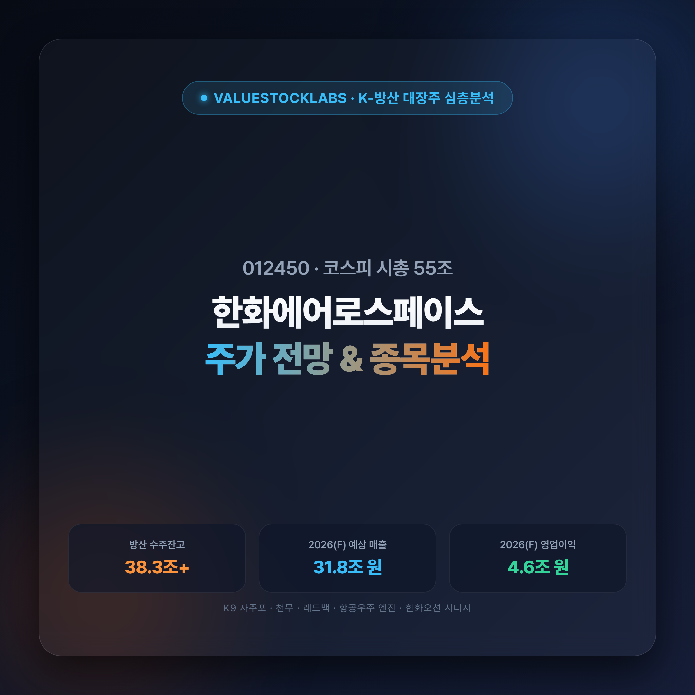
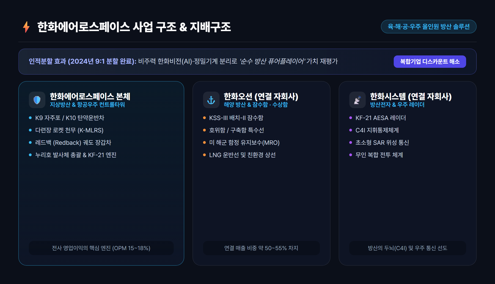
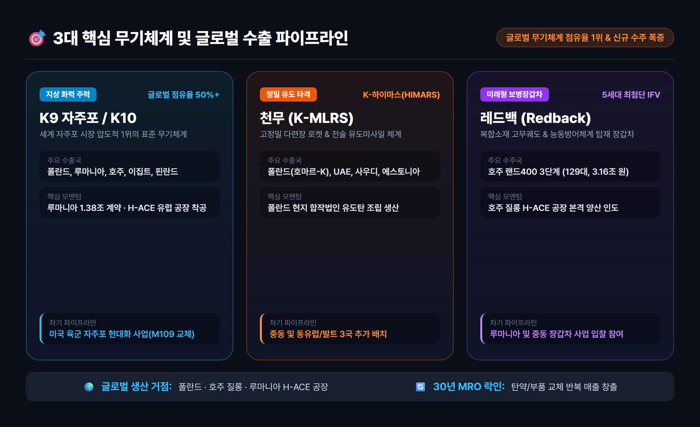
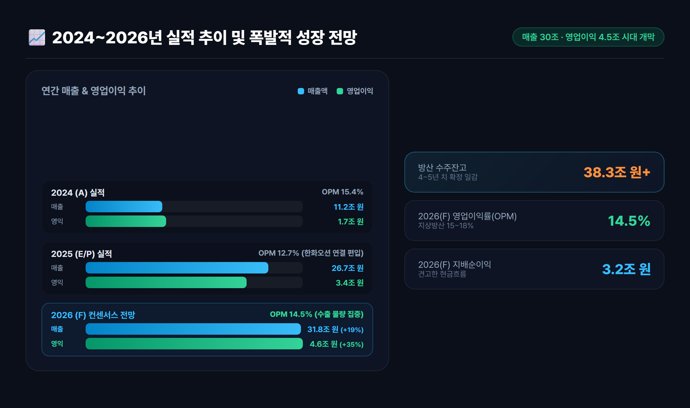
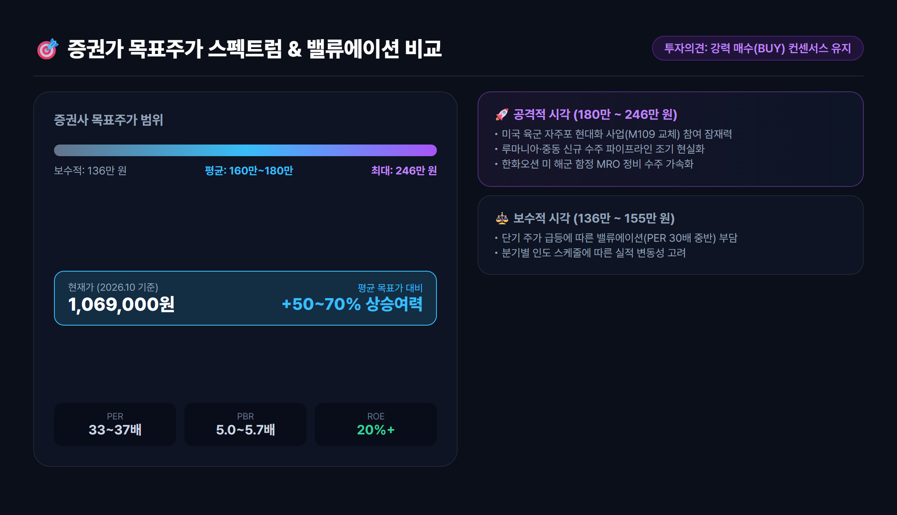
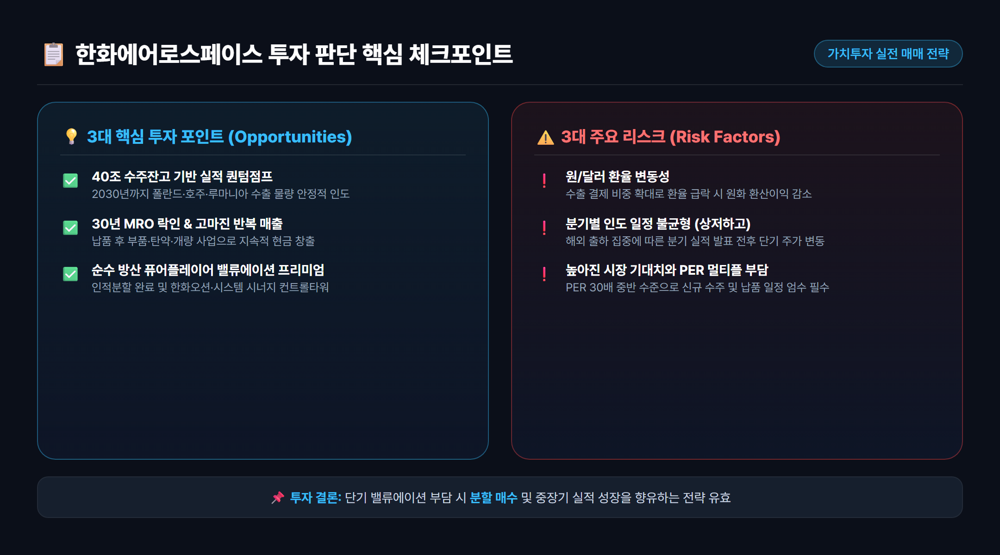

# 한화에어로스페이스 주가 전망 및 기업분석: 40조 수주잔고와 실적 퀀텀점프 총정리

> 한화에어로스페이스(012450)는 K9 자주포, 천무, 레드백을 앞세워 40조 원에 육박하는 수주잔고를 달성하며 글로벌 K-방산의 대장주로 확고히 자리 잡았습니다. 인적분할 이후 방산·항공우주 순수 플레이어로서의 재평가 요인과 2026년 실적 전망, 목표주가를 면밀히 분석합니다.

---

## 목차
- [1. 기업 개요 및 인적분할: 순수 방산·우주 컨트롤타워로 재탄생](#1-기업-개요-및-인적분할-순수-방산우주-컨트롤타워로-재탄생)
- [2. 3대 핵심 무기체계(K9·천무·레드백)와 글로벌 수출 파이프라인](#2-3대-핵심-무기체계k9천무레드백와-글로벌-수출-파이프라인)
- [3. 2024~2026년 실적 분석: 매출 30조·영업이익 4조 돌파 전망](#3-20242026년-실적-분석-매출-30조영업이익-4조-돌파-전망)
- [4. 밸류에이션 및 증권사 목표주가 비교: 매수 매력도는?](#4-밸류에이션-및-증권사-목표주가-비교-매수-매력도는)
- [5. 핵심 투자 포인트 3가지 vs 투자 시 주의할 리스크](#5-핵심-투자-포인트-3가지-vs-투자-시-주의할-리스크)
- [6. 최종 요약 및 실전 투자 전략](#6-최종-요약-및-실전-투자-전략)

---

## 1. 기업 개요 및 인적분할: 순수 방산·우주 컨트롤타워로 재탄생

한화에어로스페이스(012450)는 대한민국을 넘어 글로벌 방위산업 시장에서 독보적인 위상을 확보한 **지상·해양·항공우주 통합 방산 체계종합 기업**입니다. 

### 인적분할을 통한 '순수 방산' 가치 재평가
한화에어로스페이스는 2024년 AI 비전 솔루션을 영위하는 **한화비전**과 반도체 장비 제조 부문인 **한화정밀기계**를 9:1 비율로 인적분할하여 신설법인(한화인더스트리얼솔루션즈)으로 독립시켰습니다. 

이 분할을 통해 한화에어로스페이스는 다음과 같은 결정적 도약의 발판을 마련했습니다:
- **복합기업 디스카운트(Conglomerate Discount) 해소**: 비주력 제조업을 떼어내고 순수 방산·항공우주 기업으로 재정의되어 글로벌 피어(Peer) 그룹 대비 정당한 밸류에이션 멀티플을 적용받게 되었습니다.
- **방산 3사 시너지의 컨트롤타워 구축**: 자회사인 **한화오션**(특수선·잠수함·해양MRO)과 **한화시스템**(레더·지휘통제 C4I·위성통신)의 지분을 보유하며 육·해·공·우주를 유기적으로 연결하는 종합 방산 솔루션 체제를 확립했습니다.

---

## 2. 3대 핵심 무기체계(K9·천무·레드백)와 글로벌 수출 파이프라인

한화에어로스페이스의 핵심 경쟁력은 서구권 경쟁 방산 기업들이 흉내 내기 힘든 **압도적인 납기 신속성, 검증된 실전 성능, 그리고 합리적인 가성비**에 있습니다.

### ① K9 자주포: 글로벌 시장 점유율 50% 이상의 '절대 강자'
- **폴란드 1·2·3차 계약**: 1차 실행계약(212문) 인도를 완료한 데 이어 2차(152문) 및 현지 생산 물량이 순차적으로 공급되고 있습니다.
- **루마니아 수주 및 'H-ACE 유럽' 공장 착공**: 루마니아와 약 1.38조 원 규모의 K9 자주포(54문) 및 K10 탄약운반차(36대) 공급 계약을 맺고, 유럽 현지 생산 거점을 확보했습니다.
- **호주(AS9 헌츠맨) 및 이집트**: 호주 질롱 공장 본격 가동과 함께 이집트 현지화 양산이 이어지고 있습니다.

### ② 천무 다련장 로켓(K-MLRS): 정밀 타격 유도무기 시장의 게임 체인저
- **폴란드 '호마르-K' (Homar-K)**: 폴란드 군용 차체(Jelcz)에 천무 발사대를 탑재하고 현지 합작법인을 통해 유도탄 현지 조립 생산을 진행 중입니다.
- **중동 및 발트 3국 확장**: UAE, 사우디아라비아에 이어 에스토니아 등 북유럽·동유럽 공급망이 빠르게 확장되고 있습니다.

### ③ 레드백 (Redback) 보병전투장갑차(IFV): 미래 지상전의 핵심
- **호주 랜드 400 3단계(Land 400 Phase 3)**: 글로벌 유수 기업들을 제치고 총 129대(약 3.16조 원) 수주를 확정 지었으며, 2026년부터 본격적인 양산 인도가 시작됩니다.
- **유럽 추가 수주 타겟**: 루마니아 및 중동 지역의 차세대 장갑차 도입 사업에서 가장 유력한 후보로 거론되고 있습니다.

---

## 3. 2024~2026년 실적 분석: 매출 30조·영업이익 4조 돌파 전망

한화에어로스페이스의 실적은 단순한 단기 테마가 아닌, **확정된 수주잔고 기반의 구조적 퀀텀점프(Quantum Jump)**를 보여주고 있습니다.

### 연간 실적 및 주요 재무 지표 추이
| 구분 | 2024 (A) | 2025 (E/P) | 2026 (F) | 비고 및 분석 요약 |
|---|---|---|---|---|
| **매출액 (조원)** | 11.2 | 26.7 | 31.8 | 한화오션 연결 편입 및 방산 수출 본격화 |
| **영업이익 (조원)** | 1.7 | 3.4 | 4.6 | 고마진 해외 수출 믹스 개선 (전년비 +35%) |
| **영업이익률 (%)** | 15.4% | 12.7% | 14.5% | 지상방산 부문 15~18% OPM 유지 |
| **지배주주 순이익 (조원)** | 1.2 | 2.3 | 3.2 | 견고한 현금 창출력 지속 |
| **방산 수주잔고 (조원)** | 32.0 | 36.5 | 38.3+ | 4~5년 치 이상의 안정적인 일감 확보 |

*출처: 금융감독원 전자공시시스템(DART) 및 증권가 컨센서스 집계*

### 2026년 실적의 핵심: '상저하고(上低下高)' 패턴
- **상반기**: 지상방산 부문의 생산 라인 전환 및 인도 스케줄 조정으로 일시적인 실적 숨고르기가 나타났습니다.
- **하반기**: 폴란드향 2차 물량 인도 집중, 루마니아 공장 착공 매출 인식, 호주 레드백 초도 물량 출하가 겹치며 연간 최대 실적을 경신할 전망입니다.

---

## 4. 밸류에이션 및 증권사 목표주가 비교: 매수 매력도는?

### 현재 주가 밸류에이션 수준 (2026.10 기준)
- **현재 주가**: 1,069,000원
- **시가총액**: 약 55조 2,759억 원 (코스피 시총 4~5위권 안착)
- **PER (주가수익비율)**: 33.0배 ~ 37.4배
- **PBR (주가순자산비율)**: 5.0배 ~ 5.7배
- **ROE (자기자본이익률)**: 18.5% ~ 22.0% 수준

### 증권가 목표주가 스펙트럼 분석
국내 증권사들은 대부분 투자의견 **'매수(BUY)'**를 유지하고 있으며, 목표주가 밴드는 **136만 원 ~ 246만 원**(평균 160만~180만 원 선)으로 형성되어 있습니다.

1. **보수적 관점 (136만 ~ 155만 원)**:
   - 단기 주가 상승에 따른 밸류에이션(PER 30배 중반) 부담.
   - 상반기 일부 납품 지연에 따른 실적 변동성 반영.
2. **공격적 관점 (180만 ~ 246만 원)**:
   - 루마니아, 중동 등 신규 수주 파이프라인의 조기 가시화.
   - **미국 시장 진출 모멘텀**: 미국 육군 자주포 현대화 사업(M109 노후 교체) 및 미 해군 함정 MRO 수주 확장 시 글로벌 멀티플 추가 프리미엄 부여 가능.

---

## 5. 핵심 투자 포인트 3가지 vs 투자 시 주의할 리스크

### 💡 핵심 투자 포인트 (Investment Highlights)
1. **무기체계 라이프사이클 MRO 락인(Lock-in) 효과**:
   - 무기체계는 1회 판매로 끝나지 않고, 향후 30~40년간 부품 교체, 탄약 조달, 성능 개량(MRO)을 통해 지속적이고 높은 마진의 반복 매출(Recurring Revenue)을 창출합니다.
2. **K-방산 글로벌 공급망 거점화**:
   - 폴란드 합작법인, 호주 질롱 공장, 루마니아 H-ACE 공장 등 글로벌 현지 생산 기지를 선점하여 유럽/나토(NATO) 및 오세아니아 표준 무기체계로 굳건히 자리매김하고 있습니다.
3. **미래 우주항공 컨트롤타워**:
   - 누리호 반복 발사를 총괄하는 체계종합 기업이자 차세대 전투기(KF-21) 엔진 국산화를 도맡아 중장기 미래 성장 동력을 완벽히 확보했습니다.

### ⚠️ 투자 시 점검해야 할 리스크 (Risks)
- **환율 민감도**: 매출의 상당 부분이 달러화 및 외화 결제로 이루어져 원/달러 환율이 급락할 경우 원화 기준 영업이익이 다소 감소할 수 있습니다.
- **분기별 실적 변동성**: 해외 납품 일정이 특정 분기에 집중되는 경향이 있어 분기 실적 발표 시점마다 주가 단기 변동성이 확대될 수 있습니다.
- **높아진 기대치와 멀티플**: 시장 컨센서스가 매우 높게 형성되어 있어 신규 수주 공시나 납품 일정이 지연될 경우 주가 조정 요인으로 작용할 수 있습니다.

---

## 6. 최종 요약 및 실전 투자 전략

한화에어로스페이스(012450)는 **'40조 원 수주잔고 + 독보적인 생산 납기 경쟁력 + 순수 방산 퓨어 플레이어 전환'**이라는 3박자를 모두 갖춘 기업입니다. 

단기적으로는 주가 급등에 따른 밸류에이션 숨고르기가 나타날 수 있으나, 2026년 하반기 실적 급증과 2030년까지 이어지는 견고한 수주 이행을 감안할 때 **분할 매수 및 중장기 가치투자 관점**에서 매우 매력적인 대장주로 판단됩니다.

---

### ⚠️ 투자 유의사항 및 면책 조항
*본 분석글은 공개된 신뢰성 있는 공시 자료 및 금융 데이터를 바탕으로 작성된 참고용 정보이며, 특정 종목에 대한 매수·매도 추천이나 금융 투자 권유가 아닙니다. 모든 투자의 최종 결정과 손익에 대한 책임은 투자자 본인에게 있습니다.*

---

### 📚 참고 출처 (References)
1. [금융감독원 전자공시시스템 (DART)](https://dart.fss.or.kr) - 한화에어로스페이스 사업보고서 및 분기보고서
2. [네이버페이 증권 - 한화에어로스페이스(012450)](https://finance.naver.com/item/main.naver?code=012450) - 시세 및 재무정보
3. [미래에셋증권 리서치센터](https://securities.miraeasset.com) - 방위산업 및 한화에어로스페이스 기업분석 리포트
4. [NH투자증권 리서치본부](https://www.nhqv.com) - K-방산 글로벌 수출 파이프라인 분석 보고서
5. [The Defense Post / Jane's Defense](https://thedefensepost.com) - 글로벌 자주포 및 지상 무기체계 시장 점유율 분석
