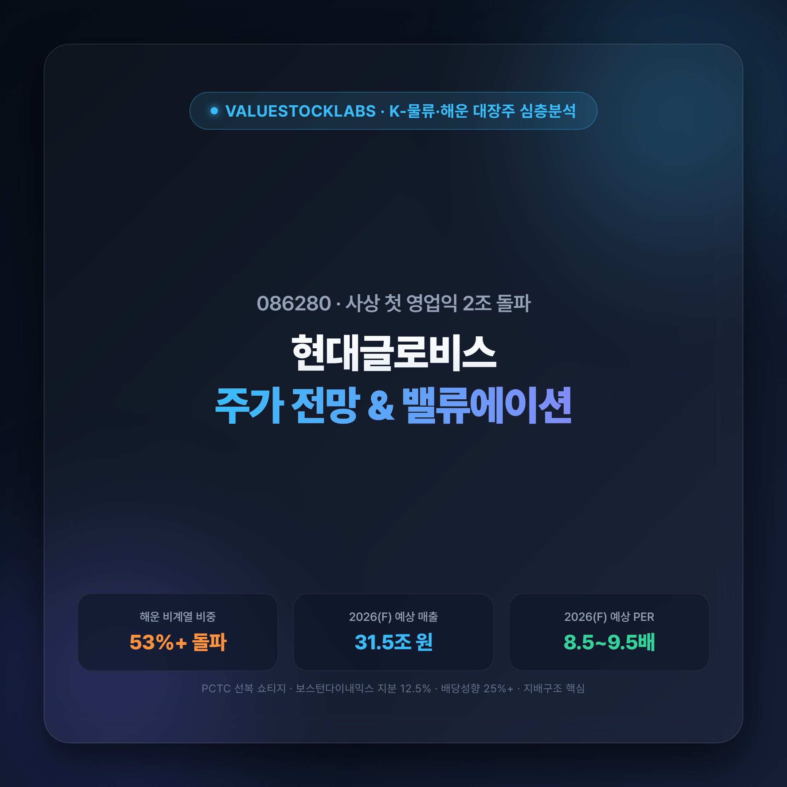
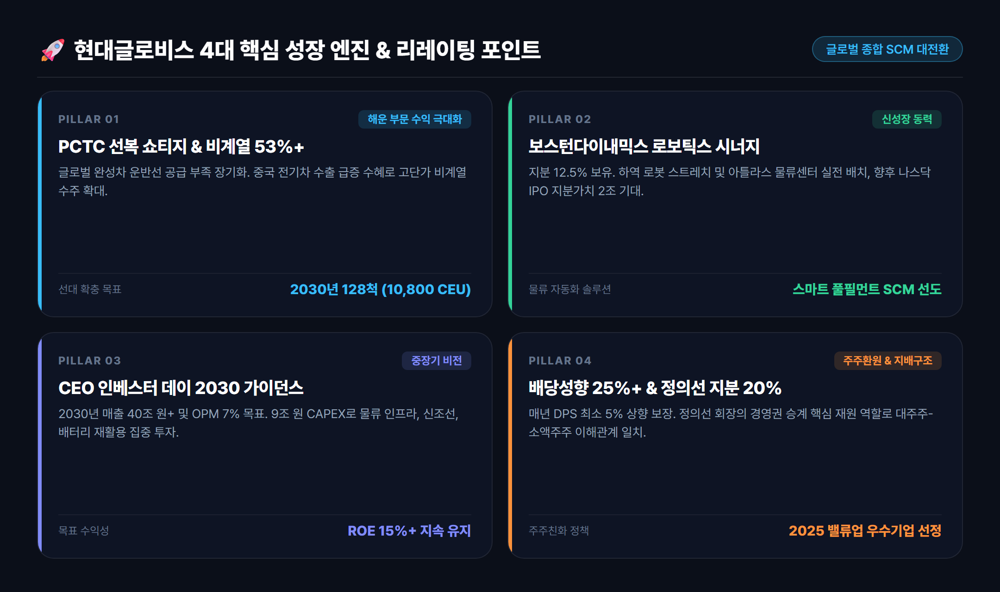
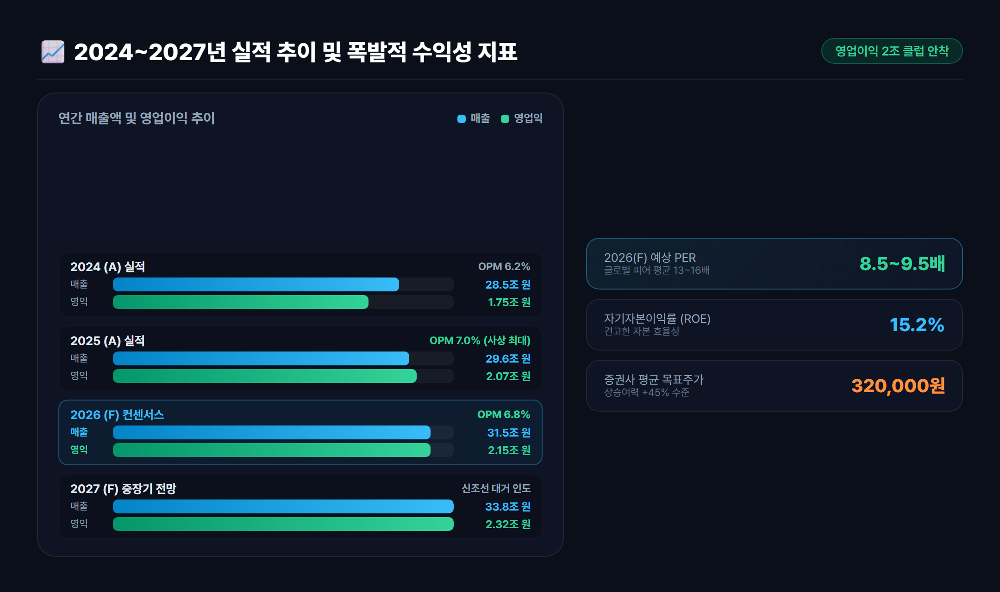
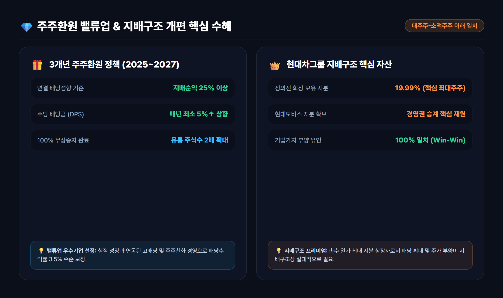

# 현대글로비스 주가 전망 및 기업분석: 영업익 2조 돌파와 2026년 밸류에이션 총정리 (086280)

> 연간 영업이익 2조 원을 돌파하며 역대 최고 실적을 쓴 현대글로비스. 글로벌 PCTC(자동차운반선) 선복 부족 수혜, 비계열 매출 53% 확대, 보스턴 다이내믹스 지분 가치 및 파격적인 주주환원 정책까지 2026년 가치투자 핵심 포인트를 완벽 정리합니다.



---

## 목차
- [1. 사상 최대 실적 경신: 현대글로비스의 펀더멘털 대전환](#1-사상-최대-실적-경신-현대글로비스의-펀더멘털-대전환)
- [2. PCTC 선복 쇼티지와 비계열 매출 53% 돌파의 위력](#2-pctc-선복-쇼티지와-비계열-매출-53-돌파의-위력)
- [3. 보스턴 다이내믹스 로보틱스 시너지와 스마트 물류 비전](#3-보스턴-다이내믹스-로보틱스-시너지와-스마트-물류-비전)
- [4. 2024~2027년 실적 추이 및 밸류에이션 심층 분석](#4-20242027년-실적-추이-및-밸류에이션-심층-분석)
- [5. 배당성향 25%+와 지배구조 개편의 핵심 수혜](#5-배당성향-25와-지배구조-개편의-핵심-수혜)
- [6. 투자 리스크 점검 및 최종 결론](#6-투자-리스크-점검-및-최종-결론)

---

## 1. 사상 최대 실적 경신: 현대글로비스의 펀더멘털 대전환

국내 대표 종합 물류·해운 기업인 **현대글로비스(086280)**가 2025년 창사 이래 최초로 **연간 영업이익 2조 원** 고지를 돌파하며 새로운 역사를 썼습니다. 

과거 현대글로비스는 '현대자동차그룹 캡티브(그룹사 내부) 물량에 의존하는 단순 물류 회사'라는 시장의 편견에 갇혀 만성적인 밸류에이션 디스카운트를 겪었습니다. 하지만 최근 몇 년간 글로벌 해운 선대 확장과 독자적인 공급망 인프라 구축을 통해 글로벌 톱티어 종합 SCM(공급망 관리) 플랫폼으로 완전히 탈바꿈했습니다.

> **💡 현대글로비스 핵심 펀더멘털 포인트**
> - **사상 최대 실적**: 2025년 연간 매출 29.6조 원, 영업이익 2조 730억 원 달성 (2026년 매출 31.5조 원, 영업익 2.15조 원 전망)
> - **글로벌 선대 경쟁력**: PCTC(자동차 전용 운반선) 글로벌 시장점유율 상위권 도약 및 2030년 128척 친환경 선대 확보
> - **주주가치 혁신**: 100% 무상증자 완료, 3개년 배당성향 25% 이상 + 매년 DPS 최소 5% 상향 약속

---

## 2. PCTC 선복 쇼티지와 비계열 매출 53% 돌파의 위력

현재 글로벌 완성차 물류 시장에서 가장 강력한 진입장벽이자 수익원 역할을 하는 것은 바로 **PCTC(Pure Car and Truck Carrier, 자동차운반선) 선복의 구조적 공급 부족(Shortage)**입니다.

국제해사기구(IMO)의 강력한 탄소 배출 규제로 인해 노후 선박 폐선이 가속화된 반면, 조선소 도크 부족으로 신조선 인도는 지연되고 있습니다. 이 와중에 **중국 완성차(BYD, 지리, 체리 등)의 해외 수출 폭증**으로 글로벌 자동차 수송 수요가 폭발하면서 PCTC 운임은 역사적 고공행진을 이어가고 있습니다.

```
[글로벌 PCTC 시장의 3대 호재]
1. 공급 제약: 신조선 인도 지연 + 탄소 배출 규제 폐선 = 선복 공급 쇼티지 지속
2. 수요 폭증: 중국 전기차 및 글로벌 하이브리드차 수출 물동량 급증
3. 운임 상승: 고단가 계약 체결 및 중장비(High & Heavy) 화물 비중 확대
```

현대글로비스의 자동차 해상운송 비계열(Non-Captive, 현대차·기아 외 고객사) 매출 비중은 **2010년 12%에서 2019년 52%, 최근 53% 이상으로 가파르게 상승**했습니다. 글로벌 완성차 업체들이 현대글로비스의 정시 운항 능력과 대규모 선대에 의존하게 되면서 협상력이 극대화된 결과입니다.

회사는 2027~2030년까지 세계 최대급인 **10,800 CEU급 초대형 LNG 이중연료 추진 PCTC선**을 대거 인도받아 선대를 110~128척 수준으로 늘려 글로벌 1위 자동차 선사로서의 입지를 굳힐 계획입니다.



---

## 3. 보스턴 다이내믹스 로보틱스 시너지와 스마트 물류 비전

현대글로비스의 미래 성장 동력 중 가장 시장의 뜨거운 관심을 받는 축은 **보스턴 다이내믹스(Boston Dynamics)와의 로보틱스 시너지**입니다.

소프트뱅크의 지분 매각 절차 이후 현대차그룹이 지배구조를 재편하면서, 현대글로비스는 **보스턴 다이내믹스 지분 약 12.5%**를 확보했습니다. (정의선 회장 25.0%, HMG글로벌 62.5%)

### 로보틱스 스마트 물류의 실전 적용
1. **스트레치(Stretch) 로봇**: 컨테이너 및 물류센터 내 트럭 하역 작업을 완전 자동화하는 박스 핸들링 전문 로봇으로, 현대글로비스 스마트 물류 거점에 순차 배치 중입니다.
2. **차세대 전동식 아틀라스(All-New Atlas)**: 인간 작업자를 대체할 차세대 휴머노이드 로봇으로, 고중량 부품 이송 및 복잡한 물류 공정에 투입을 준비하고 있습니다.
3. **나스닥 IPO 상장 모멘텀**: 글로벌 로보틱스 붐에 힘입어 향후 보스턴 다이내믹스의 미국 증시 상장 시, 기업가치 10조~15조 원 기준으로 환산하면 현대글로비스의 보유 지분 가치만 **1.5조~2조 원 규모로 재평가**받게 됩니다.

---

## 4. 2024~2027년 실적 추이 및 밸류에이션 심층 분석

현대글로비스는 2024년 6월 CEO 인베스터 데이를 통해 **'2030년 매출 40조 원 + α, 영업이익률 7%, ROE 15% 이상'**이라는 담대한 중장기 목표를 제시했습니다. 2025년에 이미 영업이익 2조 원(영업이익률 7.0%)을 조기 달성하며 목표 달성에 청신호가 켜졌습니다.

### 현대글로비스 연도별 핵심 재무제표 요약

| 구분 | 2023년 (A) | 2024년 (A) | 2025년 (A) | 2026년 (F) | 2027년 (F) |
|---|---|---|---|---|---|
| **매출액 (조 원)** | 25.68 | 28.45 | **29.57** | **31.50** | **33.80** |
| **영업이익 (조 원)** | 1.55 | 1.75 | **2.07** | **2.15** | **2.32** |
| **영업이익률 (OPM)** | 6.1% | 6.2% | **7.0%** | **6.8%** | **6.9%** |
| **지배주주순이익 (조 원)**| 1.07 | 1.09 | **1.73** | **1.65** | **1.78** |
| **ROE (%)** | 15.2% | 14.1% | **18.5%** | **15.2%** | **15.0%** |
| **EPS (수정, 원)** | 14,264 | 14,560 | **23,093** | **22,000** | **23,733** |
| **BPS (수정, 원)** | 98,500 | 108,200 | **132,000** | **149,000** | **168,000** |
| **DPS (주당배당금, 원)**| 3,150 | 3,800 | **5,800** | **6,200** | **6,600** |

*(주: 2024년 8월 100% 무상증자 반영 수정 주당 지표 기준)*



### 현재 주가와 밸류에이션 매력도
- **현재 시가총액**: 약 15조 원 (주가 20만 원 초반대)
- **2026년 예상 PER**: **8.5 ~ 9.5배**
- **PBR**: **1.3배 수준**
- **ROE**: **15% 이상**

글로벌 3PL 및 전문 해운사의 평균 PER이 13~16배 수준인 점을 감안할 때, 현대글로비스의 현재 주가는 뚜렷한 저평가(Undervalued) 구간에 머물러 있습니다. 국내외 주요 증권사들의 평균 목표주가는 **310,000원 ~ 340,000원**으로, 현 주가 대비 **45% 이상의 업사이드(상승 여력)**가 열려 있습니다.

---

## 5. 배당성향 25%+와 지배구조 개편의 핵심 수혜

현대글로비스가 가치투자자들에게 강력한 러브콜을 받는 또 다른 이유는 **한국 증시 최고의 주주환원 의지(밸류업)**와 **그룹 지배구조상의 특수성** 때문입니다.

### ① 주주환원 가이드라인 (2025~2027년 3개년)
- **연결 지배순이익 기준 배당성향 25% 이상 유지**
- **주당배당금(DPS) 매년 전년 대비 최소 5% 이상 상향 지급**
- 2024년 1:1 무상증자 단행을 통해 거래 유동성을 극대화하여 코리아 디스카운트 해소에 앞장섰으며, '2025 밸류업 우수기업'으로 선정되었습니다.

### ② 정의선 회장 20% 지분의 나비효과
현대글로비스의 최대주주 중 한 명은 **정의선 현대차그룹 회장(지분율 약 19.99%)**입니다. 향후 현대차그룹의 순환출자 해소 및 현대모비스 중심의 지배구조 개편 과정에서 정의선 회장의 경영권 승계 재원 마련을 위해 현대글로비스의 기업가치 상승과 높은 배당은 필연적인 수순입니다.

> **💡 핵심 요약**: 현대글로비스는 대주주의 경제적 이익과 일반 소액주주의 주주가치가 정확히 같은 방향을 가리키는 몇 안 되는 최우량 지배구조 수혜주입니다.



---

## 6. 투자 리스크 점검 및 최종 결론

### ⚠️ 투자 시 고려해야 할 리스크
1. **환율 변동성**: 달러 결제 비중이 높은 해운/해외물류 사업 특성상 원/달러 환율이 급격히 하락할 경우 원화 환산 이익이 일시적으로 감소할 수 있습니다.
2. **지정학적 리스크 및 유가**: 중동 분쟁이나 수에즈 운하 이슈로 희망봉 우회 항로를 이용할 경우 단기적인 연료비 부담이 발생할 수 있습니다.
3. **글로벌 완성차 수요**: 주요국의 자동차 관세 장벽이나 고금리 장기화에 따른 완성차 소비 둔화 가능성은 모니터링이 필요합니다.

### 🎯 최종 종합 의견: "실적과 주주환원, 지배구조 3박자를 갖춘 저평가 가치주"
현대글로비스는 **① PCTC 해운 선복 쇼티지에 따른 독보적 이익 체력, ② 비계열 매출 53% 달성을 통한 글로벌 독립성, ③ 보스턴 다이내믹스 로봇 지분 가치, ④ 배당성향 25% 이상의 밸류업 정책, ⑤ 대주주 지분 20%가 담보하는 기업가치 부양 동력**까지 완벽한 상승 트리거를 갖추고 있습니다.

PER 8~9배 수준의 역사적 저평가 영역에서 안정적인 배당 수익과 함께 중장기 우상향 모멘텀을 누릴 수 있는 최적의 포트폴리오 가치주로 판단됩니다.

---

*면책 조항: 본 글은 공개된 신뢰성 있는 자료를 바탕으로 작성된 분석 자료이며, 특정 종목에 대한 매수·매도 추천이나 금융 투자 권유가 아닙니다. 모든 투자의 최종 책임은 투자자 본인에게 있습니다.*

---

## 📚 참고 출처 (References)
1. [현대글로비스 공식 IR 자료실](https://www.glovis.net) - CEO 인베스터 데이 발표 자료 및 실적 공시
2. [금융감독원 전자공시시스템(DART)](https://dart.fss.or.kr) - 현대글로비스 분기보고서 및 배당/무상증자 공시
3. [미래에셋증권 리서치센터](https://securities.miraeasset.com) - 현대글로비스(086280) 기업분석 리포트
4. [대신증권 리서치센터](https://www.daishin.com) - PCTC 해운 시황 및 현대글로비스 목표주가 리포트
5. [한국거래소(KRX)](https://kind.krx.co.kr) - 2025 밸류업 우수기업 공시 및 주가 지표
