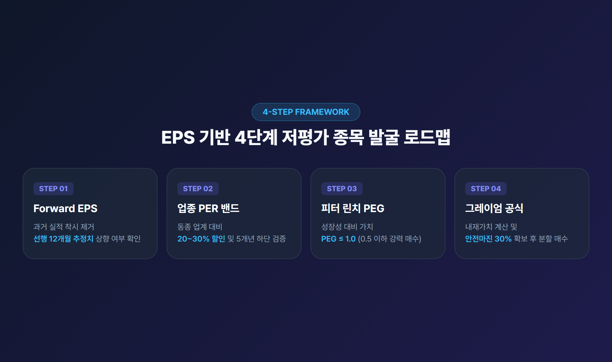
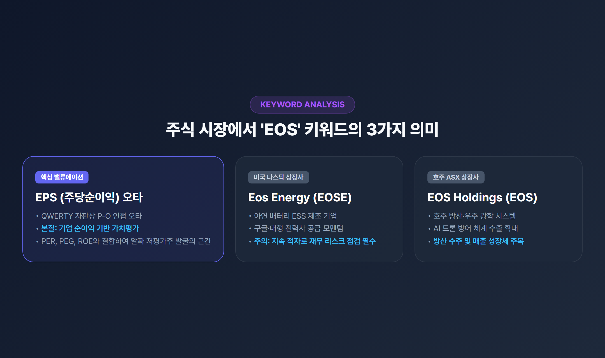
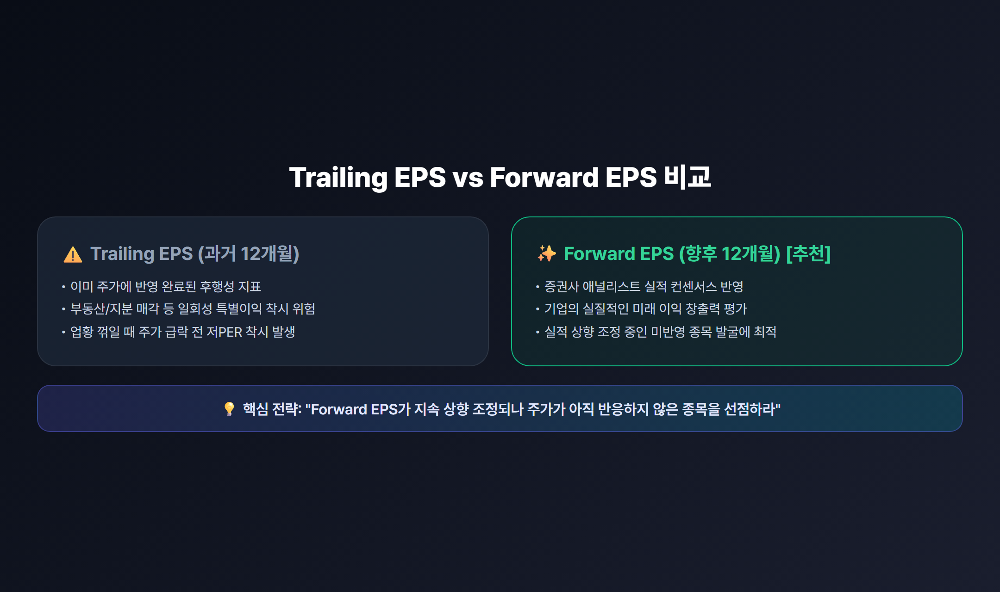
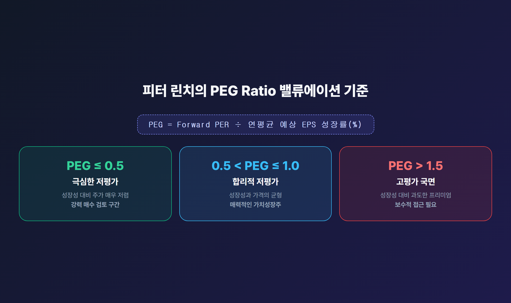
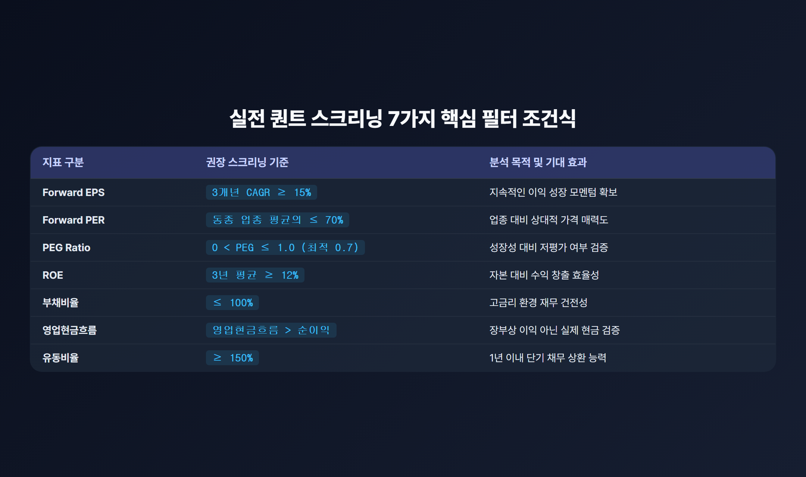
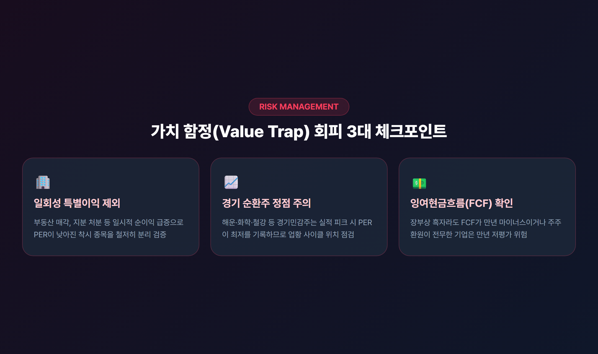

# EPS 저평가주 찾는 법: Forward PER·PEG 공식과 4단계 스크리닝 가이드

> 주가수익비율(PER)의 함정에서 벗어나, 미래 주당순이익(Forward EPS)과 성장성(PEG), 자본효율성(ROE)을 결합해 진짜 알짜 저평가 종목을 발굴하는 실전 투자 프레임워크를 정리합니다.

---

## 목차
- [1. 왜 단순 저PER 종목은 실패할까? (EPS의 본질)](#1-왜-단순-저per-종목은-실패할까-eps의-본질)
- [2. 용어 정리: 주식 시장에서 'EOS'와 'EPS'의 맥락](#2-용어-정리-주식-시장에서-eos와-eps의-맥락)
- [3. EPS 기반 저평가 종목 발굴 4단계 프레임워크](#3-eps-기반-저평가-종목-발굴-4단계-프레임워크)
  - [1단계: 과거 실적(Trailing) 대신 선행 이익(Forward EPS) 확인](#1단계-과거-실적trailing-대신-선행-이익forward-eps-확인)
  - [2단계: 업종 평균 및 5개년 PER 밴드 비교](#2단계-업종-평균-및-5개년-per-밴드-비교)
  - [3단계: 피터 린치의 PEG Ratio로 성장성 대비 가격 검증](#3단계-피터-린치의-peg-ratio로-성장성-대비-가격-검증)
  - [4단계: 벤저민 그레이엄 공식으로 내재가치와 안전마진 계산](#4단계-벤저민-그레이엄-공식으로-내재가치와-안전마진-계산)
- [4. 실전 퀀트 스크리닝 조건식 총정리](#4-실전-퀀트-스크리닝-조건식-총정리)
- [5. 가치 함정(Value Trap)을 피하는 3가지 체크리스트](#5-가치-함정을-피하는-3가지-체크리스트)
- [6. 요약 및 결론](#6-요약-및-결론)

---

## 1. 왜 단순 저PER 종목은 실패할까? (EPS의 본질)

많은 투자자가 "PER(주가수익비율)이 5배 이하니까 저평가 종목이다"라며 매수 버튼을 누릅니다. 하지만 주가는 반등하지 않고 오히려 끝없는 횡보나 추가 하락을 겪는 경우가 부지기수입니다. 이를 가치투자에서는 **'가치 함정(Value Trap)'**이라고 부릅니다.

PER은 단순히 주가를 **EPS(Earnings Per Share, 주당순이익)**로 나눈 값입니다.
$$\text{PER} = \frac{\text{현재 주가}}{\text{EPS}}$$

즉, PER이 낮다는 것은 두 가지 경우 중 하나입니다:
1. 회사의 이익 창출 능력(EPS)은 뛰어난데 시장에서 일시적으로 소외되어 주가가 싼 경우 (**진짜 저평가**)
2. 회사의 성장 동력이 멈추거나 업황이 꺾여 미래 EPS가 급감할 것을 시장이 미리 알고 주가를 떨어뜨린 경우 (**가짜 저평가 / 가치 함정**)

따라서 성공적인 가치 투자를 위해서는 단순히 과거 PER 숫자만 볼 것이 아니라, **EPS의 방향성(성장률)과 이익의 질(ROE, 현금흐름)**을 결합하여 분석해야 합니다.

---

## 2. 용어 정리: 주식 시장에서 'EOS'와 'EPS'의 맥락

주식 커뮤니티나 검색 포털에서 간혹 **'EOS 기반 저평가주'**라는 키워드를 접하게 됩니다. 투자 전 혼동을 방지하기 위해 시장에서 쓰이는 3가지 맥락을 짚고 넘어갈 필요가 있습니다.

1. **EPS(주당순이익)의 키보드 오타**:
   - 표준 QWERTY 자판에서 'P' 바로 옆에 'O'가 위치하여, 'EPS 저평가'를 입력하려다 'EOS 저평가'로 오타가 발생하는 대표적인 사례입니다. 펀더멘털 스크리닝 관점에서는 **EPS 기반 가치평가**를 의미합니다.
2. **개별 상장 기업 티커 (EOSE / EOS)**:
   - **Eos Energy Enterprises (NASDAQ: EOSE)**: 차세대 아연 배터리 기반 ESS(에너지저장장치) 제조사로, 대형 프로젝트 수주 모멘텀이 있으나 영업적자 리스크 관리가 필요한 성장주입니다.
   - **Electro Optic Systems Holdings (ASX: EOS)**: 호주 방산·우주 광학 기업으로 드론 방어 체계 수출과 관련된 종목입니다.
3. **IT 업계 교체 주기 (End of Service / End of Support)**:
   - 윈도우나 주요 소프트웨어의 지원 종료(EOS) 시점에 발생하는 IT 인프라 교체 및 보안 수혜주를 지칭하기도 합니다.

본 가이드에서는 일반 투자자가 우량 저평가주를 선별할 때 핵심이 되는 **EPS 기반 밸류에이션 프레임워크**를 집중적으로 다룹니다.

---

## 3. EPS 기반 저평가 종목 발굴 4단계 프레임워크

알짜 종목을 스크리닝하기 위해선 아래의 4단계 검증 절차를 순서대로 적용하는 것이 정석입니다.

### 1단계: 과거 실적(Trailing) 대신 선행 이익(Forward EPS) 확인
- **Trailing EPS (과거 12개월 실적)**: 이미 지나간 실적으로, 일회성 자산 매각이나 부동산 처분 이익 등으로 일시적 착시가 생길 수 있습니다.
- **Forward EPS (향후 12개월 예상 실적)**: 증권사 애널리스트들의 실적 추정치(컨센서스) 평균값입니다. 주가는 미래 이익을 선반영하므로, **"Forward EPS 추정치가 상향 조정되고 있는데도 주가가 아직 오르지 않은 기업"**이 가장 매력적인 투자 타깃입니다.

### 2단계: 업종 평균 및 5개년 PER 밴드 비교
- 절대적인 PER 수치(예: 10배)만으로 평가하면 안 됩니다. 성장성이 높은 바이오·소프트웨어 업종과 성장이 완만한 금융·유틸리티 업종의 기준 PER은 완전히 다릅니다.
- **체크포인트**: 동일 업종(Peer Group) 평균 PER 대비 **20~30% 이상 할인**되어 거래되는지, 그리고 해당 종목의 **과거 5개년 PER 밴드 최하단**에 근접해 있는지 확인합니다.

### 3단계: 피터 린치의 PEG Ratio로 성장성 대비 가격 검증
전설적인 펀드매니저 피터 린치는 "성장률을 고려하지 않은 PER은 무의미하다"며 **PEG(Price/Earnings to Growth Ratio)** 지표를 개발했습니다.

$$\text{PEG} = \frac{\text{Forward PER}}{\text{향후 예상 연평균 EPS 성장률(\%)}}$$

- **PEG 해석 기준표**:
  - **$\text{PEG} \le 0.5$**: 극심한 저평가 상태 (강력 매수 후보)
  - **$0.5 < \text{PEG} \le 1.0$**: 성장성 대비 합리적인 저평가 구간
  - **$\text{PEG} > 1.5$**: 이익 성장성에 비해 주가 프리미엄이 과도한 상태

> **실전 비교 예시**:
> - **A기업**: PER 25배, 예상 EPS 성장률 35% $\rightarrow \text{PEG} = \frac{25}{35} \approx 0.71$ (**저평가**)
> - **B기업**: PER 10배, 예상 EPS 성장률 5% $\rightarrow \text{PEG} = \frac{10}{5} = 2.0$ (**고평가**)
> 
> 단순 PER만 보면 B기업이 저렴해 보이지만, 이익 성장 속도를 감안한 진짜 저평가주는 A기업입니다.

### 4단계: 벤저민 그레이엄 공식으로 내재가치와 안전마진 계산
'가치투자의 아버지' 벤저민 그레이엄은 기업의 본질적 가치를 계산하기 위해 다음과 같은 내재가치 산출 공식을 제시했습니다.

$$\text{내재가치(Intrinsic Value)} = \text{EPS} \times (8.5 + 2g)$$
- $8.5$: 성장이 정체된 기업의 기본 기준 PER
- $g$: 향후 7~10년간의 예상 연평균 EPS 성장률(%)

산출된 내재가치 대비 **최소 30% 이상의 안전마진(Margin of Safety)**을 확보한 가격대에서 분할 매수하는 것이 보수적 가치투자의 핵심 원칙입니다.

---

## 4. 실전 퀀트 스크리닝 조건식 총정리

증권사 HTS(키움 영웅문 등), 네이버 증권, 트레이딩뷰, FnGuide 등의 조건검색 툴에 입력할 수 있는 표준 퀀트 필터링 조건입니다.

| 구분 | 스크리닝 조건 | 설정 이유 및 기대 효과 |
|---|---|---|
| **성장성** | Forward EPS 성장률 $\ge 15\%$ (3개년 CAGR) | 지속적인 이익 확장 국면에 진입한 기업 선별 |
| **밸류에이션** | Forward PER $\le$ 동일 업종 평균의 $70\%$ | 업종 대비 상대적 가격 매력도 확보 |
| **성장 가치** | $0 < \text{PEG Ratio} \le 1.0$ (최적 $\le 0.7$) | 성장성 대비 고평가된 거품 제거 |
| **자본 효율성** | 3개년 평균 ROE $\ge 12\%$ | 주주 자본을 활용한 수익 창출 능력 검증 |
| **재무 건전성** | 부채비율 $\le 100\%$ (제조·IT 기준) | 고금리 장기화 국면에서 이자 비용 리스크 방어 |
| **이익의 질** | 영업현금흐름 / 당기순이익 $> 1.0$ | 장부상 이익이 아닌 실제 현금 유입 여부 확인 |
| **단기 유동성** | 유동비율 $\ge 150\%$ | 1년 이내 단기 부채 상환 능력 확보 |

위 7가지 조건을 동시에 만족하는 종목군은 하방 경직성이 강하면서도 시장 반등 시 탄력적인 주가 상승을 보여줄 확률이 높습니다.

---

## 5. 가치 함정(Value Trap)을 피하는 3가지 체크리스트

스크리닝을 통과했더라도 최종 매수 전 반드시 다음 3가지 리스크 요인을 점검해야 합니다.

1. **일회성 특별이익 착시 여부 확인**:
   - 부동산 매각이나 지분 처분, 대규모 소송 합의금으로 당기순이익이 일시 폭증해 PER이 낮아진 것은 아닌지 재무제표의 '영업이익'과 '영업외수익'을 분리해 확인해야 합니다.
2. **경기 순환주(Cyclical)의 실적 정점(Peak) 주의**:
   - 해운, 정유·화학, 철강 등 경기 민감주는 호황기 정점에서 EPS가 최대치를 기록하여 PER이 극단적으로 낮아집니다. 이 시기가 실제로는 주가의 최고점일 수 있으므로 산업 사이클 위치를 확인해야 합니다.
3. **잉여현금흐름(FCF)과 주주환원 정책 확인**:
   - 순이익은 흑자인데 잉여현금흐름(Free Cash Flow)이 만년 마이너스이거나, 대주주 지배구조 리스크로 주주환원이 전무한 기업은 만년 저평가(코리아 디스카운트) 상태를 벗어나기 어렵습니다.

---

## 6. 요약 및 결론

주식 시장에서 저평가주를 발굴하는 성공 공식은 단순한 '저PER 찾기'가 아닙니다.

1. **과거보다 미래(Forward EPS)**를 보고,
2. **성장성(PEG 1.0 이하)**과 **경영 효율성(ROE 12% 이상)**을 갖추었으며,
3. **영업현금흐름이 든든한 기업**을 업종 평균 대비 할인된 가격에 매수하는 것입니다.

이 원칙을 바탕으로 포트폴리오를 구성한다면 단기 시장 변동성에 흔들리지 않고 장기적으로 복리 수익을 누리는 든든한 투자 기반을 마련할 수 있을 것입니다.

---

*면책 조항: 본 글은 정보 제공 및 투자 학습을 목적으로 작성되었으며, 특정 종목에 대한 매수·매도 추천이나 금융상품 가입 권유가 아닙니다. 모든 투자의 결정과 최종 책임은 투자자 본인에게 있습니다.*
