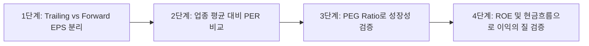

# [주식] EPS(EOS) 기반 저평가 종목 발굴 및 적정주가 산출법 리서치 보고서

- **조사 일자**: 2026-09-16
- **조사 주제**: 주식 EPS(주당순이익, 키보드 오타 EOS 포함) 기반의 저평가 종목 발굴법 및 밸류에이션 분석
- **핵심 요약 (Key Takeaways)**:
  1. 주식 시장에서 'EOS 저평가'는 통상 키보드 오타로 인한 **EPS(Earnings Per Share, 주당순이익)** 기반 가치 평가 모델을 지칭하거나, 나스닥 상장사인 **Eos Energy(EOSE)** 및 호주 **EOS Holdings**의 개별 기업 밸류에이션을 의미함.
  2. **EPS 기반 저평가 판별의 3대 축**: 단순 과거 EPS가 아닌 **Forward EPS(향후 12개월 선행 주당순이익)**, 이익 성장성을 반영한 **PEG(Price/Earnings to Growth Ratio)**, 자본 효율성을 측정하는 **ROE(자기자본이익률)**의 결합 분석이 핵심.
  3. **대가들의 적정주가 산출 모델**:
     - 피터 린치: $PEG \le 0.5$ (강력 저평가), $PEG \le 1.0$ (적정/저평가)
     - 벤저민 그레이엄 공식: $\text{적정주가} = \text{EPS} \times (8.5 + 2g)$
  4. **실전 퀀트 스크리닝 필터 조건**: ① 최근 3개년 EPS 성장률 $\ge 15\%$, ② Forward PER $\le$ 동일 업종 평균의 70%, ③ ROE $\ge 12\%$, ④ 부채비율 $\le 100\%$, ⑤ 영업현금흐름 > 당기순이익.

---

## 1. 용어 명확화 및 시장 맥락 (EPS vs EOS)

### 1-1. EPS(주당순이익)의 정의 및 가치 투자에서의 의미
- **정의**: 당기순이익을 총 발행주식수로 나눈 지표 ($\text{EPS} = \frac{\text{당기순이익}}{\text{발행주식수}}$).
- **의미**: 기업이 1주당 얼마의 순이익을 창출했는지를 보여주는 수익성의 절대 척도. 주가수익비율(PER), 주가순자산비율(PBR)의 근간이 되는 핵심 펀더멘털 지표.

### 1-2. 키워드 'EOS'의 주식 시장 내 3가지 갈래
1. **EPS(주당순이익)의 오타**:
   - QWERTY 자판 배열상 'P'와 'O'가 인접해 있어, 금융 커뮤니티 및 검색 포털에서 'EPS 저평가'를 'EOS 저평가'로 검색하는 빈도가 높음.
2. **개별 상장 기업 티커 (EOS / EOSE)**:
   - **Eos Energy Enterprises (NASDAQ: EOSE)**: 유틸리티급 아연 기반 ESS(에너지저장장치) 제조 기업. 구글 및 대형 전력사 공급 계약 모멘텀이 있으나, 지속적인 영업적자로 인해 밸류에이션 시 재무 리스크 평가가 필수적인 종목.
   - **Electro Optic Systems Holdings (ASX: EOS)**: 호주 방산·우주 광학 시스템 기업. 드론 방어 체계 수출 확대로 주목받고 있음.
3. **IT 산업 용어 (End of Service / End of Support)**:
   - 주요 소프트웨어/하드웨어 교체 주기(EOS 도래)에 따른 보안·서버 업그레이드 수혜주 발굴 관점.

---

## 2. EPS 기반 저평가 종목 판별 4단계 프레임워크

### 2-1. [1단계] Trailing EPS vs Forward EPS 구분
- **Trailing EPS (과거 12개월 실적)**: 이미 주가에 반영된 과거 데이터로, 일회성 자산 매각이나 환차익에 의한 착시가 발생할 위험 존재.
- **Forward EPS (향후 12개월 예상 실적)**: 시장 컨센서스(증권사 추정치 평균)를 반영한 미래 수익력. 진정한 저평가주는 **'Forward EPS가 상향 조정되고 있음에도 주가가 아직 반응하지 않은 종목'**에서 발생.

### 2-2. [2단계] PER(주가수익비율)과 업종 밴드 분석
- $\text{PER} = \frac{\text{현재 주가}}{\text{EPS}}$
- **저평가 기준**: 동일 산업(Peer Group) 평균 PER 대비 20~30% 이상 할인된 상태이거나, 해당 기업의 과거 5개년 PER 밴드 하단에 위치할 때.
- **주의점 (가치 함정, Value Trap)**: 산업 사양화나 지배구조 문제로 인해 PER이 영구히 낮은 '저평가 착시 종목'은 배제해야 함.

### 2-3. [3단계] 피터 린치의 PEG Ratio (성장성 대비 가치)
- $\text{PEG} = \frac{\text{Forward PER}}{\text{연평균 예상 EPS 성장률(\%)}}$
- **판단 기준**:
  - **PEG < 0.5**: 극심한 저평가 (강력 매수 구간)
  - **PEG 0.5 ~ 1.0**: 합리적 저평가 (매력적인 가치 성장주)
  - **PEG > 1.5 ~ 2.0**: 고평가 또는 프리미엄 반영 구간
- **예시**:
  - A기업: PER 25배, EPS 성장률 35% $\rightarrow$ $\text{PEG} = \frac{25}{35} \approx 0.71$ (**저평가**)
  - B기업: PER 10배, EPS 성장률 5% $\rightarrow$ $\text{PEG} = \frac{10}{5} = 2.0$ (**고평가**)
  - *결론*: 단순 PER은 B기업이 낮아 보이지만, 성장성을 감안한 실질 저평가주는 A기업임.

### 2-4. [4단계] 벤저민 그레이엄의 내재가치 산출 공식
- $\text{내재가치(Intrinsic Value)} = \text{EPS} \times (8.5 + 2g)$
  - $8.5$: 성장이 멈춘 제로 성장 기업의 기준 PER
  - $g$: 향후 7~10년 예상 연평균 EPS 성장률(%)
- **현대적 보정 공식**: $\text{적정주가} = \frac{\text{EPS} \times (8.5 + 2g) \times 4.4}{Y}$
  - $4.4$: 1960년대 미국 AAA등급 회사채 평균 수익률
  - $Y$: 현재 AAA등급 회사채 또는 무위험 국채 금리(%)
- **안전마진(Margin of Safety)**: 내재가치 대비 30% 이상 할인된 가격에서 매수.

---

## 3. 실전 퀀트 스크리닝(Screening) 조건식

증권사 HTS(영웅문, HTS 종합), 네이버 증권, 트레이딩뷰, FnGuide 등에서 저평가 우량주를 필터링할 때 적용하는 표준 조건식:

| 스크리닝 항목 | 권장 필터 기준 | 분석 목적 |
|---|---|---|
| **Forward EPS 성장률** | 최근 3개년 CAGR $\ge 15\%$ | 지속적인 이익 성장 모멘텀 확보 |
| **Forward PER** | 동종 업계 평균 대비 $\le 70\%$ | 상대적 가격 매력도 확인 |
| **PEG Ratio** | $0 < \text{PEG} \le 1.0$ (최적 $\le 0.7$) | 성장성 대비 저평가 여부 검증 |
| **ROE (자기자본이익률)** | 최근 3년 평균 $\ge 12\%$ | 자본 투하 대비 이익 창출 효율성 |
| **부채비율** | $\le 100\%$ (금융업 제외) | 금리 변동기 재무 안정성 확보 |
| **영업현금흐름 / 순이익** | 비율 $> 1.0$ | 회계상 이익이 아닌 실제 현금 유입 검증 |
| **유동비율** | $\ge 150\%$ | 단기 채무 상환 능력 검증 |

---

## 4. 저평가주 발굴 시 반드시 피해야 할 '가치 함정(Value Trap)'과 체크리스트

### 4-1. 대표적인 가치 함정 유형
1. **일회성 특별이익 착시**: 부동산 매각, 소송 승소금, 자회사 지분 처분 등으로 일시적 순이익 급증 $\rightarrow$ 다음 해 EPS 급락으로 PER 왜곡.
2. **사이클 산업의 정점(Cyclical Peak)**: 해운, 석유화학, 반도체 등 경기 순환주는 실적 정점에서 EPS가 최대가 되어 PER이 가장 낮게 찍힘 (실제로는 주가 고점 신호일 수 있음).
3. **지배구조 및 배당 성향 미흡**: 돈은 잘 벌지만 대주주 횡령/배임, 물적분할, 주주환원 전무 등으로 시장에서 만년 디스카운트를 받는 종목.

### 4-2. 리스크 헤지 체크리스트
- [ ] 최근 4분기 연속 흑자 유지 여부 확인
- [ ] 매출액 증가율이 EPS 증가율을 뒷받침하고 있는지 (원가절감만으로 쥐어짠 이익인지 점검)
- [ ] 대주주 지분율 및 최근 1년간 내부자 매수/매도 내역 확인
- [ ] 잉여현금흐름(FCF, Free Cash Flow)이 플러스(+)인지 확인

---

## 5. 참고 소스 (Reference Sources)

1. [GuruFocus - Valuation & Financial Ratios Framework](https://www.gurufocus.com) - 벤저민 그레이엄 내재가치 모델 및 글로벌 밸류에이션 스크리닝 공식
2. [Simply Wall St - Eos Energy Enterprises & Value Stock Analysis](https://simplywall.st) - 나스닥 EOSE 실적 밸류에이션 및 Forward EPS 분석 가이드
3. [버핏연구소 (Buffett Lab)](https://www.buffettlab.co.kr) - 피터 린치 PEG 기반 저평가 성장주 발굴 전략 및 공식 해설
4. [가치투자연구소 (Valuetuja)](https://www.valuetuja.com) - ROE-PBR-PER 관계식을 통한 한국 증시 저평가 종목 스크리닝 방법론
5. [Investing.com - Electro Optic Systems & Financial Indicators](https://www.investing.com) - 방산/에너지 EOS 기업 지표 및 시장 멀티플 데이터
6. [한국거래소(KRX) 정보데이터시스템](http://data.krx.co.kr) - KOSPI/KOSDAQ 업종별 평균 PER, PBR, 배당수익률 통계 기준
